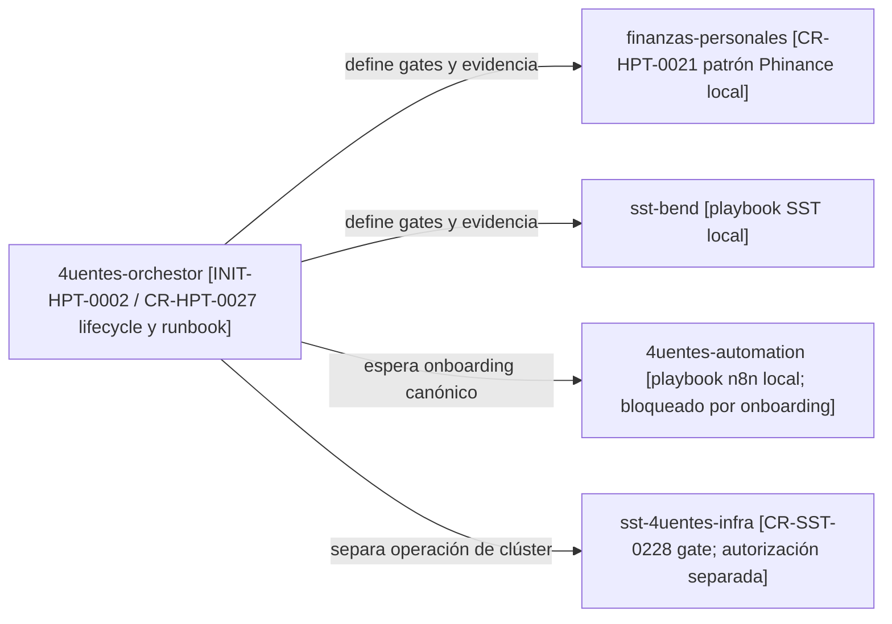
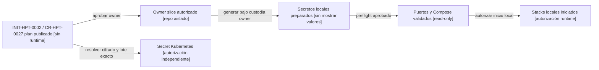

# Gobierno de secretos y puertos para desarrollo local

Este runbook humano define cómo coordinar Phinance, SST Bend y 4uentes
Automation sin centralizar credenciales, mezclar redes Docker ni convertir al
control plane en un runtime owner. Los comandos ejecutables deberán vivir en
el repositorio que posee cada servicio.

## Resultado esperado

- Cada stack genera y consume credenciales propias ignoradas por Git.
- Los valores locales no se reutilizan en Kubernetes ni entre servicios.
- Los puertos se validan antes de levantar contenedores.
- Los tres proyectos Compose conservan nombres y redes independientes.
- La rotación contempla bases inicializadas y consumidores, no sólo archivos.

## Mapa de ownership y dependencias

<!-- visual-map:start -->

```yaml
visual_map:
  schema_version: "1.0"
  id: "cr-hpt-0027-local-development-owner-dependencies"
  type: "dependency"
  question: "¿Qué owner conserva cada playbook y qué coordina el control plane?"
  abstraction_level: "repository ownership"
  source_refs:
    - "requests/planned/CR-HPT-0027-govern-local-development-secrets-and-compose-ports.yaml"
    - "requests/running/CR-HPT-0021-activate-private-ephemeral-phinance-development.yaml"
    - "requests/running/CR-SST-0228-migrate-shared-development-secret-storage.yaml"
  observed_at: "2026-08-29"
  authority_boundary: "Vista derivada; los requests y la documentación de cada owner conservan autoridad."
  textual_fallback_required: true
  request_ids: ["CR-HPT-0027", "CR-HPT-0021", "CR-SST-0228"]
  initiative_ids: ["INIT-HPT-0002"]
```



### Fallback textual del mapa de ownership

```text
4uentes-orchestor / INIT-HPT-0002 / CR-HPT-0027 --define gates y evidencia--> finanzas-personales / CR-HPT-0021
4uentes-orchestor --define gates y evidencia--> sst-bend
4uentes-orchestor --espera onboarding canónico--> 4uentes-automation
4uentes-orchestor / CR-HPT-0027 --separa operación de clúster--> sst-4uentes-infra / CR-SST-0228
Cada repo owner conserva su playbook, documentación y credenciales.
```

<!-- visual-map:end -->

## Matriz de puertos propuesta

| Owner | Superficie | Variable | Default | Binding |
| --- | --- | --- | ---: | --- |
| SST Bend | API | `SST_API_HOST_PORT` | `3005` | loopback |
| SST Bend | scrapper | `SST_SCRAPPER_HOST_PORT` | `3200` | loopback |
| SST Bend | PostgreSQL | `SST_POSTGRES_HOST_PORT` | `5432` | loopback |
| SST Bend | pgAdmin | `SST_PGADMIN_HOST_PORT` | `5051` | loopback |
| 4uentes Automation | n8n | `N8N_HOST_PORT` | `5678` | loopback |
| 4uentes Automation | pgAdmin | `N8N_PGADMIN_HOST_PORT` | `5050` | loopback |
| Phinance | API | `PHINANCE_API_HOST_PORT` | `8766` | loopback |
| Phinance | PostgreSQL | no aplica | interno | red Compose propia |
| 4uentes Automation | PostgreSQL | no aplica | interno | red Compose propia |

Los defaults son una propuesta contractual de `CR-HPT-0027`; no están activos
hasta que cada owner publique y valide su adopción.

## Secuencia gobernada

<!-- visual-map:start -->

```yaml
visual_map:
  schema_version: "1.0"
  id: "cr-hpt-0027-local-development-execution-sequence"
  type: "lifecycle"
  question: "¿Qué gate debe completarse antes de iniciar los stacks o provisionar Kubernetes?"
  abstraction_level: "request execution gates"
  source_refs:
    - "requests/planned/CR-HPT-0027-govern-local-development-secrets-and-compose-ports.yaml"
  observed_at: "2026-08-29"
  authority_boundary: "Vista derivada; CR-HPT-0027 y las autorizaciones de cada slice conservan autoridad."
  textual_fallback_required: true
  request_ids: ["CR-HPT-0027"]
  initiative_ids: ["INIT-HPT-0002"]
```



### Fallback textual del mapa de lifecycle

```text
INIT-HPT-0002 / CR-HPT-0027 plan publicado --aprobar owner--> Owner slice autorizado
Owner slice autorizado --generar bajo custodia owner--> Secretos locales preparados
Secretos locales preparados --preflight aprobado--> Puertos y Compose validados
Puertos y Compose validados --autorizar inicio local--> Stacks locales iniciados
Plan publicado --resolver cifrado y lote exacto--> Secret Kubernetes
El camino Kubernetes es independiente del startup local.
```

<!-- visual-map:end -->

## Contrato del playbook por owner

Cada implementación deberá ofrecer, como mínimo:

1. Un modo `Plan` o `Preflight` sin mutaciones.
2. Generación CSPRNG sin imprimir valores.
3. Archivos ignorados por Git y ACL restrictiva.
4. Rechazo de overwrite por defecto.
5. Validación de puertos antes de iniciar Compose.
6. Validación de configuración sin persistir secretos interpolados.
7. Rotación coordinada con PostgreSQL y consumidores.
8. Teardown limitado al proyecto y volumen expresamente autorizado.

El playbook común futuro sólo podrá invocar comandos owner y recopilar estados
sanitizados. No podrá leer, copiar ni transportar valores secretos.

## Compuertas pendientes

- Publicar y releer el onboarding canónico de `4uentes-automation`.
- Autorizar por separado los slices de SST Bend, Automation y Phinance.
- Resolver el cifrado del clúster compartido o aceptar explícitamente el riesgo
  temporal antes de aprovisionar `phinance-postgres-secret`.
- Autorizar explícitamente cualquier inicio de contenedores o cambio de una
  base persistente.
