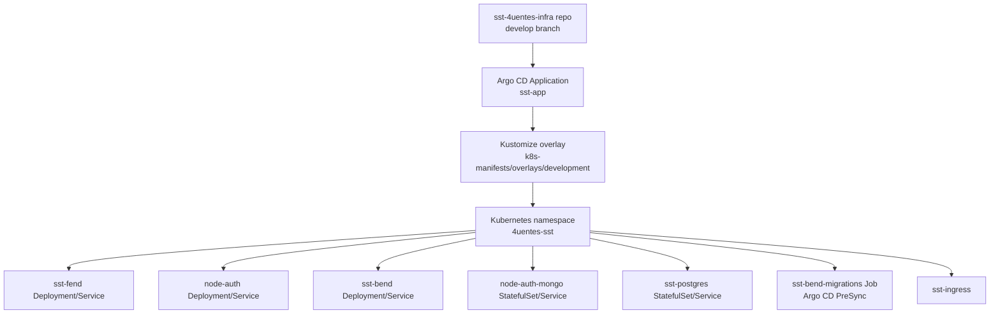
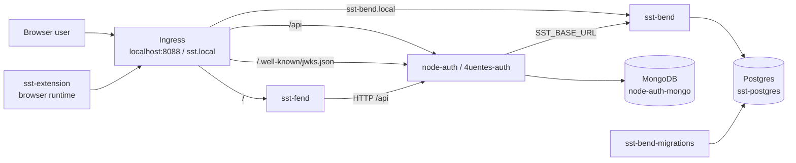
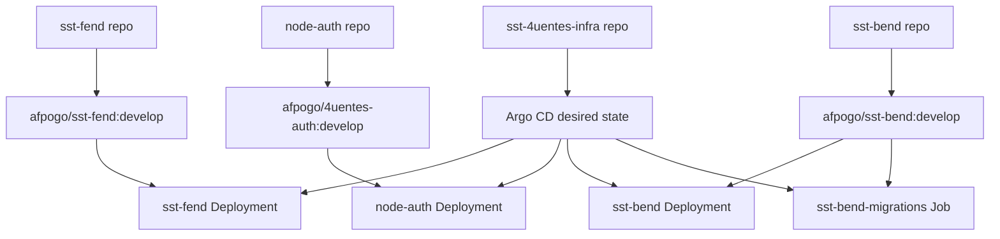

# Mapa De Dependencias Del Cluster SST

Observado el: 2026-05-19

## Proposito

Este mapa describe el grafo actual de dependencias para deployment y
comportamiento runtime del cluster SST.

Separa:

- dependencias de control GitOps
- dependencias runtime entre servicios
- dependencias de datos
- dependencias de procedencia de codigo/imagen

## 1. Grafo De Control GitOps

## 2. Grafo De Dependencias Runtime

## 3. Lectura De Dependencias

### Entrypoint Edge

- El entrypoint local aprobado es `http://localhost:8088`.
- `sst-fend` se sirve en `/`.
- `node-auth` es dueno de `/api` y `/.well-known/jwks.json`.
- `sst-bend` no es el edge publico principal; se alcanza principalmente de
  forma interna desde `node-auth`, con `sst-bend.local` como host de debug.

### Dependencias Servicio A Servicio

- `sst-fend -> node-auth`
  El trafico API del frontend pasa por la capa BFF/auth, no directo a
  `sst-bend`.
- `sst-extension -> node-auth`
  La extension corre fuera de Kubernetes y usa la misma base URL externa.
- `node-auth -> sst-bend`
  `node-auth` reenvia trafico de dominio SST a
  `http://sst-bend-service:3005`.
- `node-auth -> node-auth-mongo`
  Usuarios de identidad, refresh tokens y auth state dependen de MongoDB.
- `sst-bend -> sst-postgres`
  Los datos de dominio SST dependen de Postgres.
- `sst-bend-migrations -> sst-postgres`
  Argo CD ejecuta migraciones antes de reconciliar el backend.

## 4. Grafo De Procedencia De Codigo

## 5. Restriccion Actual Importante

El cluster no construye actualmente codigo de aplicacion desde repos fuente
durante deploy.

El comportamiento actual de desarrollo es:

- `sst-4uentes-infra` define que image tags debe ejecutar Kubernetes.
- Argo CD sincroniza manifests desde el repo de infra.
- Se espera que los repos de app produzcan Docker images por separado.
- Para desarrollo local con `kind`, el camino documentado es retag manual +
  `kind load docker-image`.

Eso significa que la dependencia runtime efectiva es:

`app repo code -> docker image -> image tag used by infra repo -> Argo CD sync -> cluster`

no:

`app repo code -> direct cluster deploy`

## 6. Mapping Actual Repo A Cluster

| Componente logico | Source repo | Ubicacion runtime | Expuesto publicamente | Dependencia downstream principal |
|---|---|---|---|---|
| `sst-fend` | `sst-fend` | Kubernetes | yes | `node-auth` |
| `4uentes-auth` / `node-auth` | `node-auth` | Kubernetes | yes | `sst-bend`, MongoDB |
| `sst-bend` | `sst-bend` | Kubernetes | debug/internal | Postgres |
| `sst-extension` | `sst-extension` | browser outside cluster | yes, via browser | `node-auth` |
| `sst-4uentes-infra` | `sst-4uentes-infra` | GitOps control plane input | indirect | all cluster workloads |

## 7. Nodos De Riesgo Principales

- Image tags mutables: `develop` es la referencia de deployment para todas las
  app images.
- App CI faltante u obsoleto: la publicacion de imagenes no esta automatizada de
  forma consistente.
- Modelo de deployment mezclado: algunos workflows viejos de app todavia
  implican deploy directo, mientras que el modelo esperado es GitOps mediante
  `sst-4uentes-infra`.
- Drift de modo runtime: `sst-fend` y `node-auth` todavia reflejan comandos de
  contenedor estilo desarrollo en el camino de deployment.

## 8. Resumen Practico

Si queres saber "que depende de que", la lectura correcta mas corta es:

1. `sst-4uentes-infra` controla el desired cluster state.
2. Argo CD lee infra Git y reconcilia Kubernetes.
3. Usuarios y extension entran por Ingress.
4. Ingress envia trafico UI a `sst-fend` y trafico API/JWKS a `node-auth`.
5. `node-auth` depende de `sst-bend` para comportamiento de dominio SST.
6. `node-auth` depende de MongoDB para identity state.
7. `sst-bend` depende de Postgres para persistencia de dominio SST.
8. El codigo que llega al cluster viene de Docker images, no directo del repo
   checkout durante deploy.
