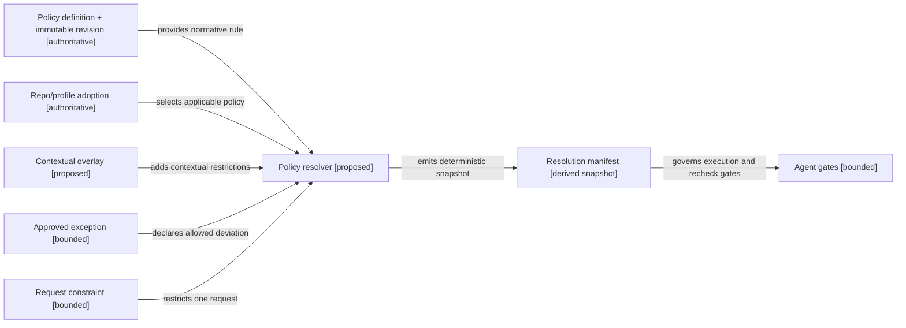
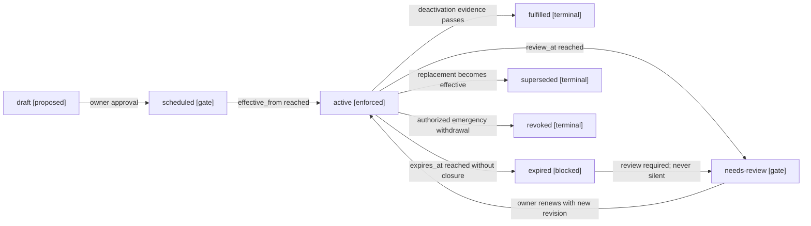
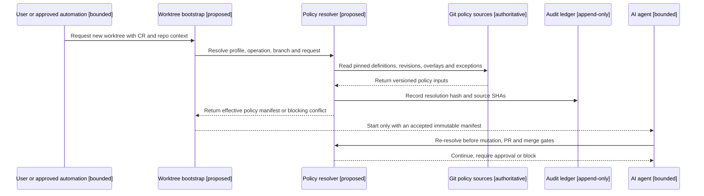
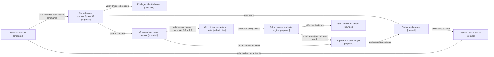
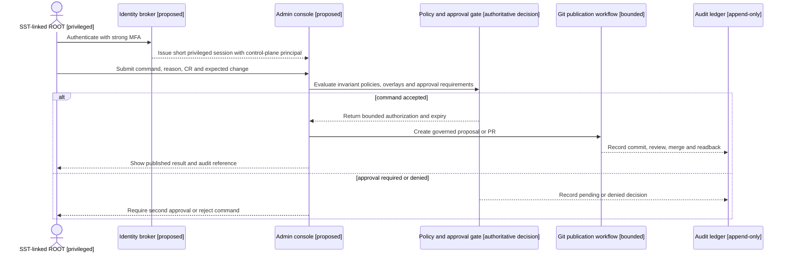
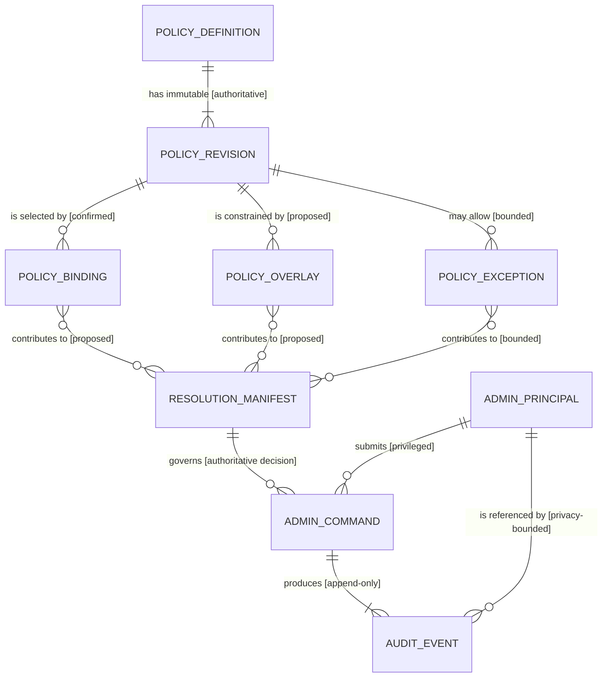

# Políticas dinámicas y consola de administración ARDS/SDD

## Estado y propósito

Este documento es una propuesta de arquitectura bajo `CR-CP-0025`. Explica
cómo una política puede evolucionar o activarse temporalmente sin perder
trazabilidad y cómo una futura consola administrativa puede mostrar y
configurar el control plane en tiempo real.

La propuesta no implementa una consola, no crea usuarios, no modifica Auth y
no concede privilegios runtime. Las fuentes Git del control plane conservan la
autoridad hasta que un CR posterior apruebe otro mecanismo.

Fuentes normativas actuales:

- `specs/policies/ards-sdd-policy-component-model.yaml` define los componentes
  de policy, adopción, enforcement, excepción, evidencia y state link.
- `specs/integration/policies.yaml` registra las policies adoptadas.
- `templates/policy-adoption-manifest.template.yaml` y
  `templates/policy-exception-manifest.template.yaml` modelan adopción y
  excepción.
- `specs/integration/visual-documentation-as-code-profile.yaml` gobierna los
  mapas derivados de este documento.

## Qué significa overlay

Un **overlay de policy** es una capa de activación contextual que se aplica
sobre una revisión inmutable de una policy. Su función es ajustar el conjunto
de reglas efectivas para un alcance, condición y periodo determinados sin
copiar, editar ni reemplazar la definición original.

Un overlay responde preguntas como:

- ¿En qué repositorios y operaciones aplica esta regla ahora?
- ¿Qué gap activa la restricción?
- ¿Cuándo debe revisarse o vencer?
- ¿Qué evidencia permite retirarla?
- ¿Qué agente, request u owner autorizó su activación?

Por ejemplo, la regla durable puede exigir preservar trabajo no publicado. Un
overlay de remediación puede endurecer esa regla mientras existan worktrees
sucios: prohíbe `reset`, exige inventario y obliga a crear un worktree limpio.
Cuando el inventario se completa, se desactiva el overlay; la policy durable no
cambia.

### Lo que un overlay no es

| Concepto | Función | ¿Cambia la policy base? | Temporalidad típica |
| --- | --- | --- | --- |
| Revisión de policy | Cambia el texto normativo para ejecuciones futuras | Crea una nueva revisión inmutable | Durable |
| Adopción | Declara que un repo o perfil aplica una policy | No | Durable o revisable |
| Overlay | Activa o endurece reglas por contexto | No | Temporal o condicional |
| Excepción | Autoriza una desviación acotada si la policy lo permite | No | Temporal y con vencimiento |
| Constraint de CR | Restringe una única ejecución | No | Vida del request |
| Advisory | Informa sin bloquear | No | Revisable |

Un overlay normal puede agregar restricciones o reducir alcance. No puede
debilitar una policy superior. Si se necesita una desviación, debe existir un
`policy_exception_manifest` aprobado.

### Ejemplo machine-readable

```yaml
schema_version: "1.0"
kind: "policy_overlay"
overlay_id: "dirty-worktree-preservation-cr-cp-0024"
policy_id: "worktree-request-lifecycle-policy"
policy_revision: "2026-08-22"
lifecycle_mode: "remediation"
status: "active"
authority:
  owner: "4uentes-ards-control-plane"
  request_id: "CR-CP-0024"
validity:
  effective_from: "2026-08-30T00:00:00Z"
  review_at: "2026-09-10T00:00:00Z"
  expires_at: "2026-09-30T00:00:00Z"
  expiry_behavior: "block-and-review"
scope:
  operations: ["worktree-bootstrap", "worktree-cleanup"]
activation:
  all: ["dirty-worktrees-exist", "disposition-incomplete"]
deactivation:
  any: ["disposition-validator-passes", "request-is-closed"]
rules:
  - {effect: "deny", operation: "reset-dirty-worktree"}
  - {effect: "require", operation: "create-clean-isolated-worktree"}
```

## Mapa de dependencias para resolver una policy efectiva

<!-- visual-map:start -->

```yaml
visual_map:
  schema_version: "1.0"
  id: "dynamic-policy-resolution-dependencies"
  type: "dependency"
  question: "¿Qué artefactos participan en la resolución de policies efectivas para un agente?"
  abstraction_level: "control-plane policy component"
  source_refs:
    - "specs/policies/ards-sdd-policy-component-model.yaml"
    - "specs/integration/policies.yaml"
    - "requests/planned/CR-CP-0025-dynamic-policy-lifecycle-and-administration-console.yaml"
  observed_at: "2026-09-03"
  authority_boundary: "Vista derivada y propuesta; las specs y el lifecycle CR-CP-0025 conservan autoridad."
  textual_fallback_required: true
```



### Fallback textual del mapa de dependencias

```text
La definición y revisión aportan la regla normativa al resolvedor.
La adopción selecciona si la policy aplica al repo o perfil.
El overlay agrega restricciones contextuales.
La excepción aprobada aporta una desviación acotada.
El constraint limita un request concreto.
El resolvedor emite un manifest inmutable que gobierna los gates del agente.
```

<!-- visual-map:end -->

## Lifecycle de un overlay

Un overlay conserva historia: nunca se borra para simular que no existió. Una
nueva decisión produce una transición o una revisión nueva.

<!-- visual-map:start -->

```yaml
visual_map:
  schema_version: "1.0"
  id: "policy-overlay-lifecycle"
  type: "lifecycle"
  question: "¿Qué estados y gates atraviesa un overlay temporal?"
  abstraction_level: "policy overlay lifecycle"
  source_refs:
    - "specs/policies/ards-sdd-policy-component-model.yaml"
    - "requests/planned/CR-CP-0025-dynamic-policy-lifecycle-and-administration-console.yaml"
  observed_at: "2026-09-03"
  authority_boundary: "Vista derivada y propuesta; CR-CP-0025 conserva autoridad sobre el diseño."
  textual_fallback_required: true
```



### Fallback textual del lifecycle

```text
draft --owner approval--> scheduled
scheduled --effective_from reached--> active
active --review_at reached--> needs-review
needs-review --owner renews with new revision--> active
active --deactivation evidence passes--> fulfilled
active --expires_at reached without closure--> expired and blocked
active --replacement becomes effective--> superseded
active --authorized emergency withdrawal--> revoked
expired --mandatory review--> needs-review
```

<!-- visual-map:end -->

## Resolución al iniciar un worktree

Cada ejecución debe recibir un snapshot reproducible de las policies vigentes.
El agente vuelve a resolver antes de mutar un repo hijo, publicar un PR o
fusionar, porque una actualización crítica puede invalidar el snapshot inicial.

<!-- visual-map:start -->

```yaml
visual_map:
  schema_version: "1.0"
  id: "worktree-policy-bootstrap-sequence"
  type: "sequence"
  question: "¿En qué orden se resuelven y verifican las policies al iniciar un worktree?"
  abstraction_level: "worktree bootstrap"
  source_refs:
    - "docs/policies/worktree-request-lifecycle-policy.md"
    - "specs/integration/policies.yaml"
    - "requests/planned/CR-CP-0025-dynamic-policy-lifecycle-and-administration-console.yaml"
  observed_at: "2026-09-03"
  authority_boundary: "Vista derivada y propuesta; las policies referenciadas y el request conservan autoridad."
  textual_fallback_required: true
```



### Fallback textual de la secuencia de bootstrap

```text
1. Un usuario o automatización aprobada solicita un worktree con repo y CR.
2. Bootstrap entrega el contexto al resolvedor.
3. El resolvedor lee fuentes Git versionadas y fijadas por SHA.
4. El resolvedor registra hash, inputs y decisión en el ledger de auditoría.
5. El agente inicia sólo con un manifest efectivo aceptado.
6. El agente vuelve a resolver antes de mutación, publicación y merge.
```

<!-- visual-map:end -->

## Consola administrativa Git-first

La consola se divide en lectura y comandos:

- La superficie de consulta proyecta estado de repos, requests, policies,
  overlays, excepciones, resoluciones, worktrees, gates y auditoría.
- La superficie de comando crea propuestas. No modifica silenciosamente las
  fuentes autoritativas.
- La activación efectiva requiere validación, autorización y publicación en el
  lifecycle correspondiente.
- Los eventos en tiempo real actualizan la vista, pero no reemplazan el readback
  de Git ni la evidencia de ejecución.

<!-- visual-map:start -->

```yaml
visual_map:
  schema_version: "1.0"
  id: "ards-sdd-admin-console-architecture"
  type: "dependency"
  question: "¿Cómo se relaciona la consola con identidad, autoridad Git, resolución, gates y auditoría?"
  abstraction_level: "logical control-plane service"
  source_refs:
    - "initiatives/INIT-CP-0003-ards-sdd-runtime-enforcement.yaml"
    - "requests/planned/CR-CP-0025-dynamic-policy-lifecycle-and-administration-console.yaml"
  observed_at: "2026-09-03"
  authority_boundary: "Vista derivada de arquitectura propuesta; Git y los requests aprobados conservan autoridad."
  textual_fallback_required: true
```



### Fallback textual de la arquitectura

```text
La consola usa una API de comandos y consultas y valida la sesión privilegiada.
Las consultas leen proyecciones derivadas.
Los comandos crean propuestas gobernadas y publican sólo mediante CR o PR aprobado.
Git conserva policies, requests y state como fuente autoritativa.
El resolvedor consume Git y entrega decisiones efectivas al bootstrap de agentes.
Comandos y resoluciones se registran en un ledger append-only.
El stream en tiempo real refresca la UI, pero no tiene autoridad de escritura.
```

<!-- visual-map:end -->

## Principal especial ROOT vinculado a SST

`ROOT` debe ser una identidad del dominio de administración ARDS/SDD, aunque su
autenticación se vincule a una persona identificada por SST. No debe modelarse
como una bandera `is_root` dentro de un usuario funcional común ni como una
credencial compartida.

Modelo propuesto:

- `sst_subject_id`: referencia estable al sujeto autenticado; no contiene datos
  personales en manifests o logs.
- `control_plane_principal_id`: identidad administrativa independiente.
- `role: ards.root`: rol privilegiado del control plane.
- Sesión corta con MFA resistente a phishing y reautenticación para comandos.
- Credenciales de servicio separadas de sesiones humanas.
- Motivo, CR, diff esperado y resultado obligatorios para cada acción.
- ROOT no puede editar el ledger, borrar evidencia ni evitar policies
  invariantes.
- Una acción de emergencia genera un overlay `emergency`, con TTL corto y
  revisión posterior obligatoria.
- Operaciones críticas pueden exigir segundo aprobador aunque el iniciador sea
  ROOT.

La vinculación SST prueba quién es el sujeto. El control plane decide qué puede
hacer. Esta separación evita que comprometer un rol funcional de SST conceda
automáticamente autoridad de gobierno.

<!-- visual-map:start -->

```yaml
visual_map:
  schema_version: "1.0"
  id: "root-privileged-command-sequence"
  type: "sequence"
  question: "¿Cómo ejecuta ROOT un comando privilegiado sin evitar policies ni auditoría?"
  abstraction_level: "privileged control-plane command"
  source_refs:
    - "docs/policies/agent-architecture-boundary-policy.md"
    - "docs/policies/work-tracker-control-plane-authority-policy.md"
    - "requests/planned/CR-CP-0025-dynamic-policy-lifecycle-and-administration-console.yaml"
  observed_at: "2026-09-03"
  authority_boundary: "Vista derivada del flujo propuesto; las policies y futuros contratos de identidad conservan autoridad."
  textual_fallback_required: true
```



### Fallback textual del comando ROOT

```text
1. ROOT se autentica con MFA y recibe una sesión privilegiada corta.
2. ROOT presenta comando, motivo, CR y cambio esperado.
3. El gate evalúa invariantes, overlays y aprobaciones requeridas.
4. Si se acepta, la consola crea una propuesta o PR gobernado y auditable.
5. Si requiere segundo aprobador o está prohibido, no se ejecuta y se registra la decisión.
6. ROOT nunca escribe directamente en Git autoritativo ni en el ledger.
```

<!-- visual-map:end -->

## Modelo lógico mínimo de auditoría

<!-- visual-map:start -->

```yaml
visual_map:
  schema_version: "1.0"
  id: "dynamic-policy-audit-data-model"
  type: "data"
  question: "¿Qué entidades lógicas permiten reconstruir una decisión de policy y una acción administrativa?"
  abstraction_level: "logical audit entity"
  source_refs:
    - "specs/policies/ards-sdd-policy-component-model.yaml"
    - "requests/planned/CR-CP-0025-dynamic-policy-lifecycle-and-administration-console.yaml"
  observed_at: "2026-09-03"
  authority_boundary: "Vista derivada del modelo lógico propuesto; CR-CP-0025 conserva autoridad y no define almacenamiento físico ni valores productivos."
  textual_fallback_required: true
```



### Fallback textual del modelo de datos

```text
PolicyDefinition tiene revisiones inmutables.
PolicyBinding selecciona una revisión para un alcance.
PolicyOverlay restringe una revisión bajo condiciones.
PolicyException representa una desviación aprobada.
Binding, overlay y excepción contribuyen al ResolutionManifest.
AdminPrincipal presenta AdminCommand, gobernado por un ResolutionManifest.
El comando produce AuditEvent append-only que referencia al principal sin copiar datos personales.
```

<!-- visual-map:end -->

## Precedencia y conflictos

El resolvedor propuesto aplica estas reglas:

1. Un `deny` aplicable prevalece sobre un `allow`.
2. Una policy local no contradice una policy canónica.
3. Un overlay normal puede endurecer, acotar o activar; no puede debilitar.
4. Una excepción sólo opera si la policy base declara un camino de excepción.
5. Policies incompatibles producen un conflicto bloqueante, no una elección
   silenciosa.
6. Toda decisión fija revisions, overlays, excepciones, SHAs y hash de
   resolución.

## Superficies de la futura consola

### Observabilidad

- Estado de iniciativas, CRs, repos, capabilities y feature/bugfix states.
- Policies vigentes, próximas a revisar, expiradas y supersedidas.
- Overlays activos y condición que los mantiene activos.
- Excepciones, owner, vencimiento y plan de cierre.
- Worktrees limpios, sucios, obsoletos y vinculados a requests.
- Gates, bloqueos, drift y evidencia de readback.

### Configuración gobernada

- Crear drafts de policy y nuevas revisiones.
- Proponer bindings, overlays y excepciones.
- Simular la resolución antes de activar un cambio.
- Mostrar el diff efectivo: reglas agregadas, retiradas o bloqueadas.
- Solicitar aprobaciones y publicar mediante commits/PRs.

### Auditoría

- Quién solicitó, aprobó, rechazó y ejecutó una acción.
- Qué policy resolution gobernó cada acción.
- Qué fuentes y SHAs se usaron.
- Resultado, evidencia, readback y rollback/revert asociado.
- Exportación reproducible sin secretos ni datos personales.

## Límites de este diseño

- No elige framework web, base de datos ni proveedor de identidad.
- No define todavía contratos HTTP, eventos ni schemas de persistencia.
- No autoriza acceso directo desde la consola a Kubernetes, GitHub, Jira o
  repos hijos.
- No crea el principal ROOT ni modifica SST/Auth.
- No promueve el modelo de overlays a `4uentes-ards-core`.

Cada punto requiere un CR posterior con owner, threat model, contrato,
validación y rollback propios.

## Próximos incrementos sugeridos

1. Especificar `policy_overlay` y `policy_resolution_manifest` como kinds
   machine-readable locales.
2. Implementar un resolvedor read-only con fixtures y conflictos negativos.
3. Publicar una API exclusivamente de consulta y un read model de auditoría.
4. Definir threat model, identidad privilegiada y autorización ROOT.
5. Añadir comandos que sólo creen propuestas Git; todavía sin merge automático.
6. Evaluar promoción del modelo reusable al core canónico.
