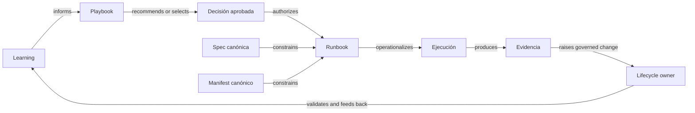

# Policy de documentación desde conocimiento hasta ejecución

## Propósito

Definir el propósito, los límites y las relaciones de autoridad de Learning,
playbooks, runbooks, specs y manifests sin convertirlos en fuentes de verdad
paralelas.

La secuencia resumida es:

```text
Aprendizaje -> Playbook -> Runbook -> Specs/manifests
por qué         qué decidir  cómo ejecutar  autoridad técnica
```

La flecha representa un recorrido cognitivo recomendado. No representa orden
cronológico obligatorio, precedencia normativa ni autorización para ejecutar.

## Clasificación y alcance

- `policy_id`: `knowledge-to-execution-documentation-policy`.
- Clase actual: `origin-repo-policy`.
- Origin repo de la policy: `4uentes-orchestor`.
- Owner de la incubación local: `4uentes-ards-control-plane`.
- Procedencia del patrón: `sst-4uentes-infra`, bajo `CR-HPT-0024`.
- Destino reusable propuesto: `core-profile-scoped` en `4uentes-ards-core`.
- Aplicabilidad temporal: artefactos nuevos o materialmente modificados después
  de la adopción local.

La adopción local no obliga a crear las cuatro capas para cada cambio, no
retrofita automáticamente documentación legacy y no prueba adopción en repos
hijos. La deuda legacy se registra como gap, backlog o excepción. Una
propagación futura requiere request y `policy_adoption_manifest` o
`policy_exception_manifest` por owner.

## Roles documentales

### Learning o aprendizaje

Explica propósito, contexto, conceptos, vocabulario, responsabilidades y
lecciones estables. Es informativo: no autoriza mutaciones ni redefine
contratos. Puede incluir snippets ilustrativos si se rotulan como
no-autoritativos, pero no debe ser la única fuente de una secuencia operacional
reutilizable.

En esta policy, `Learning` es un rol documental. No se confunde con el producto
o la ruta funcional `/learning` de SST.

### Playbook

Convierte comprensión en decisiones repetibles. Define opciones, responsables,
gates, criterios de avance o detención y rutas de escalamiento. Recomienda o
selecciona una estrategia; no concede por sí mismo autorización y no debe
duplicar una secuencia ejecutable completa.

Cuando exista operación técnica, el playbook enlaza un runbook. Cuando no sea
necesario, justifica la omisión y enlaza directamente la autoridad técnica
aplicable.

### Runbook

Operacionaliza una decisión ya seleccionada y autorizada. Contiene
precondiciones, pasos o comandos, checks, stop conditions, evidencia esperada
y rollback o compensación. Si rollback y compensación no aplican, declara la
razón. Debe referenciar la revisión técnica aplicable y no puede redefinirla.

### Specs y manifests

Las specs expresan contratos normativos. Los manifests expresan estado deseado
ejecutable. Sólo tiene autoridad una fuente que haya sido publicada por el owner,
esté activa y aplicable, se identifique como canónica para ese dominio y
declare revisión o lineage suficiente. Drafts, ejemplos, fixtures, renders y
proyecciones generadas no obtienen autoridad sólo por su tipo, nombre o path.

Un manifest generado enlaza su fuente canónica. No existe una precedencia
universal entre spec y manifest. Si fuentes owner canónicas divergen, la
aceptación se bloquea y el owner reconcilia contrato y estado deseado mediante
un lifecycle aprobado; el agente no elige silenciosamente un ganador.

## Relaciones tipadas

<!-- visual-map:start -->

```yaml
visual_map:
  schema_version: "1.0"
  id: "knowledge-to-execution-typed-relations"
  type: "dependency"
  question: "Cómo se separan lectura, autorización, restricción y feedback?"
  abstraction_level: "Relaciones normativas entre roles documentales y lifecycle."
  source_refs:
    - "specs/integration/policies.yaml"
    - "requests/running/CR-CP-0026-define-knowledge-to-execution-documentation-policy.yaml"
  request_ids: []
  observed_at: "2026-09-05"
  authority_boundary: "Vista derivada; specs, manifests, decisiones aprobadas y lifecycles owner conservan su autoridad declarada."
  textual_fallback_required: true
```



### Fallback textual

```text
Learning informa. El playbook recomienda o selecciona. Una decisión externa
aprobada autoriza. El runbook operacionaliza. Specs y manifests owner,
canónicos y activos restringen. La evidencia valida y retroalimenta sólo a
través del lifecycle del owner.
```

<!-- visual-map:end -->

Estas relaciones no forman una única cadena de precedencia:

- `informs`: Learning aporta comprensión al playbook;
- `recommends` o `selects`: el playbook estructura una decisión;
- `authorizes`: un request, aprobación o gate externo habilita la ejecución;
- `operationalizes`: el runbook vuelve ejecutable la decisión autorizada;
- `constrains`: las fuentes técnicas canónicas limitan decisión y ejecución;
- `validates` y `feeds_back`: la evidencia comprueba resultados y origina un
  cambio sólo mediante lifecycle owner.

## Cuatro ejes obligatorios

### Recorrido de lectura

El recorrido recomendado es `Learning -> Playbook -> Runbook -> autoridad
técnica`. Se puede omitir una capa que no agregue valor. Un playbook puramente
decisional puede enlazar specs/manifests sin crear un runbook.

### Restricción y conflicto

La autoridad técnica canónica restringe al runbook; el runbook no amplía la
decisión; el playbook no convierte aprendizaje en obligación. Ante una
discrepancia entre fuentes owner canónicas se registra un gap o blocker y se
reconcilia; ninguna capa derivada corrige silenciosamente a otra.

### Autorización

Ninguna capa documental autoriza por sí sola una mutación. Requests aprobados,
decisiones humanas, policies aplicables y gates de seguridad constituyen un eje
externo de autorización.

### Retroalimentación

Runtime, QA, incidentes y evidence pueden descubrir drift o una lección. El
hallazgo puede actualizar una capa solamente mediante el lifecycle y owner
correspondientes. La evidencia observada no reescribe por sí sola el contrato.

## Reglas obligatorias

- Todo artefacto nuevo o materialmente modificado dentro del alcance declara o
  hace inequívocos su rol primario, owner, alcance, estado y fuentes técnicas.
- Learning declara su límite informativo; los comandos ilustrativos se marcan
  como no-autoritativos y enlazan la guía operacional cuando existe.
- Un playbook declara si requiere runbook o justifica su no aplicabilidad.
- Un runbook incluye precondiciones, validación, stop conditions, evidencia y
  rollback/compensación o una razón explícita de no aplicabilidad.
- Specs/manifests que reclamen autoridad declaran owner, estado, aplicabilidad,
  revisión y lineage; las proyecciones enlazan su fuente canónica.
- Las discrepancias producen gap, blocker o cambio owner gobernado.
- Los documentos compuestos declaran un rol primario y preservan los límites de
  cada sección.
- La clasificación no se infiere solamente desde nombres, directorios o
  palabras como `learning`, `playbook` o `runbook`.

## Reglas recomendadas

- Fijar commit, tag o versión cuando un runbook dependa de una revisión exacta.
- Mantener enlaces bidireccionales entre playbook y runbook.
- Distinguir estado observado, estado actual y estado objetivo.
- Registrar `TODO` verificable cuando falte una fuente o capa necesaria.

## Overlays y excepciones

Esta regla es una policy durable nueva, no un overlay. `CR-CP-0025` documenta
overlays como arquitectura propuesta, pero el canon vigente no publica todavía
kind, schema ni resolver activos. Por eso este lifecycle no crea ni simula una
instancia `policy_overlay`.

Una excepción identifica owner, alcance, razón, riesgo, vencimiento y plan de
cierre. Omitir una capa no es una excepción cuando el artefacto explica la no
aplicabilidad y conserva enlaces a la autoridad técnica.

## Enforcement

El enforcement inicial es `operational-review`:

- revisar propósito y autoridad, no sólo path o título;
- verificar relaciones y referencias declaradas;
- confirmar que una capa humana no contradice una fuente owner canónica;
- confirmar que las mutaciones tienen autorización externa;
- registrar gaps o bloquear aceptación cuando exista drift.

Un validador estructural futuro puede consumir manifests declarativos de
cadena, IDs, enums, links y paths. No debe clasificar Markdown libre ni decidir
contradicciones semánticas mediante regex.

## Evidencia de origen

El patrón fue publicado inicialmente en la branch owner
`docs/CR-HPT-0024/human-receipt-custody-guides`, commit
`67c4874b2404235d70dc56ce143343954f5c707e`, e integrado mediante
`4ab3e7e9f0869c7c035d75a85149977994aa0af9`. La aclaración posterior
`83bac64d5a7323276af4b691b666890c9cda81fe` permanece preservada en una branch
divergente y requiere su propio gate; no forma parte de esta adopción.

La evidencia de `CR-HPT-0024` también demuestra que manifests y runbook pueden
estar validados mientras despliegue, Secrets, licencia y QA runtime siguen
bloqueados. Por eso la jerarquía no equivale a autorización ni a cierre.

## Definition of Done

- La secuencia se usa como recorrido, no como ranking total de autoridad.
- Cada rol conserva límites y referencias al owner técnico.
- La ausencia legítima de una capa queda explícita.
- Los conflictos se reconcilian mediante lifecycle aprobado.
- La adopción en repos hijos permanece request-driven.
- La promoción a Core y un validator dedicado quedan en requests separados.
