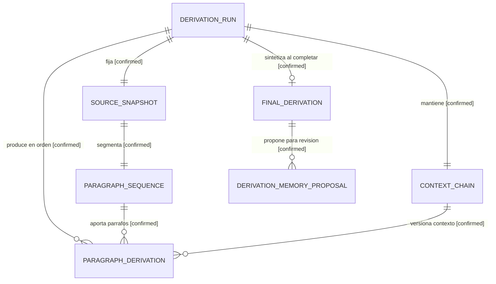

# Contrato SST de derivacion secuencial por parrafos V1

Estado observado: `approved-for-owner-implementation` al 2026-08-25.

La autoridad machine-readable es
[`paragraph-sequential-derivation-contract-v1.yaml`](../../../evidence/requests/CR-SST-0219/paragraph-sequential-derivation-contract-v1.yaml).
Este documento la explica; no autoriza cambios runtime ni reemplaza los ARDS/SDD
locales que cada owner debera adoptar mediante requests posteriores.

## Que representa cada entidad

| Entidad | Responsabilidad | Cardinalidad y limite |
| --- | --- | --- |
| `DERIVATION_RUN` | Agregado que fija identidad, source, prompt y progreso de una lectura. | Una corrida por ejecucion o fork; no se reescribe al terminar. |
| `SOURCE_SNAPSHOT` | Evidencia inmutable de la version del articulo. | Exactamente uno por corrida. |
| `PARAGRAPH_SEQUENCE` | Segmentacion ordenada y estable del snapshot. | Exactamente una por corrida, con cero o mas parrafos. |
| `CONTEXT_CHAIN` | Cadena versionada y acotada de interpretaciones anteriores. | Exactamente una por corrida; avanza por append y conserva provenance. |
| `PARAGRAPH_DERIVATION` | Interpretacion de un parrafo usando un snapshot de prompt y una version de contexto. | Cero o mas, ordenadas por ordinal. Un parrafo puede no aportar una derivacion util. |
| `FINAL_DERIVATION` | Sintesis terminal de una corrida exitosa. | Cero o una; solo existe si la corrida completa correctamente. |
| `DERIVATION_MEMORY_PROPOSAL` | Candidato opcional a memoria, siempre sujeto a revision. | Cero o mas; nace en `needs_review` y nunca se acepta automaticamente. |

## Mapa logico de datos

<!-- visual-map:start -->
```yaml
visual_map:
  schema_version: "1.0"
  id: "sst-paragraph-sequential-derivation-data-v1"
  type: "data"
  question: "Que entidades mantiene una corrida de derivacion y como se relacionan?"
  abstraction_level: "logical entity"
  source_refs:
    - "evidence/requests/CR-SST-0219/paragraph-sequential-derivation-contract-v1.yaml"
    - "state/features/paragraph-sequential-derivation.current.yaml"
  observed_at: "2026-08-25"
  authority_boundary: "Vista derivada; la autoridad la conserva el contrato machine-readable CR-SST-0219 y los futuros contratos locales de cada owner."
  textual_fallback_required: true
```



### Fallback textual del mapa

```text
DERIVATION_RUN fija exactamente un SOURCE_SNAPSHOT.
SOURCE_SNAPSHOT se segmenta en una PARAGRAPH_SEQUENCE inmutable.
DERIVATION_RUN mantiene exactamente una CONTEXT_CHAIN versionada.
DERIVATION_RUN produce cero o mas PARAGRAPH_DERIVATION ordenadas.
Cada PARAGRAPH_DERIVATION referencia un parrafo y una version de CONTEXT_CHAIN.
Una corrida completada puede producir una FINAL_DERIVATION.
La FINAL_DERIVATION puede producir candidatos DERIVATION_MEMORY_PROPOSAL para revision.
```
<!-- visual-map:end -->

## Dinamica del chatbot

El chatbot ejecutara la derivacion, pero no definira por si solo identidad,
autorizacion ni memoria persistente. Al iniciar, el backend fija el snapshot del
articulo, la secuencia de parrafos y un `prompt_snapshot`. Para cada ordinal, el
chatbot recibe guardrails, prompt default, perfil elegido, instrucciones del
usuario, contexto acotado, parrafo actual y output schema. La salida confirmada
se agrega a la cadena y habilita el siguiente ordinal.

El perfil default es `open-general-analysis`: permite interpretaciones amplias,
pero obliga a diferenciar evidencia, inferencia e incertidumbre. Una mirada mas
sesgada se expresa mediante perfil o instrucciones del usuario. Si cambia,
comienza otra corrida o un fork con provenance propio; el analisis anterior
permanece intacto y comparable.

## Memoria y adopcion

Al finalizar puede aparecer una `DERIVATION_MEMORY_PROPOSAL`. El estado inicial
es `needs_review`. El usuario puede aceptar, corregir o rechazar; solamente esa
decision explicita permite que `sst-bend` aplique el contrato canonico de memoria.
La sintesis final y la propuesta no son memoria aceptada por el mero hecho de
existir.

## Recuperacion y seguridad

Cada parrafo confirma un checkpoint con el proximo ordinal y la version de
contexto. Un retry reutiliza claves de idempotencia y no duplica derivaciones ni
propuestas. Pausa, fallo, cancelacion o supersesion impiden publicar la sintesis
final. El articulo, el contexto acumulado y el prompt del usuario se tratan como
datos no confiables; no pueden sustituir guardrails ni expandir scope.

## Orden de adopcion

Los siguientes IDs todavia son `TODO`: primero `sst-bend`, luego
`sst-chatbot`, integracion durable, `sst-fend` y finalmente E2E. Cada slice debe
tener lifecycle aprobado, ARDS/SDD local del owner, checks del owner, full check
del control plane y QA manual como ultima revision.
