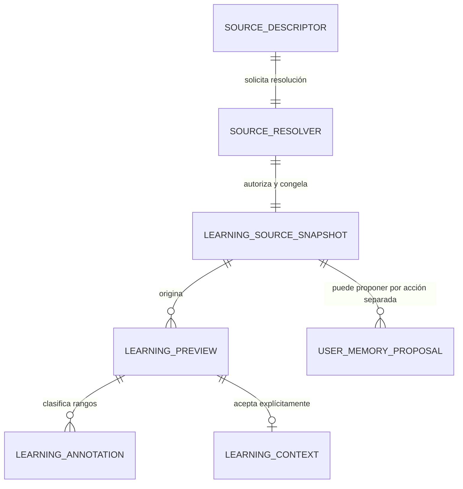
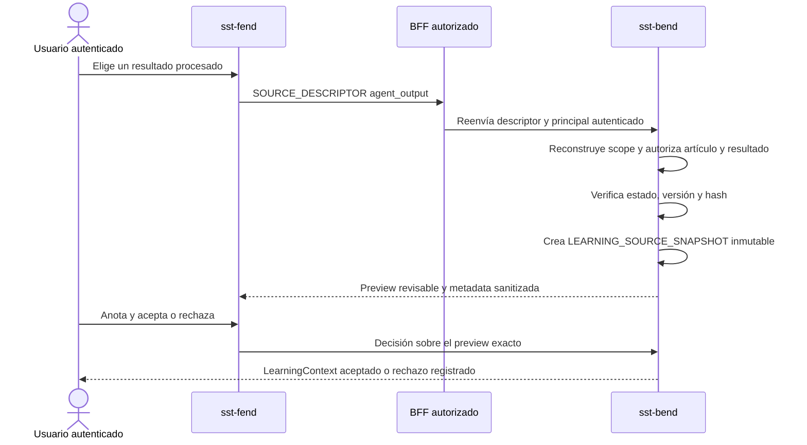
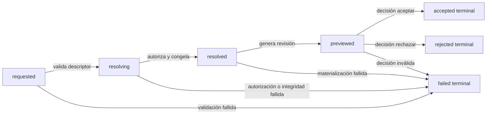

# Contrato de fuentes de Learning Workspace V1

## Rol documental y autoridad

- Rol primario: `Learning`, como explicación humana derivada del contrato; no debe confundirse con la ruta funcional `/learning`.
- Owner: `4uentes-orchestor` para el contrato y lifecycle cross-repo; los futuros contratos runtime pertenecen a sus repos owner.
- Estado: preparado y validado localmente, pendiente de publicación canónica.
- Alcance: propósito, vocabulario, límites, responsabilidades y recorrido de adopción; no contiene un runbook ni autoriza mutaciones de runtime.
- Autoridad técnica: `evidence/requests/CR-SST-0232/learning-workspace-source-contract-v1.yaml` y los futuros specs/manifests owner versionados.

El recorrido recomendado parte de este aprendizaje, continúa con lifecycles y planes owner aprobados y sólo llega a ejecución mediante runbooks owner cuando correspondan. La ausencia actual de playbook y runbook es intencional: este gate materializa el contrato cross-repo, no selecciona ni ejecuta una implementación.

## Intención

`/learning` pasa a concebirse como el workspace de conocimiento personal de SST: puede comenzar con texto escrito o pegar una referencia a un contenido que SST ya posee. El usuario revisa una representación congelada, anota qué partes importan y decide si ese contenido entra al contexto de aprendizaje.

El cambio esencial es que un artículo persistido, un documento derivado o el resultado de un agente ya no viajan como una copia de texto confiada al navegador. Fend envía una referencia estable; Bend reconstruye el scope autenticado, autoriza el objeto y crea un snapshot inmutable antes del preview.

## Qué existe hoy y qué cambia

Hoy la hoja envía `sourceText` para todos los casos. `originArticleId` sólo cambia la etiqueta `sourceType`; Bend normaliza el cuerpo recibido, pero no vuelve a leer ni autoriza el artículo dueño de ese texto.

V1 introduce tres piezas:

- `SOURCE_DESCRIPTOR`: pedido discriminado. Sólo `manual_text` contiene texto; las fuentes persistidas contienen identificadores.
- `SOURCE_RESOLVER`: responsabilidad server-side de Bend. Autoriza, resuelve versión y verifica integridad.
- `LEARNING_SOURCE_SNAPSHOT`: evidencia inmutable exacta sobre la que se genera el preview.

## Mapa lógico

<!-- visual-map:start -->

```yaml
visual_map:
  schema_version: "1.0"
  id: "learning-workspace-source-data-v1"
  type: "data"
  question: "¿Cómo pasa una fuente owner a contexto aceptado sin mezclar tags ni memoria?"
  abstraction_level: "Entidades lógicas y fronteras del contrato cross-repo V1."
  source_refs:
    - "evidence/requests/CR-SST-0232/learning-workspace-source-contract-v1.yaml"
    - "requests/running/CR-SST-0232-define-learning-workspace-source-contract.yaml"
  observed_at: "2026-08-29"
  authority_boundary: "Vista derivada; el contrato YAML y los futuros contratos owner conservan autoridad."
  textual_fallback_required: true
```



### Fallback textual

```text
Un SOURCE_DESCRIPTOR solicita a SOURCE_RESOLVER una fuente. El resolver autoriza el objeto owner y crea exactamente un LEARNING_SOURCE_SNAPSHOT inmutable. Ese snapshot puede originar previews y anotaciones. Sólo una decisión explícita convierte un preview en LEARNING_CONTEXT aceptado. Otra acción, separada, puede proponer USER_MEMORY_PROPOSAL; aceptar contexto nunca acepta memoria.
```

<!-- visual-map:end -->

## Clases de fuente

| Fuente | Lo que envía Fend | Lo que resuelve Bend |
| --- | --- | --- |
| `manual_text` | texto explícito y `client_source_id` | versión, hash y snapshot acotado |
| `article` | `article_id` | versión autorizada del artículo |
| `article_document` | `article_id` y `document_id` | documento perteneciente al artículo |
| `agent_output` | `article_id` y `article_processing_result_id` | resultado exitoso e inmutable, con run y procedencia |

`agent_output` importa un resultado existente. No dispara otro procesamiento y no crea un modelo paralelo de jobs. Referencias legacy a documento o job sólo pueden sobrevivir detrás de un adaptador server-side que las traduzca a un resultado estable.

## Secuencia de importación de un resultado del agente

<!-- visual-map:start -->

```yaml
visual_map:
  schema_version: "1.0"
  id: "learning-workspace-agent-output-sequence-v1"
  type: "sequence"
  question: "¿Cómo importa /learning un resultado de agente sin copiar ni reprocesar contenido?"
  abstraction_level: "Handoff cross-repo exitoso para agent_output."
  source_refs:
    - "evidence/requests/CR-SST-0232/learning-workspace-source-contract-v1.yaml"
    - "evidence/requests/CR-SST-0220/article-agent-processing-contract-v1.yaml"
  observed_at: "2026-08-29"
  authority_boundary: "Vista derivada; Bend conserva autorización y persistencia, y Fend sólo conduce la interacción."
  textual_fallback_required: true
```



### Fallback textual

```text
El usuario elige un resultado ya procesado. Fend manda su descriptor por el BFF. Bend reconstruye el principal, autoriza el artículo y el resultado, verifica integridad y congela un snapshot. Fend muestra el preview. Las anotaciones y la decisión se aplican a ese preview exacto; no se reejecuta el agente ni se acepta memoria.
```

<!-- visual-map:end -->

## Estados de una fuente

<!-- visual-map:start -->

```yaml
visual_map:
  schema_version: "1.0"
  id: "learning-workspace-source-lifecycle-v1"
  type: "lifecycle"
  question: "¿Qué estados recorre una fuente y dónde termina cada decisión?"
  abstraction_level: "Ciclo lógico de resolución, preview y decisión V1."
  source_refs:
    - "evidence/requests/CR-SST-0232/learning-workspace-source-contract-v1.yaml"
  observed_at: "2026-08-29"
  authority_boundary: "Vista derivada; el contrato YAML conserva la autoridad sobre las transiciones normativas."
  textual_fallback_required: true
```



### Fallback textual

```text
La fuente comienza en requested, pasa por resolving y resolved, y recién entonces produce previewed. El usuario termina ese preview en accepted o rejected. Cualquier validación, autorización o integridad fallida termina en failed sin snapshot utilizable. Los estados terminales no se reescriben.
```

<!-- visual-map:end -->

## Tags: tres autoridades distintas

Los tags no se aplican todos en el mismo momento:

1. `ArticleTag` describe al artículo canónico y permanece en el módulo de artículos.
2. `Learning contentTags` anotan rangos del snapshot durante preview; sólo se aceptan junto con LearningContext.
3. La clasificación de memoria pertenece a `UserMemoryProposal`, que nace en `needs_review` mediante otra acción.

Resolver una fuente no crea `TagDefinition`. Aceptar contexto tampoco publica el artículo ni adopta memoria.

## Integridad, idempotencia y cambios

El snapshot conserva versión, SHA-256, momento de captura, scope y procedencia. Si el owner cambia después, el snapshot anterior sigue siendo evidencia de lo revisado. Solicitar la versión nueva crea otro snapshot y otro preview; nunca reemplaza silenciosamente el aceptado.

Repetir el mismo descriptor con la misma clave de idempotencia y el mismo principal devuelve la misma identidad de resolución. Un hash o versión esperados que no coinciden fallan de forma explícita.

## Secretos

V1 no permite adquirir fuentes usando credenciales ni colocar secretos en descriptor, snapshot, preview, memoria, logs, Jira o mapas. Una integración futura podrá aceptar un `SecretRef` opaco sólo mediante un request de seguridad separado, con resolución server-side y sin revelar el valor al navegador.

## Adopción posterior

Este documento no implementa runtime. Después de publicar y revisar el contrato, el control plane debe reservar gates separados para:

1. Bend: resolver, autorizar, persistir snapshots y publicar capability.
2. BFF: retransmitir el contrato versionado sin asumir autoridad.
3. Fend: crear inbox de fuentes, selección por referencia, estados de snapshot y acción independiente de propuesta de memoria.
4. E2E: probar los cuatro tipos, aislamiento, stale source, tags y separación de memoria desde el flujo visible.
