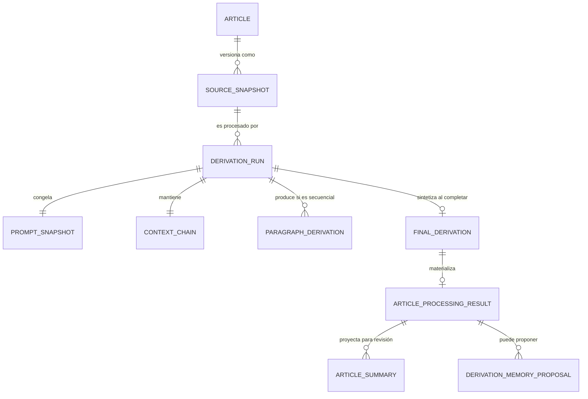
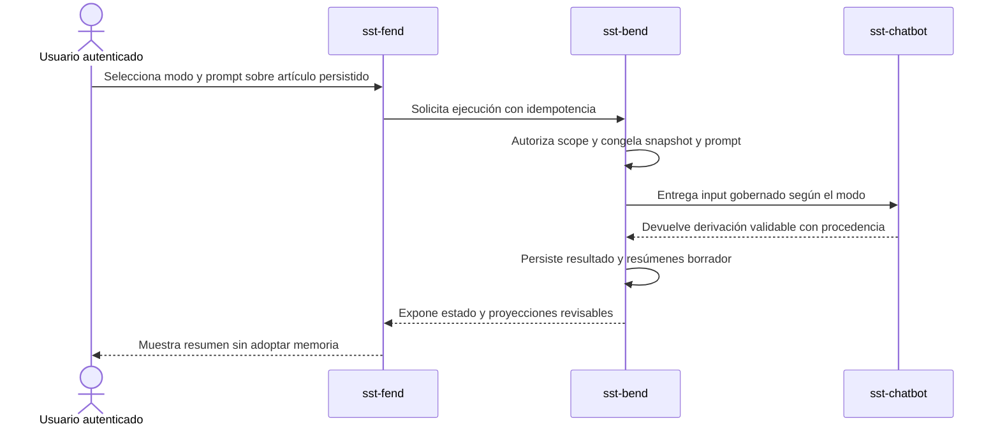

# Contrato de procesamiento de artículos con agente V1

## Intención

Un artículo persistido puede iniciar una ejecución del agente desde `Procesar con agente`. El usuario elige si el modelo recibe el documento completo o si avanza en orden, párrafo por párrafo. También puede conservar el prompt abierto por defecto, seleccionar un perfil o aportar instrucciones propias.

Cada combinación de versión del artículo, modo y prompt crea una ejecución inmutable. El sistema nunca sobrescribe el análisis anterior para aparentar continuidad.

## Entidades y responsabilidades

`DERIVATION_RUN` es la raíz. Identifica al usuario y su scope, el artículo, su snapshot, el modo y el prompt usados. Mantiene exactamente una `CONTEXT_CHAIN`:

- en `full_document`, la cadena permanece vacía en versión 0;
- en `sequential_paragraphs`, incorpora contexto acotado después de cada derivación confirmada.

La ejecución puede producir una `FINAL_DERIVATION` y un `ARTICLE_PROCESSING_RESULT`. Del resultado nacen cero o más `ARTICLE_SUMMARY` revisables y, de manera independiente, cero o más `DERIVATION_MEMORY_PROPOSAL`. Publicar un resumen no acepta memoria.

## Mapa lógico de datos

<!-- visual-map:start -->

```yaml
visual_map:
  schema_version: "1.0"
  id: "article-agent-processing-data-v1"
  type: "data"
  question: "¿Qué entidades conserva una ejecución y cómo separa resultados, resúmenes y memoria?"
  abstraction_level: "Entidades lógicas del contrato cross-repo V1."
  source_refs:
    - "evidence/requests/CR-SST-0220/article-agent-processing-contract-v1.yaml"
    - "evidence/requests/CR-SST-0219/paragraph-sequential-derivation-contract-v1.yaml"
  observed_at: "2026-08-27"
  authority_boundary: "Vista derivada; el contrato YAML y los futuros ARDS/SDD de los owners conservan autoridad."
  textual_fallback_required: true
```



### Fallback textual

```text
Un ARTICLE tiene versiones inmutables SOURCE_SNAPSHOT. Cada snapshot puede originar varios DERIVATION_RUN. Cada run congela exactamente un PROMPT_SNAPSHOT y mantiene exactamente una CONTEXT_CHAIN. Sólo el modo secuencial produce PARAGRAPH_DERIVATION. Un run completado puede sintetizar una FINAL_DERIVATION y materializar un ARTICLE_PROCESSING_RESULT. Ese resultado puede originar varios ARTICLE_SUMMARY revisables y, por separado, varias DERIVATION_MEMORY_PROPOSAL sujetas a revisión.
```

<!-- visual-map:end -->

## Dinámica entre UI y owners

<!-- visual-map:start -->

```yaml
visual_map:
  schema_version: "1.0"
  id: "article-agent-processing-sequence-v1"
  type: "sequence"
  question: "¿En qué orden colaboran el usuario, Fend, Bend y chatbot para procesar un artículo?"
  abstraction_level: "Handoff cross-repo de una ejecución exitosa V1."
  source_refs:
    - "evidence/requests/CR-SST-0220/article-agent-processing-contract-v1.yaml"
    - "requests/running/CR-SST-0220-generalize-agent-processing-modes-for-articles.yaml"
  observed_at: "2026-08-27"
  authority_boundary: "Vista derivada; el contrato YAML y los futuros contratos locales de Fend, Bend y chatbot conservan autoridad."
  textual_fallback_required: true
```



### Fallback textual

```text
El usuario selecciona modo y prompt en sst-fend sobre un artículo persistido. Fend solicita una ejecución idempotente a sst-bend. Bend autoriza el scope y congela fuente y prompt antes de entregar al chatbot un input gobernado. El chatbot devuelve una derivación validable con procedencia. Bend persiste el resultado y los resúmenes como borradores, y Fend los presenta al usuario sin aceptar memoria.
```

<!-- visual-map:end -->

## Reglas por modo

### Documento completo

El chatbot recibe el snapshot completo sólo si cumple el límite vigente. No crea derivaciones por párrafo. Si excede el límite, el sistema falla antes de enviar contenido al proveedor, explica la restricción y ofrece el modo secuencial; nunca recorta silenciosamente.

### Párrafo por párrafo

Se reutiliza el contrato de `CR-SST-0219`: secuencia inmutable, orden ascendente, checkpoints, idempotencia y procedencia por párrafo. Una falla preserva el último checkpoint confirmado y no publica una derivación final parcial como si fuera completa.

## Prompt y sesgo elegido

El perfil `open-general-analysis` queda por defecto para permitir interpretaciones amplias, distinguiendo evidencia, inferencia, incertidumbre y preguntas abiertas. Los perfiles futuros podrán orientar el análisis —por ejemplo, riesgo, sentimiento o crítica—, pero no modificarán autorización, guardrails, modo de procesamiento ni esquema de salida.

Cambiar el perfil o las instrucciones crea un run nuevo. Así el usuario puede comparar miradas sin perder la historia ni la procedencia.

## Resultado, resumen y memoria

- `ARTICLE_PROCESSING_RESULT` es el sobre técnico inmutable del run exitoso.
- `ARTICLE_SUMMARY` es una vista editorial del artículo. Nace como `draft` y puede publicarse, rechazarse o quedar reemplazada.
- `DERIVATION_MEMORY_PROPOSAL` es una candidata separada. Nace en `needs_review` y sólo una decisión autorizada puede aceptarla, corregirla o rechazarla.

## Adopción futura

El contrato no implementa runtime. Primero deben reservarse lifecycles separados para Bend, chatbot, integración, Fend y E2E. Cada owner publicará su ARDS/SDD local, pasará sus checks y cerrará con QA manual. La validación final de usuario se hará exclusivamente mediante Chrome DevTools MCP, creando el artículo desde la UI, sin scripts de base ni seeders.
