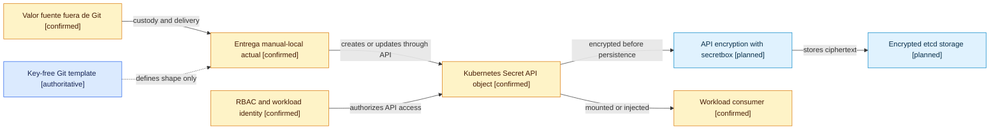
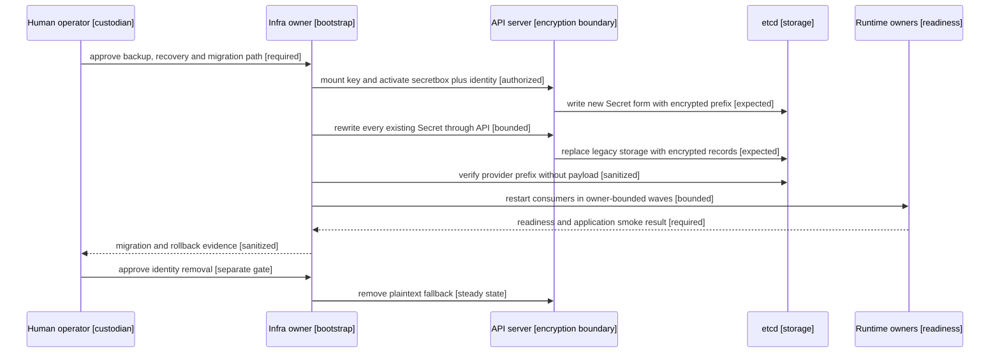

# Gobierno del cifrado de Secrets de Kubernetes en SST

Estado observado: `plan-published` al 2026-08-27.

Este documento explica visualmente la funcionalidad gobernada por
`CR-SST-0221`. La autoridad machine-readable permanece en
`state/features/kubernetes-secret-storage-encryption.current.yaml` y en el
lifecycle de la solicitud. Los mapas no autorizan cambios en el clúster, claves,
Secrets, repositorios hijos, workloads o Jira.

## Invariantes gobernadas

- El cifrado de etcd, la custodia del valor fuente y el consumo runtime son
  controles distintos y acumulativos.
- Git sólo puede contener plantillas sin valores ni claves de cifrado.
- El proveedor inicial planificado para Kind es `secretbox` y su alcance es el
  recurso `secrets`.
- `identity` puede aparecer únicamente como fallback temporal al final del
  orden de proveedores durante la migración.
- Ninguna evidencia puede mostrar valores, claves o payloads crudos.
- La pérdida de la clave, la restauración de datos y el rollback deben probarse
  antes de migrar el clúster compartido.
- Cada owner runtime valida únicamente su consumo y readiness; infraestructura
  conserva autoridad sobre bootstrap y configuración del API server.

## Mapa de dependencias de las capas de protección

<!-- visual-map:start -->
```yaml
visual_map:
  schema_version: "1.0"
  id: "sst-kubernetes-secret-protection-layers"
  type: "dependency"
  question: "Que capa protege cada etapa de un Secret y que dependencias no pueden sustituirse?"
  abstraction_level: "security control"
  source_refs:
    - "state/features/kubernetes-secret-storage-encryption.current.yaml"
    - "requests/planned/CR-SST-0221-adopt-encrypted-kubernetes-secret-storage.yaml"
  observed_at: "2026-08-27"
  authority_boundary: "Vista derivada; el feature state CR-SST-0221 y los futuros contratos del owner de infraestructura conservan autoridad."
  textual_fallback_required: true
```



### Fallback textual del mapa de dependencias

```text
El valor fuente, custodiado fuera de Git, depende de un mecanismo de entrega.
La plantilla Git define forma pero no contiene valores ni claves.
La entrega crea o actualiza un Kubernetes Secret mediante el API.
El API server cifra el Secret con secretbox antes de persistirlo en etcd.
RBAC gobierna quien puede leer el objeto; no cifra su almacenamiento.
El workload consume el Secret bajo el contrato y readiness de su owner.
Ninguna de estas capas reemplaza a otra.
```
<!-- visual-map:end -->

## Mapa del lifecycle de adopción

<!-- visual-map:start -->
```yaml
visual_map:
  schema_version: "1.0"
  id: "sst-kubernetes-secret-encryption-adoption-lifecycle"
  type: "lifecycle"
  question: "Que gate debe completarse antes de avanzar desde el baseline sin cifrado hasta el estado estable?"
  abstraction_level: "adoption gate"
  source_refs:
    - "state/features/kubernetes-secret-storage-encryption.current.yaml"
    - "requests/planned/CR-SST-0221-adopt-encrypted-kubernetes-secret-storage.yaml"
  observed_at: "2026-08-27"
  authority_boundary: "Vista derivada; el lifecycle CR-SST-0221 conserva autoridad y cada mutacion futura requiere autorizacion separada."
  textual_fallback_required: true
  status_vocabulary: ["observed", "published", "proven", "authorized", "migrating", "steady", "blocked"]
```



```mermaid
flowchart LR
    U["Unencrypted storage [confirmed]"]
    P["Plan publication [validated]"]
    C["Data and recovery approval gate [blocked]"]
    X["Disposable prototype [planned]"]
    A["Shared migration [planned]"]
    F["Encrypted plus identity fallback [planned]"]
    S["Encrypted without identity [planned]"]
    V["Rotation and recovery [validated]"]
    B["Stop and recover [blocked]"]

    U -->|"plan merge and readback"| P
    P -->|"custodian, backup and outage defined"| C
    C -->|"synthetic proof approved"| X
    X -->|"human path decision"| A
    A -->|"activate provider with bounded waves"| F
    F -->|"rewrite all Secrets and verify raw prefix"| S
    S -->|"rotate and prove recovery"| V
    C -.->|"missing recovery gate"| B
    X -.->|"migration or rollback fails"| B
    F -.->|"consumer or storage verification fails"| B

    classDef observed fill:#fef3c7,stroke:#d97706,color:#451a03
    classDef planned fill:#e0f2fe,stroke:#0284c7,color:#082f49
    classDef validated fill:#dcfce7,stroke:#16a34a,color:#052e16
    classDef blocked fill:#fee2e2,stroke:#dc2626,color:#450a0a
    class U observed
    class P,C,A,F,S planned
    class X,V validated
    class B blocked
```

### Fallback textual del mapa de lifecycle

```text
Unencrypted observed --plan merge and readback--> Plan published.
Plan published --custodian, backup and outage defined--> Data and recovery gate.
Data and recovery gate --synthetic proof approved--> Disposable prototype proven.
Disposable prototype --human path decision--> Shared migration authorized.
Shared migration --activate provider with bounded waves--> Encrypted plus identity fallback.
Encrypted plus identity fallback --rewrite and verify--> Encrypted without identity.
Encrypted without identity --rotate and recover--> Rotation and recovery validated.
Si falta recovery o falla una prueba, el flujo pasa a Stop and recover y no promociona.
```
<!-- visual-map:end -->

## Mapa de secuencia de la migración compartida

<!-- visual-map:start -->
```yaml
visual_map:
  schema_version: "1.0"
  id: "sst-kubernetes-secret-shared-migration-sequence"
  type: "sequence"
  question: "En que orden colaboran operador, API server, etcd y owners durante una migracion autorizada?"
  abstraction_level: "request execution"
  source_refs:
    - "state/features/kubernetes-secret-storage-encryption.current.yaml"
    - "requests/planned/CR-SST-0221-adopt-encrypted-kubernetes-secret-storage.yaml"
    - "evidence/requests/CR-SST-0221/baseline-and-adoption-decision-2026-08-27.md"
  observed_at: "2026-08-27"
  authority_boundary: "Vista derivada sin valores; la futura solicitud de infraestructura y su runbook owner conservaran autoridad de ejecucion."
  textual_fallback_required: true
```



### Fallback textual del mapa de secuencia

```text
1. El operador humano aprueba backup, recuperación y camino de migración.
2. Infraestructura monta la clave y activa secretbox con identity temporal al final.
3. El API server persiste nuevas escrituras cifradas en etcd.
4. Infraestructura reescribe todos los Secrets existentes mediante el API.
5. Infraestructura verifica sólo el prefijo del proveedor, nunca el payload.
6. Los consumidores se reinician por ondas acotadas y cada owner valida readiness.
7. Infraestructura entrega evidencia sanitizada al operador.
8. Una aprobación separada permite retirar identity y alcanzar el estado estable.
```
<!-- visual-map:end -->

## Mapa del ciclo de rotación de claves

<!-- visual-map:start -->
```yaml
visual_map:
  schema_version: "1.0"
  id: "sst-kubernetes-secret-encryption-key-rotation"
  type: "lifecycle"
  question: "Que pasos y gates gobiernan la rotacion segura de una clave de cifrado de Secrets?"
  abstraction_level: "key rotation gate"
  source_refs:
    - "state/features/kubernetes-secret-storage-encryption.current.yaml"
    - "requests/planned/CR-SST-0221-adopt-encrypted-kubernetes-secret-storage.yaml"
  observed_at: "2026-08-27"
  authority_boundary: "Vista derivada sin material criptografico; el futuro runbook de sst-4uentes-infra y la aprobacion del custodio conservaran autoridad operativa."
  textual_fallback_required: true
```



```mermaid
flowchart LR
    G["Generate vNext outside Git [planned]"]
    E["Escrow recovery copy [validated]"]
    D["Add old plus new decrypt keys [planned]"]
    W["Promote vNext writer [planned]"]
    R["Rewrite all Secrets through API [planned]"]
    V["Verify storage and reads [validated]"]
    K["Retain previous key for rollback [planned]"]
    X["Remove previous key [validated]"]
    B["Keep both keys and stop [blocked]"]

    G -->|"custodian receives key"| E
    E -->|"recovery copy proven"| D
    D -->|"API decrypts current data"| W
    W -->|"new writes use vNext"| R
    R -->|"rewrite completes"| V
    V -->|"all checks pass"| K
    K -->|"rollback window expires and removal approved"| X
    E -.->|"recovery proof fails"| B
    D -.->|"API read fails"| B
    V -.->|"plaintext or unreadable record detected"| B

    classDef planned fill:#e0f2fe,stroke:#0284c7,color:#082f49
    classDef validated fill:#dcfce7,stroke:#16a34a,color:#052e16
    classDef blocked fill:#fee2e2,stroke:#dc2626,color:#450a0a
    class G,D,W,R,K planned
    class E,V,X validated
    class B blocked
```

### Fallback textual del mapa de rotación

```text
Generate vNext --custodian receives key--> Escrow recovery copy.
Escrow --recovery proof passes--> Add new key while retaining the old key.
Add decrypt capability --API reads current data--> Promote vNext as writer.
Promote writer --new writes use vNext--> Rewrite all Secrets through the API.
Rewrite --complete--> Verify encrypted storage and normal API reads.
Verify --pass--> Retain previous key during the rollback window.
Retain --window expires and removal is approved--> Remove previous key.
Any recovery, API read or storage verification failure stops removal and keeps both keys.
```
<!-- visual-map:end -->

## Responsabilidades y siguientes gates

| Superficie | Autoridad | Próximo gate |
| --- | --- | --- |
| Lifecycle, coordinación y evidencia | `4uentes-orchestor` | Publicar y leer estos mapas desde `main`. |
| Bootstrap Kind y configuración del API server | `sst-4uentes-infra` | Nueva autorización y worktree limpio para el prototipo descartable. |
| Custodia y recuperación de claves | Operador humano autorizado | Definir custodio y probar una copia cifrada independiente. |
| Consumo y readiness | Owner de cada workload | Inventario y validación por ondas, sin cambiar contratos funcionales. |
| Entrega del valor fuente | Decisión posterior | Comparar SOPS+age, Sealed Secrets y External Secrets en otra CR. |
| Jira | Mirror bajo `SST-89` | Preflight y batch exacto requieren autorización independiente. |

La siguiente unidad ejecutable de `CR-SST-0221` será preparar un prototipo
reproducible en un clúster Kind descartable. Ese paso no comienza por la sola
publicación de este documento.
