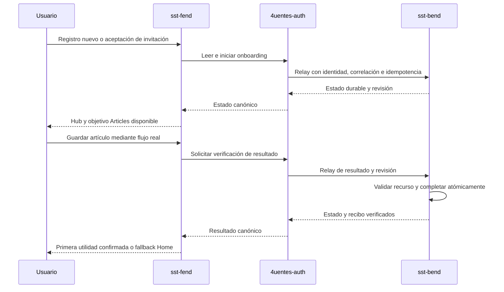

# Onboarding evolutivo y primera utilidad V1

Rol: contrato funcional de coordinación y handoff. Owner: `4uentes-orchestor`.
Estado: coordinación iniciada; implementación pendiente en los owners.
Fecha: 2026-09-08. Fuente:
[contrato V1](../../../evidence/requests/CR-SST-0240/onboarding-v1-contract.yaml).
Los contratos técnicos runtime deberán publicarse en Bend, Auth y Fend mediante
sus propios CRs. Este documento no sustituye esas fuentes ni autoriza su mutación.

El registro nuevo inicia estado durable y entra en `/onboard` sólo después de
confirmar su creación. Un usuario existente sin estado permanece en Home y
recibe una invitación que puede volver a abrir. La señal inicial de Auth dispara
el inicio; Bend determina siempre el progreso real.

V1 propone Articles como primer objetivo. Para hacerlo verificable, la primera
utilidad será crear un artículo de texto nativo mediante el flujo real: Bend
verifica el recurso y el resultado. Una visita, checkbox o afirmación del
chatbot no activa la experiencia. El binding al create existente y la prueba
de actor/intento se detallan en el plan de slices; onboarding sigue pendiente.

El usuario puede omitir, reanudar y reabrir. Al reabrir se preserva el historial,
pero la nueva activación requiere un resultado de ese intento. Un conflicto
de revisión exige volver a leer el estado; una repetición idempotente devuelve
la respuesta registrada. El timeout nunca se interpreta como éxito.

<!-- visual-map:start -->

```yaml
visual_map:
  schema_version: "1.0"
  id: "sst-onboarding-v1-owner-sequence"
  type: "sequence"
  question: "¿Qué owner conserva la autoridad al iniciar y verificar la primera utilidad?"
  abstraction_level: "Intercambio lógico entre usuario y repos owners"
  source_refs:
    - "evidence/requests/CR-SST-0240/onboarding-v1-contract.yaml"
    - "requests/planned/CR-SST-0240-define-and-coordinate-evolutionary-onboarding-v1.yaml"
  observed_at: "2026-09-08"
  authority_boundary: "Vista derivada del handoff de CR-SST-0240; Bend conserva autoridad del estado, Auth del relay y Fend de la experiencia."
  textual_fallback_required: true
```



### Fallback textual

```text
Usuario inicia por registro o invitación. Fend lee e inicia mediante Auth.
Auth propaga identidad, correlación e idempotencia a Bend. Bend devuelve
estado durable y revisión por Auth. Fend muestra Articles si está disponible.
Usuario guarda por el flujo real. Fend solicita verificación mediante Auth.
Bend valida el recurso y completa de forma atómica. Auth devuelve estado y
recibo a Fend. Fend confirma la utilidad o permite volver a Home ante fallas.
```

<!-- visual-map:end -->

## Matriz de capacidades y autoridad

| Capacidad | Productor | Consumidor | Gate de adopción |
| --- | --- | --- | --- |
| Estado y outcomes V1 | sst-bend | 4uentes-auth | API, revisión, idempotencia y verificador Articles publicados |
| Relay `/api/onboarding/*` | 4uentes-auth | sst-fend | JWT, correlación y claves preservados; sin estado de producto |
| Hub e invitación | sst-fend | Usuario | Navegación CR-SST-0238, flag y accesibilidad |
| Articles guardado | sst-bend | Verificador onboarding | Binding exacto y readiness pendiente del owner |
| Learning y Chat como metas | Owners respectivos | Onboarding | Sólo después de readiness publicada; fuera del mínimo V1 |
| Guía L1 | sst-chatbot | Usuario por UI aprobada | Opcional, sólo lectura, sin acciones ni memoria automática |
| QA Compose | Owners y control plane | Evidencia integrada | Paridad raw-v2 CR-SST-0241 y fuentes reproducibles |

## Matriz obligatoria de aceptación posterior

| Escenario | Resultado que debe probar QA |
| --- | --- |
| Registro nuevo | Un único estado durable y entrada protegida; firstLogin no sobrescribe progreso |
| Existente sin estado | Home, invitación descartable y reapertura; GET no crea estado |
| Meta y resultado válido | Sólo guardar con éxito un recurso autorizado del intento actual completa |
| Recurso inexistente, ajeno o fallido | Rechazo sin filtrar datos; estado sin completar |
| Skip, resume, refresh, reapertura | Estado durable, historial preservado y ninguna activación por mera navegación |
| Dos pestañas o dispositivos | Compare-and-swap, refetch ante 409 y convergencia sin pérdida |
| Retry, timeout y claves repetidas | Mismo resultado una vez; payload distinto con misma clave se rechaza |
| API caída, sesión vencida o flag apagado | Recuperación de sesión existente y Home seguro, sin loops |
| Chat/Learning no disponibles | Flujo estático operable; metas no anunciadas como disponibles |
| Goal pierde readiness | Preservar progreso, permitir retry, skip o Home |
| Teclado, foco, contraste, móvil, movimiento reducido | Recorrido y error accesibles sin depender de color o animación |
| Telemetría, Jira y evidencia | Sin prompts, contenido educativo ni datos sensibles |
| Cambio de versión y rollback | Historial preservado; flag desactiva entrada sin borrar estado |

Cada owner deberá publicar su contrato, documentación y checks. QA deberá
usar harness HTTP/browser reproducible con identidades sintéticas y cleanup
autorizado; el control plane ejecutará `npm run check` completo. Ninguna fila
runtime se declara probada en este lote documental.

Rollout: flag apagado, cohorte interna, registros nuevos y luego invitación a
existentes. El rollback apaga la entrada y vuelve a Home preservando progreso.
Tras repetir el preflight global se asignaron Bend CR-SST-0242, Auth
CR-SST-0243, Fend CR-SST-0244 y QA CR-SST-0245. Ver el
[binding y gates owner](../../../evidence/requests/CR-SST-0240/owner-binding-and-slice-plan.md).
