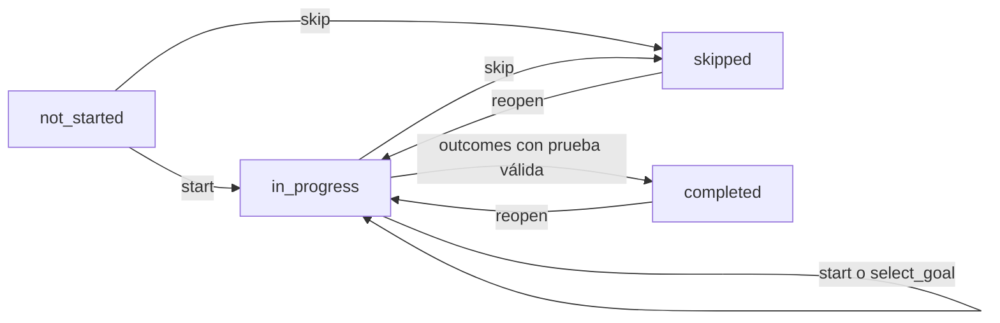
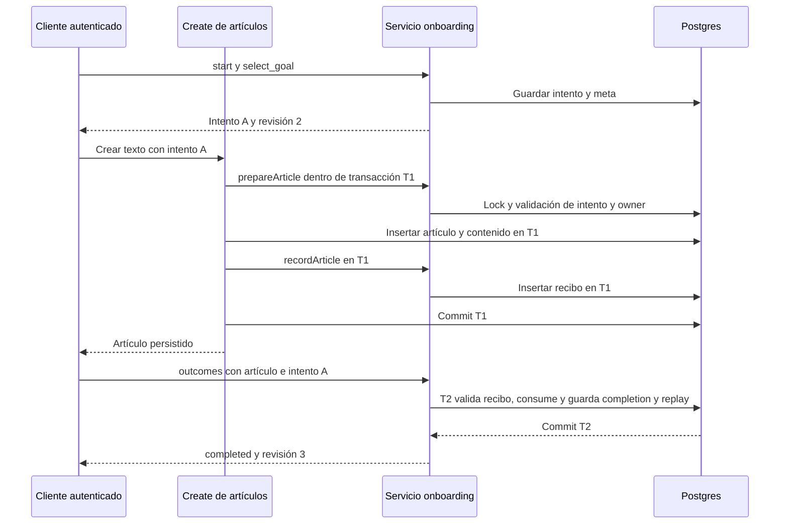
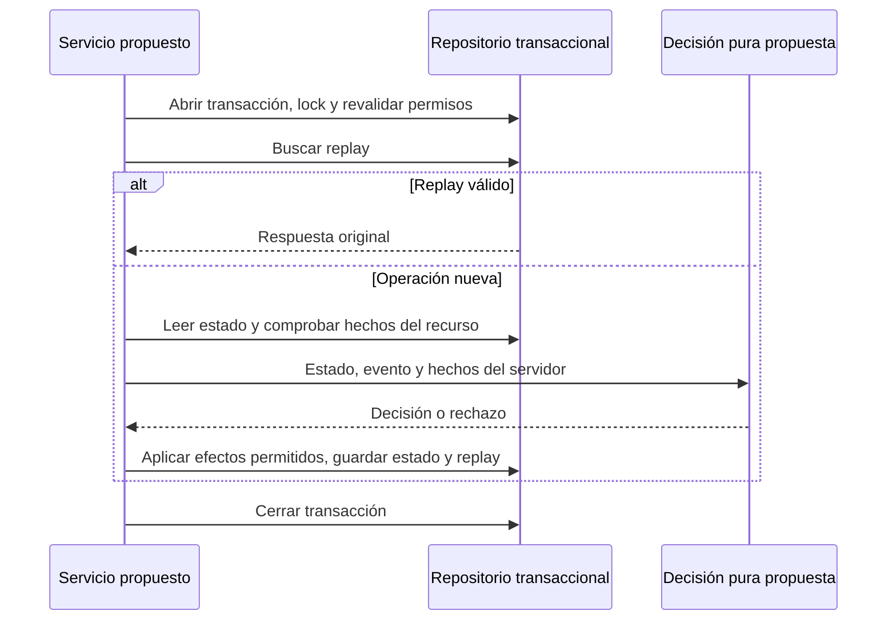

# Cómo funciona la máquina de estados del onboarding

Guía de aprendizaje y evaluación de diseño · 2026-09-10 · INIT-SST-0011 / CR-SST-0242.

El onboarding ya tiene una máquina de estados en el backend. Está implementada
con condicionales dentro de `OnboardingService.mutate`. Hacerla explícita mediante
una tabla de transiciones puede facilitar su revisión y evolución. La robustez
depende también de permisos, transacciones, persistencia y pruebas; adoptar el
patrón State por sí solo no resuelve esos problemas.

Este documento explica la implementación observada en `sst-bend` commit
`bc40bd3001cfc14c127977aa6f32c5f3f4ed1edb` y propone opciones de diseño.
Es una vista didáctica derivada, no una nueva especificación ni una autorización
de refactor o despliegue. El contrato técnico pertenece a `sst-bend`.
El [registro de implementación](../../../evidence/requests/CR-SST-0242/owner-implementation.md)
identifica las fuentes owner y la evidencia de publicación. La explicación se
fija a ese snapshot: no afirma el estado actual de un entorno desplegado.

## 1. Primero: estado, evento, condición y efecto

Imagina que una persona empieza a usar SST para guardar su primer artículo.
El sistema debe recordar dónde quedó y comprobar que realmente consiguió ese
resultado, incluso si cierra el navegador o cambia de dispositivo.

| Concepto | Pregunta que responde | Ejemplo SST |
| --- | --- | --- |
| Estado | ¿En qué situación está? | `in_progress` |
| Evento o comando | ¿Qué solicita hacer? | `skip` |
| Condición o guarda | ¿Puede hacerlo ahora? | Estado en curso y revisión vigente |
| Transición | ¿Qué situación resulta? | `in_progress → skipped` |
| Efecto | ¿Qué debemos registrar? | Timestamp, nueva revisión y respuesta de replay |
| Contexto | ¿Qué datos acompañan al estado? | Meta, intento, contador de completions |

La idea es `estado + evento + condiciones → nuevo estado + efectos`.
Un evento no habilitado se rechaza; no se fuerza un cambio arbitrario.

`status` no describe todo. Dos personas pueden estar en `in_progress`, pero una
todavía no eligió meta y la otra ya seleccionó Articles. Por eso hablamos de una
máquina con contexto adicional. `attemptId` identifica el intento; `revision`
identifica cambios del progreso; `journeyVersion` identifica la versión del
recorrido. Son tres conceptos diferentes.

## 2. Mapa del ciclo actual

<!-- visual-map:start -->

```yaml
visual_map:
  schema_version: "1.0"
  id: "onboarding-learning-lifecycle"
  type: "lifecycle"
  question: "¿Qué eventos permiten cambiar el estado del onboarding V1?"
  abstraction_level: "Estados de progreso del usuario"
  source_refs:
    - "evidence/requests/CR-SST-0242/owner-implementation.md"
    - "evidence/requests/CR-SST-0240/onboarding-v1-contract.yaml"
  observed_at: "2026-09-10"
  authority_boundary: "Vista derivada del snapshot owner bc40bd3; sst-bend conserva la autoridad técnica."
  textual_fallback_required: true
```



### Fallback textual del ciclo

```text
La ausencia se representa como not_started.
not_started admite start hacia in_progress o skip hacia skipped.
in_progress admite start y select_goal sin salir de ese estado,
skip hacia skipped y outcomes válido hacia completed.
skipped y completed admiten reopen hacia in_progress con un nuevo intento.
Las demás combinaciones se rechazan, salvo replay de una operación ya aceptada.
```

<!-- visual-map:end -->

`completed` no es un estado terminal irreversible: se permite reabrir.
Seleccionar Articles por primera vez cambia el contexto y la revisión, aunque
el estado siga siendo `in_progress`. Repetir esa selección o llamar `start`
cuando ya está en curso no cambia revisión ni timestamps. Aun así, se registra
el replay de la solicitud aceptada.

| Estado previo | Solicitud nueva | Condición específica | Resultado |
| --- | --- | --- | --- |
| `not_started` | `start` | Acceso y revisión válidos | Nuevo intento, `in_progress`, meta vacía |
| `in_progress` | `start` | Acceso y revisión válidos | Sin cambio de progreso |
| `in_progress` | `select_goal` | `selectedGoal=articles` | Selecciona meta; no-op si ya coincide |
| `not_started` o `in_progress` | `skip` | Acceso y revisión válidos | `skipped` |
| `skipped` o `completed` | `reopen` | Acceso y revisión válidos | Nuevo intento, meta vacía, `in_progress` |
| `in_progress` | `outcomes` | Meta Articles, intento actual, owner y recibo válido | Consume recibo, `completed` |
| Cualquier otra combinación | Solicitud nueva | Transición no habilitada | Error, sin cambio de progreso |

La tabla presupone flag habilitado, versión soportada e idempotencia correcta.
El replay aceptado se resuelve antes de evaluar de nuevo revisión/transición,
pero después de comprobar los permisos actuales.

## 3. Dónde vive cada responsabilidad

| Pieza | Responsabilidad observada |
| --- | --- |
| Rutas HTTP y middlewares | JWT, cuenta, sesión, DTO estricto y errores HTTP |
| `guard(scope)` | Flag y presencia del contexto autenticado; no reemplaza la validación JWT |
| `initial()` | Estado efectivo de ausencia, revisión 0; no inserta filas |
| `view(state)` | Agrega readiness V1: Articles sí, Learning y Chat no |
| `get(scope)` | Revalida acceso y lee estado en transacción; toma lock aunque no escriba progreso |
| `mutate(...)` | Coordina replay, revisión, transición y persistencia |
| `prepareArticle(...)` | Comprueba intento y rol dentro de la transacción de creación |
| `recordArticle(...)` | Inserta recibo dentro de esa misma transacción |
| `OnboardingRepository` | SQL, locks, estado, recibos, replay y purga |

El servicio recibe repositorio, reloj y comprobación de flag mediante su
constructor. Poder sustituirlos facilita probar expiración y reglas sin depender
del tiempo real. `mutate` tiene nombre genérico porque comparte mecanismos de
escritura; no es una operación CRUD que acepte cualquier estado desde el cliente.

`recordArticle` es un colaborador interno: presupone que el caso de uso ejecutó
`prepareArticle` y le pasa la transacción correcta. No debe exponerse directamente
como endpoint. El snapshot confía en ese protocolo entre métodos.

## 4. Un ejemplo completo con revisiones

Una persona sin progreso consulta GET: recibe `not_started`, `exists=false`,
`revision=0`; no se crea una fila. Luego envía `start` con revisión esperada 0:
obtiene intento A y revisión 1. Selecciona Articles con revisión esperada 1:
obtiene revisión 2.

Al crear texto nativo, envía `onboardingAttemptId=A`. El backend guarda artículo
y recibo juntos. El progreso sigue en curso y conserva revisión 2. Después envía
`outcomes` con el ID real del artículo, intento A y revisión esperada 2. Si la
prueba es válida, recibe `completed`, revisión 3 y contador 1.

Reabrir con revisión esperada 3 produce intento B, revisión 4 y meta vacía.
Conserva el contador y el último resumen de completion. Un recibo de A ya no
sirve para completar B. Estos números ilustran un recorrido sin otras escrituras.

<!-- visual-map:start -->

```yaml
visual_map:
  schema_version: "1.0"
  id: "onboarding-learning-proof-sequence"
  type: "sequence"
  question: "¿Por qué crear un artículo y completar onboarding son operaciones distintas?"
  abstraction_level: "Operaciones de aplicación y sus transacciones"
  source_refs:
    - "evidence/requests/CR-SST-0242/owner-implementation.md"
  observed_at: "2026-09-10"
  authority_boundary: "Vista derivada; el servicio y create de sst-bend bc40bd3 son autoridad del comportamiento observado."
  textual_fallback_required: true
```



### Fallback textual de la secuencia

```text
Cliente inicia y selecciona meta; onboarding guarda intento y devuelve revisión.
Cliente pide crear texto. Create llama prepareArticle dentro de T1.
Tras validar y bloquear, T1 inserta artículo, contenido y recibo, y hace commit.
Create devuelve el artículo. Sólo entonces el cliente solicita outcomes.
En T2 onboarding valida el recibo, lo consume y guarda completion y replay juntos.
Tras commit T2 devuelve completed. Si T1 falla no hay artículo ni recibo nuevos;
si T2 falla no hay consumo ni completion nuevos, pero el artículo de T1 permanece.
```

<!-- visual-map:end -->

Visitar una página no acredita un resultado. Tampoco basta presentar el ID de un
artículo que pertenece a la cuenta: el recibo debe vincularlo al mismo actor,
cuenta e intento actual. Debe seguir vigente y el artículo debe existir.
El create normal, sin metadata onboarding, no genera ese recibo.

## 5. Qué hace robusto al sistema actual

| Problema | Protección actual | Límite importante |
| --- | --- | --- |
| Dos pestañas escriben sobre revisión 2 | Lock por usuario y `expectedRevision` | La segunda debe consultar otra vez si perdió la carrera |
| Se perdió la respuesta de una escritura | Replay de misma operación, clave y payload | Vigencia 24 h; devuelve respuesta original, no necesariamente el estado más reciente |
| Se reutiliza clave con otro contenido | Hash canónico del body y cuenta | Produce conflicto; no interpreta la nueva intención |
| Falla la creación a mitad de camino | Artículo y recibo en T1 | No cubre acciones externas arbitrarias posteriores al commit |
| Dos solicitudes intentan completar | Validación, consumo y estado en T2, con lock | El backend decide; el cliente no envía un estado final confiable |
| Se revocaron permisos | Revalidación transaccional de acceso y owner para create/outcomes | Un replay no elude la autorización actual |
| Hay pruebas antiguas | Intento vigente y expiración | Recibo pendiente 30 días; consumido 24 h |
| El usuario elimina datos | Cascades y resumen acotado | El resumen de completion no guarda IDs de artículos ni contenido |

Idempotencia y revisión resuelven problemas diferentes: la primera reconoce
un reintento; la segunda detecta una intención basada en datos antiguos. Los
locks funcionan entre procesos mediante Postgres; un mutex sólo en memoria
no bastaría con varias instancias del backend.

## 6. Relación con el material de patrones de diseño

Se revisaron los ejemplos locales `design-patterns-en/TypeScript/src/State/Conceptual/index.ts`
y `design-patterns-en/TypeScript/src/State/RealWorld/index.ts`, dentro de la
carpeta de curso indicada. El primero usa `Context`, `State` y estados concretos;
el segundo representa una máquina expendedora con crédito, inventario y estados.
Esta guía parafrasea su estructura y no reproduce el código del curso.
El PDF `design-patterns-es.pdf` no se utilizó como fuente de contenido: no había
un lector PDF disponible en el entorno de esta ejecución.

**Máquina de estados** es el modelo de estados, eventos y transiciones.
**Patrón State** es una forma orientada a objetos de organizar su comportamiento:
el contexto delega al objeto de estado actual. SST ya tiene el primer concepto,
pero no implementa esa estructura de clases del segundo.

En una adaptación del patrón, `InProgressState` podría decidir cómo responde a
`selectGoal` o `skip`; `CompletedState` podría aceptar `reopen`. El contexto
coordinaría la operación. Al leer la base se reconstruiría el comportamiento a
partir del estado persistido: guardar un objeto JavaScript en memoria no permite
reanudar tras un reinicio ni sincronizar dispositivos.

| Alternativa | Qué mejora | Coste o riesgo | Ajuste al onboarding actual |
| --- | --- | --- | --- |
| Condicionales actuales | Pocas piezas y recorrido compacto | `mutate` mezcla decisiones con coordinación de persistencia | Comprensible con cuatro estados; requiere disciplina al crecer |
| Tabla explícita y función de transición | Transiciones enumerables, pruebas exhaustivas y mapa derivable | Hay que modelar guardas, efectos y contexto con precisión | Propuesta preferida para una evolución pequeña |
| Patrón State con clases | Separa comportamientos complejos por estado | Más clases; transiciones pueden dispersarse; no agrega atomicidad | Útil si cada estado adquiere reglas sustancialmente distintas |
| Motor de statecharts o workflows | Puede modelar jerarquía, regiones paralelas y temporizadores | Dependencia, integración, versionado y persistencia por evaluar | Evaluar cuando existan esas necesidades; no es requisito de V1 |

Esta comparación es una evaluación del código observado, no una medición de
rendimiento ni una recomendación de una biblioteca concreta. Ninguna alternativa
es automáticamente más segura por su nombre o por reducir los `if`.

## 7. Propuesta: separar decisión de coordinación

Para SST propondría conservar las garantías transaccionales y extraer una
función de transición: recibe estado, evento y hechos ya comprobados; devuelve
una decisión sin consultar la base. El servicio conserva autenticación,
revalidación de permisos, lectura, replay y persistencia.

```js
// Boceto didáctico, no implementado ni suficiente para sustituir mutate.
const edges = {
  not_started: { start: 'in_progress', skip: 'skipped' },
  in_progress: {
    start: 'in_progress', select_goal: 'in_progress',
    skip: 'skipped', outcomes: 'completed'
  },
  skipped: { reopen: 'in_progress' },
  completed: { reopen: 'in_progress' }
};
// La tabla sólo responde si hay arista y cuál es el destino.
// Faltan guardas, contexto, no-ops y efectos: no ejecutar como política completa.
```

Una arista `outcomes → completed` nunca debe bastar para completar. La guarda
también necesita meta, intento y recibo verificado por el servidor. Esos hechos
se obtienen y utilizan dentro de la misma transacción; no llegan como booleanos
confiables del navegador. El consumo del recibo y la escritura del estado deben
seguir siendo atómicos.

<!-- visual-map:start -->

```yaml
visual_map:
  schema_version: "1.0"
  id: "onboarding-learning-proposed-separation"
  type: "sequence"
  question: "¿Cómo separar reglas y persistencia sin perder garantías?"
  abstraction_level: "Colaboración propuesta entre servicio y decisión pura"
  source_refs:
    - "docs/projects/sst/onboarding-maquina-de-estados-guia.md"
    - "evidence/requests/CR-SST-0242/owner-implementation.md"
  observed_at: "2026-09-10"
  authority_boundary: "Vista derivada de una propuesta didáctica no implementada; sst-bend conserva autoridad técnica."
  textual_fallback_required: true
```



### Fallback textual de la propuesta

```text
Propuesta no implementada: servicio abre transacción, bloquea y revalida permisos.
Si existe replay válido, obtiene la respuesta original y cierra transacción.
Si no existe, lee estado y verifica hechos, llama a la decisión pura y recibe
una decisión o rechazo. Una decisión válida permite efectos y persistencia
dentro de esa transacción. Un rechazo cancela sin efectos confirmados.
```

<!-- visual-map:end -->

Métodos públicos `start`, `selectGoal`, `skip`, `reopen` y `verifyOutcome` podrían
expresar mejor la intención y compartir un coordinador privado. Cambiar el nombre
de `mutate` no constituye por sí mismo esa separación: lo relevante es sacar
la decisión de transición de la lógica SQL/transaccional.

## 8. ¿Construirla a partir de documentación sería más robusto?

Sí puede mejorar la robustez **si la documentación se convierte en un contrato
preciso y verificable**. Una explicación narrativa ayuda a comprender, pero deja
ambigüedades. Un Mermaid dibuja relaciones, pero tampoco define por sí solo
permisos, expiración o atomicidad.

El recorrido propuesto es: casos de producto → matriz de transiciones y guardas
en una spec owner → implementación → pruebas → mapas derivados. Si se usa YAML
o JSON ejecutable, necesita schema, versión, validación y una lista cerrada de
guardas/acciones implementadas; no debe evaluar código arbitrario del documento.

Conviene mantener una única definición owner de las transiciones y derivar el
mapa y casos parametrizados. Sin embargo, las pruebas de invariantes deben
definirse también desde requisitos independientes: generar implementación y
tests desde una misma tabla equivocada puede hacer que ambos coincidan en el error.

Antes de convertir la propuesta en refactor, el owner debería verificar:

1. **Equivalencia:** todas las parejas estado/evento tienen resultado explícito,
   incluidas las inválidas, los no-ops y el replay previo a revisión.
2. **Invariantes:** sólo un resultado real completa; otro actor o intento no
   puede usar el recibo; `reopen` genera otro intento y conserva el resumen.
3. **Concurrencia y fallos:** conservar las pruebas Postgres de doble escritura,
   rollback, permisos revocados, replay y expiración, además de pruebas puras.
4. **Evolución:** definir qué ocurre con journeys antiguos antes de agregar
   estados o cambiar transiciones; no reinterpretar silenciosamente progreso V1.
5. **Documentación:** actualizar spec, guía owner y capability en el mismo cambio,
   con lifecycle propio antes de modificar repos funcionales.

La recomendación para este tamaño de problema es una tabla explícita más una
decisión pura, si se decide refactorizar. El patrón State del curso sería una
opción razonable cuando crezca el comportamiento específico de cada estado.
En ambos casos se conservan los mecanismos actuales de integridad en Postgres.

## 9. Fuentes y mantenimiento como código

Fuentes técnicas fijadas al snapshot estudiado:

- [Servicio owner](https://github.com/afpogo/sst-bend/blob/bc40bd3001cfc14c127977aa6f32c5f3f4ed1edb/src/apps/sst/application/onboarding/onboarding.service.js).
- [Repositorio owner](https://github.com/afpogo/sst-bend/blob/bc40bd3001cfc14c127977aa6f32c5f3f4ed1edb/src/apps/sst/infrastructure/db/postgres/onboarding/onboarding.repository.js).
- [Contrato API owner](https://github.com/afpogo/sst-bend/blob/bc40bd3001cfc14c127977aa6f32c5f3f4ed1edb/specs/api/onboarding.yaml).
- [Guía y runbook owner](https://github.com/afpogo/sst-bend/blob/bc40bd3001cfc14c127977aa6f32c5f3f4ed1edb/docs/api/onboarding.md).
- Ejemplos locales del curso identificados en la sección 6; no se incorporan sus
  archivos al repositorio. TODO: registrar versión del paquete del curso si se
  requiere reproducir exactamente esa fuente en otro equipo.

Este Markdown se revisa mediante diff. Sus mapas incluyen fuentes, fecha y
alternativa textual; no requieren color para interpretarse. Al cambiar el
comportamiento owner deben revisarse juntos la matriz, los ejemplos y los mapas.
`npm run check` valida el control plane y la estructura documental. El render
Mermaid es un gate separado; ninguno de esos checks prueba por sí solo la
equivalencia de una futura implementación.

Validación de esta edición: `npm run check` completo aprobado, 54 documentos,
70 mapas y 0 FAIL; `git diff --check` sin errores. Los tres mapas nuevos pasaron
la validación estructural. No se ejecutó render gráfico: el paquete Mermaid
fijado por el perfil no está disponible en los módulos locales inspeccionados.

No se incluye un runbook de refactor: el documento es de aprendizaje y evaluación,
y no se ha seleccionado ni autorizado ese cambio funcional. La operación del
backend permanece descrita en su runbook owner enlazado arriba.

## 10. Adopción frontend aceptada

El frontend adoptará una máquina XState v5 dedicada. Esta máquina coordinará
loading, navegación, acciones pendientes, conflictos, reintentos y fallback;
no reemplazará el estado durable de Bend. Tampoco reutilizará `StepperMachine`,
porque un índice local de pasos no representa revisión, intento, idempotencia ni
resultado verificado.

El diseño, eventos, estados de interacción, integración con ArticleModal y
pruebas están detallados en
[`xstate-architecture-and-execution-plan-2026-09-11.md`](../../../evidence/requests/CR-SST-0244/xstate-architecture-and-execution-plan-2026-09-11.md).
CR-SST-0244 permanece planned hasta que Auth publique el relay de CR-SST-0243.
