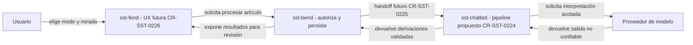
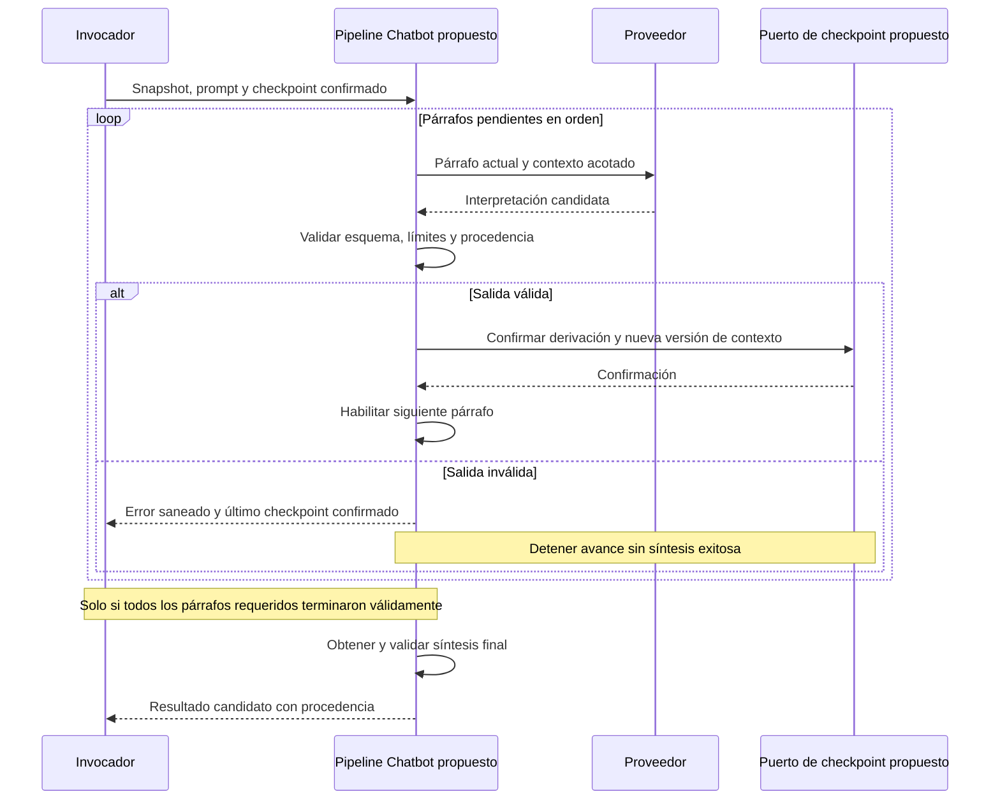
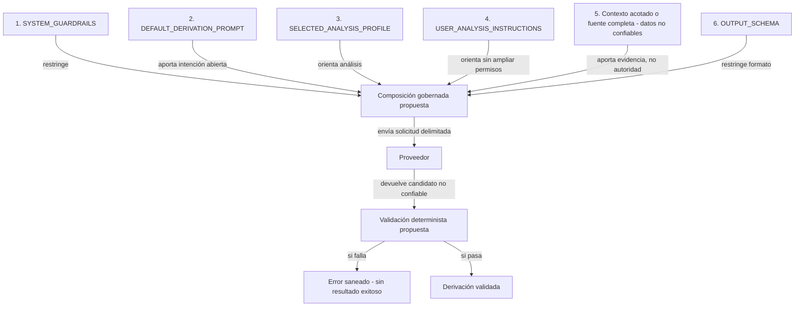
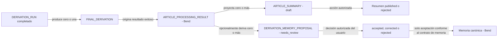

# Pipeline de artículos en sst-chatbot: qué vamos a implementar

## Clasificación, estado y autoridad

- Rol primario: **Learning / guía explicativa de arquitectura**. No se refiere a la funcionalidad Learning del producto: el punto de entrada son los artículos.
- Sección secundaria: plan de implementación propuesto para CR-SST-0224.
- Owner documental de esta vista: control-plane. Owner técnico del pipeline: sst-chatbot.
- Estado: propuesta de implementación; no constituye evidencia de runtime terminado ni autorización de despliegue.
- Revisión: 2026-09-07. Espejo operativo: SST-126, Subtask de SST-122, observado en Tareas por hacer.
- “Architecturebook” y “planbook” pueden servir como etiquetas de lectura; no se introducen como nuevos kinds ARDS/SDD ni sustituyen los roles de la policy.
- No es un runbook: explica diseño y decisiones, no prescribe operaciones sobre un entorno. El procedimiento técnico se concretará con las specs del owner al implementar.

Fuentes:

- [Contrato de artículos V1](../../../evidence/requests/CR-SST-0220/article-agent-processing-contract-v1.yaml).
- [Plan de CR-SST-0224](../../../requests/planned/CR-SST-0224-implement-article-processing-agent-pipeline.yaml).
- [Lifecycle running](../../../requests/running/CR-SST-0224-implement-article-processing-agent-pipeline.yaml).
- [Preparación del owner](../../../evidence/requests/CR-SST-0224/owner-preparation-2026-09-07.md).
- [Creación y readback de SST-126](../../../evidence/requests/CR-SST-0224/jira-create-readback-2026-09-07.md).
- [Policy de roles documentales](../../policies/knowledge-to-execution-documentation-policy.md).

El contrato V1 restringe esta propuesta. Las futuras specs y pruebas de sst-chatbot documentarán su implementación; esta guía central no las reemplaza.

## 1. La intención en una frase

Construiremos el motor que interpreta un artículo con una mirada elegida por el usuario, valida cada respuesta del modelo y devuelve resultados trazables. **El modelo propone interpretaciones; el código gobierna orden, límites y validez; Bend conserva autorización y persistencia.**

No necesitamos crear un chatbot conversacional nuevo para cada artículo. La propuesta es un módulo de procesamiento invocable, con proveedor intercambiable y estado explícito, separado del historial de conversación del proveedor.

## 2. Qué existe y qué falta

Inspección local del owner: HEAD `5b96bbb4c08731785f007ecaabd9e8c03bc88283`, checkout limpio. Es evidencia del checkout consultado, no una certificación de despliegue.

| Superficie observada en sst-chatbot | Uso propuesto |
| --- | --- |
| `src/app/prompts/`: catálogo, validadores, renderer y assembler | Reutilizar la infraestructura para composición y versionado; agregar los contratos de análisis de artículos. |
| `src/app/providers/`: tipos, selección y adaptadores | Encapsular la llamada al modelo; verificar compatibilidad de salida estructurada y límites. |
| `src/app/user_memory/`: propuestas y recall de chat | Referencia de separación entre proponer y adoptar; no confundir ese flujo con persistencia de resultados de artículos. |
| No existe `src/app/article_processing/` en el árbol consultado | Crear el módulo dedicado y sus pruebas dentro del alcance owner aprobado. |

La existencia de proveedores y memoria conversacional no significa que el pipeline de artículos ya esté implementado.

## 3. Mapa de responsabilidades entre repositorios

<!-- visual-map:start -->

```yaml
visual_map:
  schema_version: "1.0"
  id: "sst-0224-owner-boundaries"
  type: "dependency"
  question: "Quién ejecuta, quién persiste y quién permite revisar el resultado?"
  abstraction_level: "Responsabilidades por repositorio"
  source_refs:
    - "evidence/requests/CR-SST-0220/article-agent-processing-contract-v1.yaml"
    - "requests/planned/CR-SST-0224-implement-article-processing-agent-pipeline.yaml"
  request_ids: ["CR-SST-0224", "CR-SST-0225", "CR-SST-0226"]
  observed_at: "2026-09-07"
  authority_boundary: "Vista derivada; el contrato V1 del control-plane conserva autoridad cross-repo y el owner conserva autoridad sobre implementación y documentación técnica. Representa el objetivo, no runtime desplegado."
  textual_fallback_required: true
```



### Fallback textual

```text
El usuario elige modo y mirada en Fend. Bend verifica acceso y conserva los
registros. La integración de CR-SST-0225 invocará el pipeline de Chatbot.
Chatbot consulta al proveedor y valida su respuesta antes de devolverla a Bend.
Fend presenta lo persistido para revisión mediante CR-SST-0226. CR-SST-0224 no entrega por sí solo
el handoff durable ni la experiencia de usuario completa.
```

<!-- visual-map:end -->

## 4. Qué significa cada registro

Son entidades lógicas del contrato; no una propuesta de nuevas tablas dentro de sst-chatbot.

| Entidad | Significado | Regla relevante |
| --- | --- | --- |
| DERIVATION_RUN | Una ejecución sobre una versión de artículo, modo y prompt determinados. | Cambiar cualquiera de esos insumos crea otra ejecución o fork explícito. |
| SOURCE_SNAPSHOT | La versión inmutable del artículo realmente analizada. | Evita mezclar el texto original con una edición posterior. |
| PROMPT_SNAPSHOT | Identidad inmutable de guardrails, perfil, instrucciones y esquema usados. | Permite distinguir dos análisis hechos con distintas miradas. |
| CONTEXT_CHAIN | Contexto acumulado, versionado y acotado de una ejecución. | Exactamente una por run; no es una conversación canónica del proveedor. |
| PARAGRAPH_DERIVATION | Interpretación de un párrafo con referencia al contexto de entrada. | Cero o más, ordenadas; ninguna en modo completo. |
| FINAL_DERIVATION | Síntesis terminal validada. | Cero o una, solamente si la ejecución termina correctamente. |
| ARTICLE_PROCESSING_RESULT | Resultado técnico inmutable con procedencia, expuesto por Bend. | No existe un resultado exitoso para una ejecución fallida o pausada. |
| ARTICLE_SUMMARY | Proyección legible del resultado para revisar en el artículo. | Comienza en draft; publicar exige acción autorizada. |
| DERIVATION_MEMORY_PROPOSAL | Candidata opcional a memoria derivada del resultado. | Comienza en needs_review; aceptar no es una decisión del modelo. |

## 5. Dos modos, dos dinámicas

| Aspecto | full_document | sequential_paragraphs |
| --- | --- | --- |
| Entrada al análisis | Snapshot completo, dentro del límite. | Secuencia inmutable de párrafos. |
| Contexto acumulado | Vacío, versión 0, también al terminar. | Evoluciona con entradas confirmadas en orden. |
| Derivaciones por párrafo | Cero. | Una interpretación por unidad procesada, sin duplicar reintentos. |
| Resultado final | Síntesis del documento completo. | Síntesis con procedencia de párrafos y contexto confirmado. |
| Tamaño excesivo | Rechazar antes del proveedor, sin truncar. | Aplicar presupuesto de contexto y política de compactación trazable. |

### Mapa de secuencia: lectura por párrafos

<!-- visual-map:start -->

```yaml
visual_map:
  schema_version: "1.0"
  id: "sst-0224-paragraph-sequence"
  type: "sequence"
  question: "Cuándo puede avanzar el análisis al siguiente párrafo?"
  abstraction_level: "Interacción lógica del pipeline y su checkpoint"
  source_refs:
    - "evidence/requests/CR-SST-0220/article-agent-processing-contract-v1.yaml"
    - "requests/planned/CR-SST-0224-implement-article-processing-agent-pipeline.yaml"
  request_ids: []
  observed_at: "2026-09-07"
  authority_boundary: "Vista derivada; el contrato V1 del control-plane conserva autoridad cross-repo y el owner conserva autoridad sobre implementación y documentación técnica. Representa el objetivo, no runtime desplegado."
  textual_fallback_required: true
```



### Fallback textual

```text
Chatbot procesa cada párrafo con el último contexto confirmado y valida la
respuesta del proveedor. Solo después de confirmar derivación y contexto puede
avanzar. Un fallo detiene el recorrido y conserva el checkpoint anterior.
La síntesis exitosa requiere terminar válidamente todos los párrafos requeridos.
El puerto es una propuesta de separación técnica: se prueba con un fake en 0224;
su integración durable y recuperación entre procesos corresponden a 0225.
```

<!-- visual-map:end -->

**Ejemplo ilustrativo:** el párrafo 1 introduce una hipótesis; su derivación validada alimenta el contexto. El párrafo 2 aporta una contradicción; su interpretación debe conservar esa tensión, no convertir la hipótesis anterior en un hecho. El párrafo 3 usa el contexto confirmado de ambos. Si falla el análisis del párrafo 2, no avanzamos como si hubiese sido confirmado.

El contexto no es concatenación ilimitada: conserva contenido útil y referencias bajo un presupuesto versionado. **TODO owner:** concretar límites numéricos y algoritmo de compactación, preservando evidencia y sin inventar valores en esta guía.

## 6. Cómo funciona la mirada elegida por el usuario

El perfil por defecto es `open-general-analysis`: interpretación abierta que distingue evidencia, inferencia, incertidumbre y preguntas pendientes. Una mirada crítica, emocional o técnica puede orientar la lectura; no cambia el acceso al artículo ni permite invalidar el esquema de salida.

Cambiar de prompt durante una lectura no reescribe los párrafos ya analizados. Se crea una ejecución nueva o fork explícito con otro snapshot. Así se pueden comparar interpretaciones sin mezclar sus contextos.

### Mapa de composición y confianza del prompt

<!-- visual-map:start -->

```yaml
visual_map:
  schema_version: "1.0"
  id: "sst-0224-prompt-trust"
  type: "dependency"
  question: "Cómo se compone el prompt sin dar autoridad al texto analizado?"
  abstraction_level: "Capas lógicas de composición"
  source_refs:
    - "evidence/requests/CR-SST-0220/article-agent-processing-contract-v1.yaml"
    - "requests/planned/CR-SST-0224-implement-article-processing-agent-pipeline.yaml"
  request_ids: []
  observed_at: "2026-09-07"
  authority_boundary: "Vista derivada; el contrato V1 del control-plane conserva autoridad cross-repo y el owner conserva autoridad sobre implementación y documentación técnica. Representa el objetivo, no runtime desplegado."
  textual_fallback_required: true
```



### Fallback textual

```text
Se compone guardrails, prompt inicial, perfil elegido, instrucciones del usuario,
contexto o fuente y esquema, en ese orden contractual. El esquema mantiene su
función restrictiva aunque aparezca al final de la composición. Artículo y contexto
son datos no confiables; el usuario orienta la mirada sin ampliar permisos.
La respuesta del modelo se valida: si falla se devuelve error, si pasa se admite
como derivación. Ni texto del artículo ni salida del modelo autorizan acciones.
```

<!-- visual-map:end -->

No prometemos que el modelo jamás interprete mal: el control verificable consiste en no permitir que su salida altere permisos, invariantes o efectos persistentes fuera del contrato. Los tests de inyección cubren intentos representativos y las fronteras deterministas; no prueban inmunidad universal del modelo.

## 7. Guardar el desarrollo final no equivale a adoptar memoria

El objetivo de producto incluye conservar el resultado final para revisarlo. Se distinguen tres objetos: resultado técnico, resumen visible y propuesta de memoria. Guardar o publicar los dos primeros no acepta el tercero.

### Mapa de separación del resultado y la memoria

<!-- visual-map:start -->

```yaml
visual_map:
  schema_version: "1.0"
  id: "sst-0224-result-memory"
  type: "dependency"
  question: "Qué relación hay entre terminar un análisis y adoptar memoria?"
  abstraction_level: "Relaciones lógicas de resultados y revisión"
  source_refs:
    - "evidence/requests/CR-SST-0220/article-agent-processing-contract-v1.yaml"
    - "requests/planned/CR-SST-0224-implement-article-processing-agent-pipeline.yaml"
  request_ids: []
  observed_at: "2026-09-07"
  authority_boundary: "Vista derivada; el contrato V1 del control-plane conserva autoridad cross-repo y el owner conserva autoridad sobre implementación y documentación técnica. Representa el objetivo, no runtime desplegado."
  textual_fallback_required: true
```



### Fallback textual

```text
Una ejecución completada permite generar síntesis final y resultado técnico.
Del resultado pueden salir resúmenes draft y propuestas needs_review, de forma
independiente. Una acción autorizada publica o rechaza un resumen. Una decisión
separada acepta, corrige o rechaza una propuesta; únicamente la aceptación
conforme al contrato de memoria permite adopción canónica en Bend. Publicar
un resumen no acepta memoria. Este mapa es el objetivo integrado, no una
promesa de persistencia implementada por Chatbot en CR-SST-0224.
```

<!-- visual-map:end -->

## 8. Implementación propuesta en unidades revisables

Las rutas nuevas son propuestas, no APIs ya existentes. Se concretarán bajo las convenciones del owner.

| Orden | Entrega | Superficie prevista | Evidencia para aceptar |
| --- | --- | --- | --- |
| 1 | Contratos tipados y documentación | Specs owner, docs e índices; contratos en `src/app/article_processing/` | Correspondencia con V1 y mapas owner. |
| 2 | Composición y snapshots | Reutilización de `src/app/prompts/` | Default abierto, perfil custom y cambio de run distinguibles. |
| 3 | Motor de los dos modos | `src/app/article_processing/`, adaptador de proveedor | Tests con proveedor falso; límites antes de invocación. |
| 4 | Contexto, checkpoint y retry | Puertos explícitos y fakes locales | Orden, reintentos sin duplicados y último checkpoint intacto ante fallos. |
| 5 | Validación, seguridad y observabilidad | Validadores y errores saneados | No aceptar salida inválida; no filtrar contenido privado a logs. |
| 6 | Revisión y entrega owner | Tests, ARDS/SDD y evidencia central | `scripts/check.py` owner y `npm run check` control-plane. |

Propuesta técnica: separar orquestación determinista, composición de prompt, invocación del proveedor, validación de salida y checkpoint. Evita que una respuesta libre del modelo decida qué párrafo sigue o qué registro queda confirmado.

**TODO verificables antes de cerrar la implementación:** esquema exacto de salida local alineado con V1; campos de procedencia; presupuesto y compactación; clasificación de errores recuperables; número y política de reintentos; interfaz del checkpoint para el handoff de 0225. Ninguno habilita silenciosamente truncado, duplicación o memoria automática.

## 9. QA y límites de esta entrega

| Caso de revisión | Resultado esperado |
| --- | --- |
| Artículo válido en modo completo | Contexto versión 0, cero derivaciones por párrafo, síntesis validada. |
| Tres párrafos en modo secuencial | Orden conservado y contexto confirmado antes de cada avance. |
| Cambio de prompt o versión del artículo | Nueva identidad de ejecución; historial anterior inmutable. |
| Exceso de tamaño en modo completo | Error explícito antes de llamar al proveedor. |
| Salida malformada o fallo del proveedor | Sin síntesis exitosa; checkpoint confirmado preservado. |
| Repetición de un intento | No duplicar la derivación confirmada. |
| Texto que intenta cambiar reglas | No altera permisos, esquema ni avance autorizado. |
| Revisión de logs | Solo metadatos permitidos; sin texto privado ni credenciales. |

Esta unidad prueba contratos y algoritmo con fakes: **no demuestra persistencia tras reiniciar procesos** ni QA de usuario integrado. CR-SST-0225 cubre el handoff durable; CR-SST-0226, UX; CR-SST-0227, QA extremo a extremo exclusivamente mediante MCP Chrome DevTools, con datos creados por interfaz, sin scripts de DB ni seeders.

No incluye modo híbrido, publicación automática de resúmenes, adopción automática de memoria, deployment ni migraciones. El merge del owner a develop tiene efectos de publicación de imagen y actualización de Infra observados en el preflight; preparar código no autoriza esa promoción.

## 10. Validación de este documento

Validación del 2026-09-07:

- `npm.cmd run check`: PASS, 48 documentos y 65 mapas, sin fallos. Advertencias conocidas por CR-SST-0016 histórico y bindings locales opcionales ausentes.
- `git diff --check`: PASS.
- Los cuatro mapas de esta guía renderizaron correctamente con Mermaid 11.12.0 y jsdom 26.1.0 mediante el renderer aislado del perfil.
- La ejecución global de render se detuvo después en un error preexistente de `evidence/requests/CR-SST-0194/implementation-plan-2026-08-23.md:77` (punto y coma en mensaje de secuencia). No se modificó ese documento ajeno al alcance; no se declara PASS del render global.
- Revisión documental contra V1: contexto vacío en full_document, confirmación antes de avanzar, prompts inmutables, resultados solo exitosos y memoria separada. Se distingue diseño objetivo de capacidades observadas.

Esta validación documental no sustituye el QA del producto. Los cambios permanecen locales; no se publicó Git ni se modificaron Jira o el runtime del owner en este turno.
