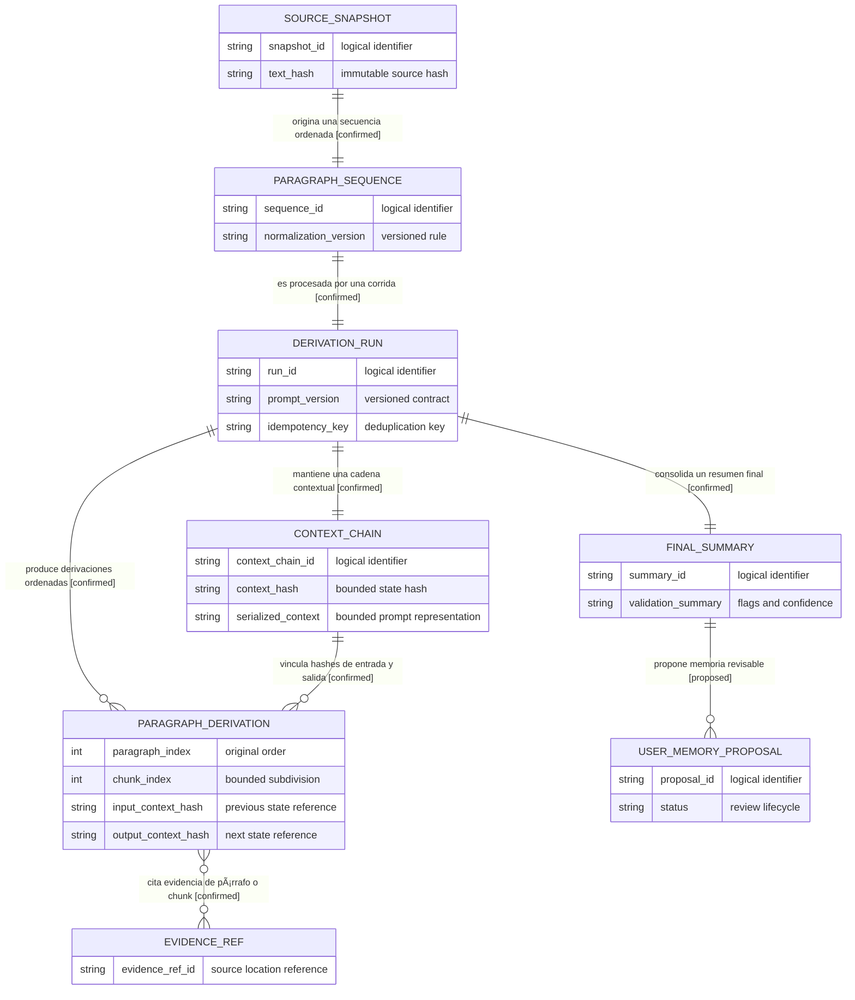

# Propuesta De Derivación Secuencial Por Párrafos

Fecha observada: 2026-08-22.

> Estado posterior (2026-08-25): este documento queda como antecedente
> historico. El contrato vigente aprobado por `CR-SST-0219` se explica en
> [`contrato-derivacion-secuencial-por-parrafos-v1.md`](contrato-derivacion-secuencial-por-parrafos-v1.md)
> y su autoridad machine-readable es
> [`paragraph-sequential-derivation-contract-v1.yaml`](../../../evidence/requests/CR-SST-0219/paragraph-sequential-derivation-contract-v1.yaml).

Este documento explica cómo recuperar la intención de `CR-SST-0027` dentro de
`INIT-SST-0010`, respetando la corrección conceptual de `CR-SST-0030`.

El plan de adopción por owner y sus gates se encuentra en
`evidence/initiatives/INIT-SST-0010/paragraph-sequential-derivation-adoption-plan.md`.

La propuesta todavía no es una autorización de implementación. No asigna un
nuevo Change Request, no habilita cambios en repos hijos y no convierte la
memoria interna de usuario en un ARDS/SDD por usuario. Los mapas son vistas
derivadas; ante una contradicción prevalecen las fuentes ARDS/SDD indicadas en
cada bloque.

## Mapa De Lifecycle: Posición Gobernada De La Propuesta

<!-- visual-map:start -->

```yaml
visual_map:
  schema_version: "1.0"
  id: "sst-paragraph-derivation-governed-lifecycle"
  type: "lifecycle"
  question: "¿Qué gates deben completarse antes de implementar la derivación secuencial por párrafos?"
  abstraction_level: "request lifecycle"
  source_refs:
    - "initiatives/INIT-SST-0010-personal-knowledge-and-memory-workspace.yaml"
    - "requests/done/CR-SST-0027-paragraph-sequential-ards-derivation.yaml"
    - "requests/done/CR-SST-0030-sst-user-internal-memory-boundary.yaml"
    - "requests/done/CR-SST-0193-implement-canonical-user-memory-runtime.yaml"
    - "requests/done/CR-SST-0194-integrate-chatbot-memory-proposals-and-recall.yaml"
    - "evidence/requests/CR-SST-0194/owner-publication-readback-2026-08-23.md"
    - "evidence/initiatives/INIT-SST-0010/request-id-collision-2026-08-22.md"
  observed_at: "2026-08-22"
  authority_boundary: "Vista derivada; la Initiative, los lifecycle de las CRs y su evidencia conservan autoridad."
  textual_fallback_required: true
  request_ids: ["CR-SST-0027", "CR-SST-0030", "CR-SST-0193", "CR-SST-0194"]
  initiative_ids: ["INIT-SST-0010"]
  status_vocabulary: ["validated", "authoritative", "running", "blocked", "proposed"]
```



```mermaid
flowchart LR
    I["INIT-SST-0010 memoria personal [authoritative]"]
    D["CR-SST-0027 contrato por párrafos [validated]"]
    C["CR-SST-0030 boundary de memoria [authoritative]"]
    M["CR-SST-0193 memoria canónica [running]"]
    B["Identidad, scope y namespace [blocked]"]
    H["CR-SST-0194 handoff de propuestas [running] owners merged"]
    P["Nueva CR propuesta de derivación por párrafos [planned]"]

    I -->|"gobierna la secuencia"| D
    D -->|"reutiliza contrato validado"| P
    C -->|"corrige destino a memoria SST"| P
    M -->|"provee persistencia canónica"| B
    B -->|"bloquea cierre e integración"| H
    H -->|"habilita proposal y recall ports"| P

    classDef authoritative fill:#dbeafe,stroke:#2563eb,color:#172554
    classDef validated fill:#dcfce7,stroke:#16a34a,color:#052e16
    classDef running fill:#fef3c7,stroke:#d97706,color:#451a03
    classDef blocked fill:#fee2e2,stroke:#dc2626,color:#450a0a
    classDef planned fill:#e0f2fe,stroke:#0284c7,color:#082f49
    class I,C authoritative
    class D validated
    class M running
    class B blocked
    class H,P planned
```

## Fallback Textual Del Mapa De Lifecycle

```text
INIT-SST-0010 [authoritative] --gobierna la secuencia--> CR-SST-0027 [validated].
CR-SST-0027 --reutiliza contrato validado--> nueva CR de derivación por párrafos [proposed].
CR-SST-0030 [authoritative] --corrige el destino a memoria interna SST--> nueva CR propuesta.
CR-SST-0193 [running] --provee persistencia canónica--> gate de identidad, scope y namespace [blocked].
El QA integrado pendiente --impide cerrar la integración--> CR-SST-0194 [running].
CR-SST-0194 --debe habilitar proposal y recall ports--> nueva CR de derivación por párrafos [proposed].
La nueva CR no puede numerarse ni ejecutarse hasta reconciliar el namespace global.
```

<!-- visual-map:end -->

Lectura humana: el diseño histórico sigue siendo reutilizable, pero no debe
saltarse la fundación de memoria, identidad ni el handoff gobernado. La nueva
feature es una unidad posterior y separada, no una ampliación silenciosa de
`CR-SST-0193` o `CR-SST-0194`.

## Mapa De Secuencia: Procesamiento De Un Artículo

<!-- visual-map:start -->

```yaml
visual_map:
  schema_version: "1.0"
  id: "sst-paragraph-derivation-runtime-sequence"
  type: "sequence"
  question: "¿En qué orden se procesa cada párrafo y se entrega una propuesta de memoria gobernada?"
  abstraction_level: "cross-repo handoff"
  source_refs:
    - "evidence/requests/CR-SST-0027/paragraph-derivation-contract.md"
    - "evidence/requests/CR-SST-0027/prompt-versioning-summary.md"
    - "evidence/requests/CR-SST-0027/agent-authority-boundary.md"
    - "evidence/requests/CR-SST-0030/correction-impact-summary.md"
    - "requests/done/CR-SST-0194-integrate-chatbot-memory-proposals-and-recall.yaml"
  observed_at: "2026-08-22"
  authority_boundary: "Vista derivada de una propuesta; CR-SST-0027, CR-SST-0030 y los contratos owner conservan autoridad."
  textual_fallback_required: true
  request_ids: []
  initiative_ids: []
  notes: "La serialización textual del contexto es acotada; la cadena durable conserva estructura y provenance."
```



```mermaid
sequenceDiagram
    participant U as Usuario [bounded]
    participant B as sst-bend [authoritative]
    participant A as sst-chatbot [proposal producer]
    participant C as Context chain [bounded]

    U->>B: solicita analizar artículo [proposed]
    B->>A: entrega snapshot, scope y run identity [validated input]
    loop por cada párrafo o chunk en orden
        A->>C: recupera resumen y referencias anteriores [bounded context]
        C-->>A: devuelve contexto serializado y context hash [confirmed]
        A->>A: deriva idea, hechos, conceptos, preguntas y flags
        A->>C: agrega derivación estructurada y output hash [append-only]
    end
    A-->>B: entrega resumen final y user_memory_proposal [proposed]
    B->>B: valida identidad, scope, idempotencia y consentimiento
    B-->>U: expone propuesta para revisión [needs review]
```

## Fallback Textual Del Mapa De Secuencia

```text
1. El usuario solicita a sst-bend analizar un artículo.
2. sst-bend entrega a sst-chatbot un snapshot inmutable, scope validado e identidad de corrida.
3. Para cada párrafo o chunk, respetando el orden original:
   a. sst-chatbot recupera de Context chain el resumen, conceptos, preguntas y referencias anteriores.
   b. Context chain entrega una serialización textual acotada más su context hash.
   c. sst-chatbot deriva resultados estructurados del párrafo actual.
   d. sst-chatbot agrega la derivación y su output hash a la cadena durable.
4. sst-chatbot entrega a sst-bend un resumen final y una user_memory_proposal; no escribe memoria canónica.
5. sst-bend valida identidad, scope, idempotencia y consentimiento.
6. El usuario recibe una propuesta revisable; ninguna inferencia queda aceptada automáticamente.
```

<!-- visual-map:end -->

Lectura humana: los análisis anteriores no deberían conservarse solamente como
un string creciente. La fuente durable es una cadena estructurada. Antes de
procesar el siguiente párrafo se genera desde ella una representación textual
acotada, reproducible y asociada a un hash.

## Mapa De Datos: Cadena Contextual Y Provenance

<!-- visual-map:start -->

```yaml
visual_map:
  schema_version: "1.0"
  id: "sst-paragraph-derivation-logical-data"
  type: "data"
  question: "¿Qué entidades lógicas preservan la cadena contextual y la evidencia de cada párrafo?"
  abstraction_level: "logical entity"
  source_refs:
    - "evidence/requests/CR-SST-0027/paragraph-derivation-contract.md"
    - "evidence/requests/CR-SST-0027/prompt-versioning-summary.md"
    - "evidence/requests/CR-SST-0030/user-internal-memory-model.md"
    - "evidence/requests/CR-SST-0192/personal-memory-governance-v1.yaml"
  observed_at: "2026-08-22"
  authority_boundary: "Vista derivada sin valores productivos; los contratos referenciados y la futura documentación owner conservan autoridad."
  textual_fallback_required: true
  request_ids: []
  initiative_ids: []
```



## Fallback Textual Del Mapa De Datos

```text
Un SOURCE_SNAPSHOT origina exactamente una PARAGRAPH_SEQUENCE ordenada.
Una PARAGRAPH_SEQUENCE es procesada por una DERIVATION_RUN.
Cada DERIVATION_RUN mantiene una CONTEXT_CHAIN y produce cero o más PARAGRAPH_DERIVATION ordenadas.
La CONTEXT_CHAIN relaciona cada PARAGRAPH_DERIVATION mediante input_context_hash y output_context_hash.
Cada PARAGRAPH_DERIVATION cita cero o más EVIDENCE_REF de su párrafo o chunk original.
La DERIVATION_RUN consolida un FINAL_SUMMARY.
El FINAL_SUMMARY puede producir una o más USER_MEMORY_PROPOSAL revisables.
serialized_context es una representación textual acotada para el prompt; no reemplaza las derivaciones estructuradas ni sus referencias.
```

<!-- visual-map:end -->

## Decisiones Que Debe Cerrar La Futura CR

- Política exacta de segmentación y normalización de artículos.
- Límite de tokens de `serialized_context` y estrategia de compactación.
- Persistencia de runs parciales, reanudación y supersession.
- Schema versionado de `paragraph_derivation` y `user_memory_proposal`.
- Tratamiento de contradicciones entre párrafos y baja confianza.
- Política de consentimiento y revisión antes de aceptar memoria inferida.
- Retención de snapshots y evidencia sin conservar contenido sensible más allá
  de lo necesario.

## Boundary De Implementación

La futura CR deberá identificar como mínimo a `sst-chatbot` como productor de
derivaciones y a `sst-bend` como autoridad de validación y persistencia. Si se
modifican esos repos, sus specs, docs, capabilities y pruebas owner deberán
actualizarse dentro del mismo lifecycle. Este documento del control plane no
reemplaza esa documentación owner.
