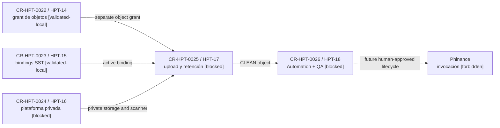

# Estado de custodia gobernada de comprobantes

Fecha observada: 2026-08-28

## Resultado de los gates ejecutados

`CR-HPT-0022 / HPT-14` dejó validado localmente el grant M2M separado para
objetos. `CR-HPT-0023 / HPT-15` dejó validado localmente el aprovisionamiento
owner-only de bindings en SST. Ambos resultados viven en worktrees aislados;
todavía no están integrados, desplegados ni provisionados.

`CR-HPT-0024 / HPT-16` quedó bloqueado en preflight: no hay una distribución
oficial MinIO AIStor/MinIO KMS licenciada y accesible para fijar por digest.
`CR-HPT-0025 / HPT-17` quedó bloqueado por esa plataforma ausente y porque
`CR-HPT-0019` todavía no tiene un resultado integrado. `CR-HPT-0026 / HPT-18`
quedó bloqueado porque no existe un camino CLEAN desplegado ni credenciales
protegidas provisionadas. Phinance permanece fuera del flujo.

## Mapa de lifecycle

Pregunta: qué resultados están validados y qué gates bloquean la QA integrada.

Nivel de abstracción: lifecycle de CRs; no representa secretos, rutas privadas,
tablas ni topología runtime.

<!-- visual-map:start -->

```yaml
visual_map:
  schema_version: "1.0"
  id: "receipt-custody-gates-2026-08-28"
  type: "lifecycle"
  question: "¿Qué gates de custodia están validados localmente y cuáles faltan antes de la QA integrada?"
  abstraction_level: "Lifecycle de gates de INIT-HPT-0003."
  source_refs:
    - "initiatives/INIT-HPT-0003-financial-document-intake-and-assisted-accounting.yaml"
    - "requests/running/CR-HPT-0022-adopt-automation-receipt-object-service-grant.yaml"
    - "requests/running/CR-HPT-0023-implement-sst-receipt-binding-provisioning.yaml"
    - "requests/planned/CR-HPT-0024-deploy-private-receipt-object-platform.yaml"
    - "evidence/requests/CR-CP-0024/precursors/infra-provider-preflight-blocker.md"
    - "requests/planned/CR-HPT-0025-implement-sst-receipt-object-upload-custody-retention.yaml"
    - "evidence/requests/CR-HPT-0025/dependency-blocker-and-sequence-map.md"
    - "requests/planned/CR-HPT-0026-adopt-automation-receipt-custody-and-integrated-qa.yaml"
    - "evidence/requests/CR-HPT-0026/dependency-preflight-blocker.md"
  observed_at: "2026-08-28"
  authority_boundary: "Vista derivada; los requests, contratos owner y evidencia referenciada conservan autoridad."
  request_ids: ["CR-HPT-0022", "CR-HPT-0023", "CR-HPT-0024", "CR-HPT-0025", "CR-HPT-0026"]
  status_vocabulary: ["validated-local", "blocked", "pending", "forbidden"]
  textual_fallback_required: true
```



### Fallback textual del mapa

```text
CR-HPT-0022 / HPT-14 [validated-local] publica el grant exacto de objetos.
CR-HPT-0023 / HPT-15 [validated-local] publica bindings owner-only.
CR-HPT-0024 / HPT-16 [blocked] requiere distribución/licencia oficial para MinIO KMS.
Los tres resultados son prerequisitos de CR-HPT-0025 / HPT-17 [blocked].
Upload debe producir objetos CLEAN antes de CR-HPT-0026 / HPT-18 [blocked].
La invocación a Phinance permanece forbidden y requiere otro lifecycle.
```

<!-- visual-map:end -->
