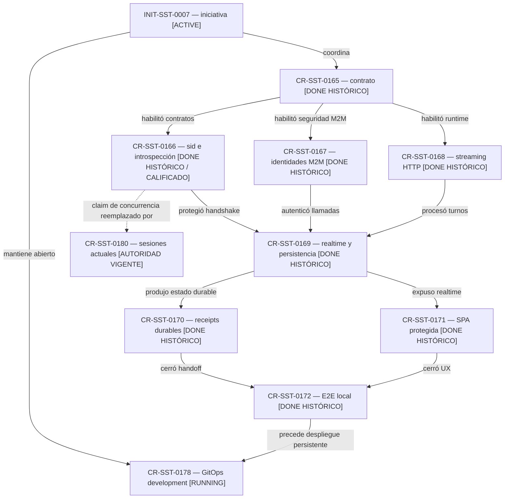

# Reconciliación canónica retroactiva de INIT-SST-0007

## Resultado

El control-plane incorpora de forma retroactiva el lifecycle de
`INIT-SST-0007` y de `CR-SST-0165` a `CR-SST-0172`, y conserva
`CR-SST-0178` en `running`. Este cambio repara una brecha de publicación: la
implementación y parte de su evidencia existían antes de que esos artefactos
quedaran versionados en la rama canónica del control-plane.

La reconciliación no ejecutó código funcional, no modificó repos hijos, no
leyó ni mutó el cluster y no escribió en Jira. Los estados de runtime se
presentan como observaciones históricas, no como un readback vigente.

## Desviación de orden

El orden normal exige crear o avanzar el lifecycle antes de modificar repos
hijos. En este caso, los cambios funcionales y sus validaciones locales se
realizaron antes de publicar el lifecycle en `main`. La desviación queda
aceptada solamente como reconciliación histórica; no crea una autorización
reutilizable para nuevas mutaciones.

## Mapa de lifecycle del corte conectado

<!-- visual-map:start -->

```yaml
visual_map:
  schema_version: "1.0"
  id: "init-sst-0007-connected-chat-lifecycle"
  type: "lifecycle"
  question: "¿Qué gates formaron el primer chatbot conectado y cuál permanece abierto?"
  abstraction_level: "request lifecycle"
  source_refs:
    - "initiatives/INIT-SST-0007-sst-chatbot-first-connected-version.yaml"
    - "requests/done/CR-SST-0165-sst-chat-realtime-boundary-contract.yaml"
    - "requests/done/CR-SST-0166-auth-session-id-revocation-introspection.yaml"
    - "requests/done/CR-SST-0167-sst-chat-service-identities.yaml"
    - "requests/done/CR-SST-0168-sst-chatbot-http-streaming-runtime.yaml"
    - "requests/done/CR-SST-0169-sst-bend-realtime-persistence-bridge.yaml"
    - "requests/done/CR-SST-0170-sst-agent-handoff-durable-receipts.yaml"
    - "requests/done/CR-SST-0171-sst-fend-protected-realtime-chat.yaml"
    - "requests/done/CR-SST-0172-sst-chat-e2e-recovery-capability-closure.yaml"
    - "requests/running/CR-SST-0178-deploy-sst-chatbot-development-cluster.yaml"
    - "requests/running/CR-SST-0180-integrate-login-sessions-and-timeout-corrections.yaml"
  observed_at: "2026-08-18"
  authority_boundary: "Vista derivada; los requests y la documentación owner de cada repositorio conservan autoridad."
  textual_fallback_required: true
  initiative_ids: ["INIT-SST-0007"]
  request_ids: ["CR-SST-0165", "CR-SST-0166", "CR-SST-0167", "CR-SST-0168", "CR-SST-0169", "CR-SST-0170", "CR-SST-0171", "CR-SST-0172", "CR-SST-0178", "CR-SST-0180"]
  status_vocabulary: ["DONE HISTÓRICO", "RUNNING", "AUTORIDAD VIGENTE"]
```



### Fallback textual

```text
INIT-SST-0007 [ACTIVE]
  -> coordina CR-SST-0165
  -> mantiene abierto CR-SST-0178
CR-SST-0165 [DONE HISTÓRICO]
  -> CR-SST-0166 [DONE HISTÓRICO / CALIFICADO]
  -> CR-SST-0167 [DONE HISTÓRICO]
  -> CR-SST-0168 [DONE HISTÓRICO]
CR-SST-0166 + CR-SST-0167 + CR-SST-0168
  -> CR-SST-0169 [DONE HISTÓRICO]
CR-SST-0169
  -> CR-SST-0170 [DONE HISTÓRICO]
  -> CR-SST-0171 [DONE HISTÓRICO]
CR-SST-0170 + CR-SST-0171
  -> CR-SST-0172 [DONE HISTÓRICO]
  -> CR-SST-0178 [RUNNING: falta persistencia GitOps y cierre browser]
CR-SST-0166
  -> sus garantías de carrera quedan reemplazadas por CR-SST-0180 [AUTORIDAD VIGENTE].
```

<!-- visual-map:end -->

## Calificación de seguridad

`CR-SST-0166` queda preservado como antecedente funcional de `sid`,
introspección y revocación. Auditorías posteriores detectaron que su flujo
histórico validate-delete-create no probaba atomicidad ante refresh concurrente
ni precedencia de logout. La autoridad vigente para la familia de sesión,
rotación CAS y logout es `CR-SST-0180`; no debe reimplantarse el flujo antiguo.

## Estado de CR-SST-0178

La evidencia de agosto registra una validación transitoria del workload y del
camino interno. También registra que la reconciliación GitOps revirtió cambios
locales y que el E2E de navegador aislado quedó bloqueado. Por eso el CR sigue
activo y no se interpreta como deployment persistente. Cualquier continuación
funcional necesita una aprobación nueva y worktrees limpios desde las ramas
owner vigentes.

## Modelo de ejecución de esta reconciliación

- Perfil: `complex-high-risk-task`.
- Modelo: `gpt-5.6-sol`, razonamiento `max`.
- Recursos: `normal/default`.
- Delegación: no aplicada; el gate documental fue ejecutado por el agente
  principal y no autorizó trabajo paralelo en repos hijos.
