# INIT-SST-0010 - Plan De Adopción De Derivación Secuencial Por Párrafos

Fecha observada: 2026-08-23.

## Objetivo

Adoptar de forma gobernada la derivación secuencial de artículos y otras
fuentes largas, reutilizando `CR-SST-0027` bajo el boundary corregido de
`CR-SST-0030`: `sst-chatbot` analiza y propone; `sst-bend` valida, persiste la
propuesta durable y decide la promoción a memoria canónica; el usuario conserva
control sobre adopción, corrección y rechazo.

Este documento es un plan del control plane. No asigna IDs numéricos, no crea
lifecycle ejecutable, no autoriza Jira y no habilita mutaciones en repos hijos.
El namespace global de CRs y el predecessor de identidad/scope deben
reconciliarse antes de promover cualquiera de los candidatos `TODO`.

## Policy Aplicada

- `agent-model-selection-policy`: tarea `complex-high-risk-task`, recursos
  `normal/default`, perfil principal `gpt-5.6-sol`, reasoning `max` y fallback
  `gpt-5.5/high` si la capacidad efectiva degrada.
- `agent-task-atomization-policy`: un slice verificable por owner y un slice
  separado para integración E2E.
- `agent-delegation-policy`: el plan recomienda revisiones de arquitectura,
  seguridad, impacto cross-repo y validación; no se desplegaron subagentes
  porque el usuario no solicitó delegación explícita.
- `agent-architecture-boundary-policy`: no se redefine ownership, identidad,
  autorización ni memoria canónica desde este plan.
- `owner-documentation-authority-policy`: cada child repo debe actualizar sus
  propias specs, docs, capabilities y pruebas dentro de su CR.
- `visual-documentation-as-code-policy`: el mapa siguiente es una vista
  derivada con fallback textual y fuentes trazables.

## Mapa De Lifecycle: Adopción En Control Plane Y Repos Hijos

<!-- visual-map:start -->

```yaml
visual_map:
  schema_version: "1.0"
  id: "sst-paragraph-derivation-adoption-lifecycle"
  type: "lifecycle"
  question: "¿En qué orden debe adoptar el control plane y cada repo hijo la derivación secuencial por párrafos?"
  abstraction_level: "adoption gate"
  source_refs:
    - "initiatives/INIT-SST-0010-personal-knowledge-and-memory-workspace.yaml"
    - "docs/projects/sst/propuesta-derivacion-secuencial-por-parrafos.md"
    - "requests/done/CR-SST-0193-implement-canonical-user-memory-runtime.yaml"
    - "requests/planned/CR-SST-0194-integrate-chatbot-memory-proposals-and-recall.yaml"
    - "requests/planned/CR-SST-0196-adopt-user-memory-review-and-export-ux.yaml"
    - "evidence/initiatives/INIT-SST-0010/request-id-collision-2026-08-22.md"
    - "docs/policies/owner-documentation-authority-policy.md"
  observed_at: "2026-08-23"
  authority_boundary: "Vista derivada; INIT-SST-0010, los lifecycle numéricos y la documentación owner conservan autoridad."
  textual_fallback_required: true
  request_ids: ["CR-SST-0193", "CR-SST-0194", "CR-SST-0196"]
  initiative_ids: ["INIT-SST-0010"]
  status_vocabulary: ["authoritative", "running", "blocked", "planned", "validated"]
```



```mermaid
flowchart LR
    INIT["INIT-SST-0010 [authoritative]"]
    NS["Namespace e identidad/scope [blocked]"]
    M["CR-SST-0193 memoria canónica [running]"]
    H["CR-SST-0194 proposal y recall ports [planned]"]
    CP["Control plane: contrato y CRs numéricas [planned]"]
    BE["sst-bend: persistencia y APIs de derivación [planned]"]
    BOT["sst-chatbot: pipeline y prompts [planned]"]
    INT["Integración backend-chatbot [planned]"]
    UXBASE["CR-SST-0196 controles de memoria [planned]"]
    FE["sst-fend: selección, progreso y revisión [planned]"]
    OPT["extension e infra: adopción opcional [planned]"]
    E2E["Cierre E2E y promoción [planned]"]

    INIT -->|"gobierna candidatos descubiertos"| CP
    NS -->|"habilita IDs y ejecución"| CP
    M -->|"debe cerrar con scope confiable"| H
    H -->|"estabiliza puertos gobernados"| CP
    CP -->|"publica contrato aprobado"| BE
    CP -->|"publica contrato aprobado"| BOT
    BE -->|"expone storage y lifecycle"| INT
    BOT -->|"expone derivación y prompt profiles"| INT
    INT -->|"habilita propuesta durable"| FE
    UXBASE -->|"provee controles canónicos"| FE
    INT -->|"habilita source adapters posteriores"| OPT
    FE -->|"aporta revisión de usuario"| E2E
    OPT -->|"si se adopta, aporta evidencia adicional"| E2E
    INT -->|"aporta integración obligatoria"| E2E

    classDef authoritative fill:#dbeafe,stroke:#2563eb,color:#172554
    classDef running fill:#fef3c7,stroke:#d97706,color:#451a03
    classDef blocked fill:#fee2e2,stroke:#dc2626,color:#450a0a
    classDef planned fill:#e0f2fe,stroke:#0284c7,color:#082f49
    class INIT authoritative
    class M running
    class NS blocked
    class H,CP,BE,BOT,INT,UXBASE,FE,OPT,E2E planned
```

## Fallback Textual Del Mapa De Lifecycle

```text
INIT-SST-0010 [authoritative] gobierna los candidatos descubiertos del control plane.
El namespace y el predecessor de identidad/scope [blocked] deben habilitar IDs y ejecución.
CR-SST-0193 [running] debe cerrar con scope confiable antes de CR-SST-0194.
CR-SST-0194 [planned] debe estabilizar proposal y recall ports antes de esta adopción.
El control plane [planned] publica el contrato aprobado y crea CRs numéricas separadas.
sst-bend [planned] adopta persistencia, lifecycle y APIs de derivación.
sst-chatbot [planned] adopta el pipeline secuencial, prompt profiles y salida estructurada.
La integración backend-chatbot [planned] prueba handoff, reanudación e idempotencia.
CR-SST-0196 [planned] aporta los controles canónicos de memoria.
sst-fend [planned] adopta selección de prompt, progreso y revisión después de la integración.
sst-extension e infraestructura son adopciones opcionales y posteriores al núcleo validado.
El cierre E2E [planned] requiere integración y revisión de usuario; incluye adopciones opcionales solo si fueron ejecutadas.
```

<!-- visual-map:end -->

## Decisiones De Producto Ya Aceptadas

1. La primera implementación usa un único pipeline secuencial, no un subagente
   independiente por párrafo.
2. Cada corrida conserva snapshot, secuencia, contexto acumulado, derivaciones,
   evidencia, hashes, prompt efectivo y resumen final.
3. El paso `finalize_derivation_run` produce una
   `derivation_memory_proposal` durable en `sst-bend`.
4. La propuesta durable no es memoria aceptada. Su lifecycle permite
   `needs_review`, `accepted`, `corrected`, `rejected` y `superseded`.
5. El prompt efectivo se compone mediante guardrails fijos, prompt base,
   profile elegido, instrucciones del usuario, contexto acotado, párrafo actual
   y schema de salida.
6. El profile default es `open-general-analysis`: amplio y exploratorio, pero
   obliga a separar evidencia, inferencias e interpretaciones alternativas.
7. Cambiar el prompt crea una nueva corrida o un fork explícito; nunca reescribe
   silenciosamente la `context_chain` de una corrida existente.
8. Perfiles como `sentiment-analysis` son posteriores y versionados. Comparten
   guardrails y provenance con el profile default.

## Suite De CRs Candidatas

Los identificadores siguientes son placeholders de planificación. No son IDs
canónicos y no deben aparecer en Jira ni en branches hasta reconciliar el
namespace global.

### `CR-SST-TODO-PARA-CONTRACT` - Contrato Del Control Plane

Owner: `4uentes-orchestor`.

Objetivo:

- consolidar `CR-SST-0027`, `CR-SST-0030`, `CR-SST-0192` y las decisiones de
  este discovery en un contrato implementable;
- definir schemas, estados, authority boundaries y capability handoffs;
- asignar CRs numéricas libres para cada slice hijo;
- registrar feature state y evidence refs sin redefinir el canon de Core.

Archivos previstos:

- `requests/inbox/<assigned-id>-*.yaml`;
- `requests/planned/<assigned-id>-*.yaml`;
- `state/features/paragraph-sequential-derivation.current.yaml`;
- `evidence/requests/<assigned-id>/`;
- updates acotados de `INIT-SST-0010` y capability links.

Definition of Done:

- namespace reconciliado;
- CRs numéricas únicas;
- contrato de datos y handoff aprobado;
- owners, checks y documentación owner identificados;
- `npm run check` PASS.

### `CR-SST-TODO-PARA-BEND` - Persistencia Y Autoridad En `sst-bend`

Owner: `sst-bend`.

Objetivo:

- persistir `source_snapshot`, `paragraph_sequence`, `derivation_run`, estados
  de `context_chain`, `paragraph_derivation`, `final_derivation` y
  `derivation_memory_proposal`;
- exponer APIs protegidas para crear, consultar, pausar, reanudar, finalizar y
  revisar corridas;
- validar identidad, scope, idempotencia, consentimiento, retención y
  promoción a memoria canónica;
- impedir que el cliente seleccione directamente estados privilegiados.

Riesgos principales:

- contenido privado de fuentes;
- crecimiento de snapshots y estados de contexto;
- duplicación por retry;
- promoción accidental de inferencias;
- mezcla entre tenants, usuarios o aplicaciones.

Documentación owner prevista:

- spec API de derivación;
- capability outbound de runtime de derivación;
- arquitectura, migraciones y política de retención;
- harness HTTP reproducible y pruebas negativas.

Definition of Done:

- migraciones reversibles;
- lifecycle e idempotencia probados;
- aislamiento y autorización fail-closed;
- proposals durables separadas de memoria aceptada;
- check completo del repo owner y gate del control plane.

### `CR-SST-TODO-PARA-CHATBOT` - Pipeline Y Prompt Profiles En `sst-chatbot`

Owner: `sst-chatbot`.

Objetivo:

- implementar `ParagraphDerivationPipeline` secuencial;
- construir y compactar `context_chain` sin concatenación ilimitada;
- validar outputs estructurados y evidence refs;
- implementar `finalize_derivation_run` y el handoff de propuesta;
- publicar `open-general-analysis` como prompt default;
- soportar profiles versionados y una instrucción de usuario acotada;
- tratar el contenido del artículo como datos no confiables frente a prompt
  injection.

Composición obligatoria del prompt:

```text
SYSTEM_GUARDRAILS
  + DEFAULT_DERIVATION_PROMPT
  + SELECTED_ANALYSIS_PROFILE
  + USER_ANALYSIS_INSTRUCTIONS
  + BOUNDED_CONTEXT_CHAIN
  + CURRENT_PARAGRAPH
  + OUTPUT_SCHEMA
```

Definition of Done:

- corrida determinista con provider fake;
- orden y hashes reproducibles;
- retry y reanudación desde checkpoint;
- cambio de prompt crea nueva corrida o fork;
- tests de prompt injection, output inválido, contradicción y límite de tokens;
- specs, prompt registry, capability docs y check owner actualizados.

### `CR-SST-TODO-PARA-INTEGRATION` - Integración Backend-Chatbot

Owners: `sst-bend` y `sst-chatbot`; `4uentes-auth` solo si el contrato de
identidad aprobado requiere adopción adicional.

Objetivo:

- conectar las APIs de corrida con el pipeline;
- intercambiar snapshots o referencias autorizadas sin enviar identidad ni
  secretos al provider;
- persistir resultados parciales y recibos de handoff;
- probar cancelación, timeout, retry, idempotencia y restart recovery;
- demostrar que el chatbot propone y que solo el backend promueve memoria.

Definition of Done:

- smoke con provider fake y source fixture;
- reanudación después de reiniciar uno de los servicios;
- ninguna duplicación al repetir el mismo request;
- provenance desde proposal hasta párrafo/chunk;
- checks owner y control-plane PASS.

### `CR-SST-TODO-PARA-FEND` - Selección Y Revisión En `sst-fend`

Owners: `sst-fend`, BFF owner y `sst-bend` para contratos que realmente deban
cambiar. Depende de la integración y de los controles de memoria de
`CR-SST-0196`.

Objetivo:

- elegir el profile default o una mirada versionada;
- permitir instrucciones adicionales acotadas;
- mostrar progreso por párrafo sin exponer reasoning privado del modelo;
- comparar corridas realizadas con prompts diferentes;
- revisar, corregir, aceptar o rechazar candidatos individualmente;
- visualizar evidence refs, confidence y contradicciones.

Definition of Done:

- QA autenticado desktop/mobile;
- accesibilidad y estados loading, paused, failed y superseded;
- prompt y memoria privada fuera de Redux Persist;
- frontend sin acceso directo autoritativo a `sst-chatbot`;
- checks owner y control-plane PASS.

### `CR-SST-TODO-PARA-OPTIONAL` - Fuentes Y Operación Opcionales

Owners posibles: `sst-extension`, `sst-bend` y `sst-4uentes-infra`. Debe
dividirse en CRs independientes si más de un owner necesita mutación.

Alcance opcional posterior:

- captura explícita de artículo desde `sst-extension` mediante el backend;
- ingestión de PDF, libro o transcripción;
- worker/queue y límites operativos para fuentes grandes;
- observabilidad sin contenido privado;
- profile `sentiment-analysis` y otros profiles especializados.

Gate: no forma parte del núcleo V1 y solo avanza después de medir el pipeline
integrado. Una necesidad de infraestructura debe probarse con evidencia antes
de agregar nuevos componentes runtime.

### `CR-SST-TODO-PARA-E2E` - Cierre Y Promoción

Owners: control plane y todos los repos efectivamente adoptantes.

Escenario mínimo:

1. Un usuario autenticado selecciona el prompt default.
2. SST crea un snapshot y procesa una fuente de varios párrafos.
3. La corrida sobrevive a retry o restart sin duplicar derivaciones.
4. El chatbot finaliza y entrega una propuesta durable.
5. El usuario revisa candidatos y acepta solo algunos.
6. `sst-bend` promueve únicamente los aceptados a memoria canónica.
7. Una segunda corrida con otro prompt conserva provenance independiente.
8. Recall devuelve solo memoria aceptada con citas autorizadas.

Definition of Done:

- aislamiento negativo entre usuarios/tenants;
- prompt injection y secret-like content rechazados o contenidos;
- límites de contexto y retención probados;
- owner docs y evidence refs completos;
- `npm run check` en cada repo modificado;
- `npm run check` completo del control plane;
- residuals explícitamente aprobados o Initiative todavía abierta.

## Dependencias Y Orden Recomendado

```text
Reconciliar namespace global
  -> cerrar predecessor de identidad/scope
  -> cerrar CR-SST-0193
  -> ejecutar y cerrar CR-SST-0194
  -> PARA-CONTRACT
       -> PARA-BEND -----\
       -> PARA-CHATBOT ---+-> PARA-INTEGRATION
                              -> PARA-FEND
                              -> PARA-E2E

PARA-OPTIONAL
  -> solo después de PARA-INTEGRATION validado
  -> se incorpora al E2E únicamente si fue adoptado
```

`PARA-BEND` y `PARA-CHATBOT` pueden avanzar en paralelo después de aprobar el
contrato, usando fixtures y adapters fake. `PARA-INTEGRATION` no comienza hasta
que ambos publiquen contracts owner compatibles.

## Core Y Control Plane

`4uentes-ards-core` no necesita mutación para implementar esta feature de
producto. Solo se abriría un handoff futuro si el trabajo descubre un kind,
profile, schema o template verdaderamente reutilizable entre soluciones.

El control plane conserva:

- Initiative y orden de CRs;
- catálogo lógico y capability links;
- evidencia cross-repo;
- estado de adopción;
- gates de owner documentation;
- Jira como mirror, nunca como autoridad.

## Blockers Actuales

- Namespace global de CRs sin reconciliar.
- Predecessor de identidad/scope todavía sin ID canónico.
- `CR-SST-0193` permanece `running` hasta validar el flujo normal de identidad.
- `CR-SST-0194` permanece planificado y sin autorización de mutación.
- Paths owner exactos para el nuevo contrato quedan `TODO` hasta que cada CR
  aprobada permita discovery dentro del repo correspondiente.

## Siguiente Decisión Humana

Reconciliar el namespace global y asignar un ID libre al predecessor de
identidad/scope. Solo después corresponde convertir
`CR-SST-TODO-PARA-CONTRACT` y los slices hijos en lifecycle numérico
`inbox -> planned`.
