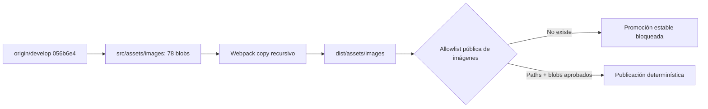

# Auditoría metadata-only de binarios

Fecha: 2026-09-05  
Repositorio owner: `4uentes-portfolio`  
Árbol auditado: `origin/develop@056b6e4ede90854685c48ff9880d475e54b8db84`  
Modo: metadata-only; ningún binario fue abierto, renderizado, copiado ni modificado.

## Corrección del conteo

El inventario previo mencionaba 79 candidatos. Ese total correspondía al árbol
histórico: 78 imágenes más el CV. El commit owner `11b1f67` eliminó del tip el
CV `src/assets/resources/afpogo_cv.pdf` (blob
`c35d6ce84417359eff24b96b26ea97a5c1d7e115`, 315.590 bytes). El árbol canónico
actual contiene 78 imágenes y ningún archivo rastreado bajo
`src/assets/resources/`.

## Resultado reproducible

El árbol contiene 78 paths y 78 blobs únicos, por un total de 17.182.570 bytes:

| Categoría | Cantidad | Bytes | Disposición previa a aprobación humana |
|---|---:|---:|---|
| Certificados de cursos | 47 | 12.314.348 | `needs-human-review-blocked` |
| Certificados históricos | 3 | 449.495 | `needs-human-review-blocked` |
| Constancia laboral | 1 | 95.589 | `needs-human-review-blocked` |
| Perfil y empleadores | 11 | 4.033.339 | `needs-human-review-blocked` |
| Logos de conocimiento | 5 | 220.953 | `needs-license-review-blocked` |
| Iconos tecnológicos SVG | 9 | 15.516 | `needs-license-review-blocked` |
| Capturas de producto | 2 | 53.330 | `needs-confidentiality-review-blocked` |

La identidad exacta del lote queda fijada por el SHA del árbol auditado y por
`git ls-tree -r origin/develop -- src/assets/images`. Antes de aprobar cualquier
publicación, cada path deberá quedar unido a su blob, propósito público,
proveniencia/licencia y aprobación humana explícita. Un cambio de blob invalida
la aprobación anterior.

## Hallazgos técnicos

- 58 PNG, 8 JPG, 3 JPEG y 9 SVG.
- 77 firmas coinciden con la extensión.
- `src/assets/images/knowledge_img/logo-platzi-sin-fondo.png`, blob
  `c81419317606a4ecf958a1b4cc78c14ffe9742e6`, contiene firma JPEG pese a su
  extensión PNG.
- `src/assets/images/apogo2.jpg`, blob
  `0e602829e0be07f722ac40fa52278bf2daea00cf`, pesa 2.378.502 bytes y es el único
  archivo mayor a 1 MiB.
- No hay blobs duplicados ni colisiones de basename en el destino Webpack
  aplanado.
- 74 imágenes tienen referencia textual por basename. Cuatro no presentan una
  referencia textual: `apogo2.jpg`, `old_certs/titulo_cetae_arpc_arg.jpeg`,
  `old_certs/titulo_cetae_redes_arg.jpeg` y `social_icons/docker_icon.svg`.
- Existen referencias con casing o extensión incompatibles en hosts sensibles
  a mayúsculas: `apogo1.jpeg` frente a `apogo1.jpg` y `apogo2.JPG` frente a
  `apogo2.jpg`.

## Brecha de publicación

`config/public-resources.json` y `scripts/check-public-assets.js` gobiernan
correctamente `resources/`, PDFs y el CV. Sin embargo, ambos Webpack continúan
copiando recursivamente `src/assets/images/**` al artefacto público. Por lo
tanto, las 78 imágenes siguen públicamente direccionables aunque cuatro no
tengan consumidor textual.

## Restricción efectiva del request

Hasta una aprobación humana enumerada:

- la allowlist pública de imágenes es vacía;
- no se abre, renderiza, OCRiza, renombra, reemplaza ni elimina un binario;
- no se modifica el owner repo;
- no se promueve `develop` a `main`;
- exposición histórica o referencia textual no equivalen a autorización;
- certificados, constancias y fotos personales fallan cerrados;
- logos e iconos requieren revisión de licencia/marca;
- capturas requieren revisión de confidencialidad.

El próximo lote permitido es documental: enumerar una propuesta path+blob por
grupo para decisión humana. Cualquier mutación posterior deberá ampliar de
forma explícita el manifest de paths de `CR-4UENTES-0039` antes de crear otro
worktree owner.
