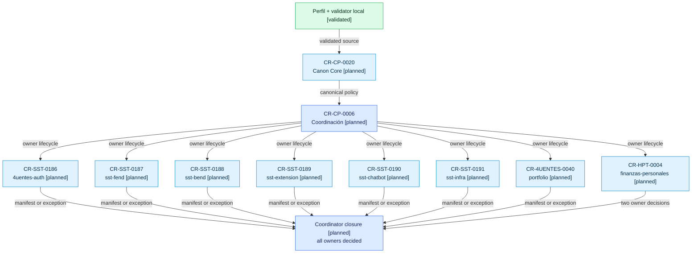

# Plan de propagación de documentación visual como código

## Decisión

La adopción se divide en dos autoridades: Core publica el canon reusable y
cada repo hijo publica su propia adopción o excepción. El control-plane sólo
coordina lifecycle, dependencias y evidencia.

## Mapa de rollout

Pregunta: ¿en qué orden se vuelve canónica y verificable la policy en cada
owner?

Nivel de abstracción: requests de promoción y adopción; no representa archivos
runtime ni arquitectura de producto.

<!-- visual-map:start -->

```yaml
visual_map:
  schema_version: "1.0"
  id: "visual-documentation-policy-rollout"
  type: "dependency"
  question: "¿En qué orden se vuelve canónica y verificable la policy de documentación visual en cada owner?"
  abstraction_level: "Requests de promoción y adopción por owner."
  source_refs:
    - "requests/planned/CR-CP-0020-promote-visual-documentation-as-code-policy-to-core.yaml"
    - "requests/planned/CR-CP-0006-roll-out-visual-documentation-policy-to-child-repos.yaml"
    - "requests/planned/CR-SST-0186-adopt-visual-documentation-policy-in-4uentes-auth.yaml"
    - "requests/planned/CR-SST-0187-adopt-visual-documentation-policy-in-sst-fend.yaml"
    - "requests/planned/CR-SST-0188-adopt-visual-documentation-policy-in-sst-bend.yaml"
    - "requests/planned/CR-SST-0189-adopt-visual-documentation-policy-in-sst-extension.yaml"
    - "requests/planned/CR-SST-0190-adopt-visual-documentation-policy-in-sst-chatbot.yaml"
    - "requests/planned/CR-SST-0191-adopt-visual-documentation-policy-in-sst-infra.yaml"
    - "requests/planned/CR-4UENTES-0040-adopt-visual-documentation-policy-in-portfolio.yaml"
    - "requests/planned/CR-HPT-0004-adopt-visual-documentation-policy-in-finanzas-personales.yaml"
  observed_at: "2026-08-16"
  authority_boundary: "Vista derivada; los YAML de lifecycle y los manifests owner conservan autoridad."
  request_ids: ["CR-CP-0020", "CR-CP-0006", "CR-SST-0186", "CR-SST-0187", "CR-SST-0188", "CR-SST-0189", "CR-SST-0190", "CR-SST-0191", "CR-4UENTES-0040", "CR-HPT-0004"]
  textual_fallback_required: true
```



### Fallback textual accesible

```text
Perfil y validator local validados
  -> CR-CP-0020 promueve policy y templates a Core
  -> CR-CP-0006 habilita lifecycles owner independientes
     -> CR-SST-0186  4uentes-auth
     -> CR-SST-0187  sst-fend
     -> CR-SST-0188  sst-bend
     -> CR-SST-0189  sst-extension
     -> CR-SST-0190  sst-chatbot
     -> CR-SST-0191  sst-4uentes-infra
     -> CR-4UENTES-0040  4uentes-portfolio
     -> CR-HPT-0004  finanzas-personales frontend + backend
  -> El coordinador cierra sólo cuando cada owner tiene manifest, excepción o defer explícito.
```

<!-- visual-map:end -->

## Estrategia de ejecución

1. Ejecutar `CR-CP-0020` en un worktree limpio de Core.
2. Reconciliar el consumo local del control-plane contra el path canónico.
3. Crear un worktree aislado por repo físico desde su baseline owner.
4. Añadir manifest, discovery y validación sin cambios runtime.
5. Validar cada repo y luego el check completo del control-plane.
6. Actualizar el state únicamente con resultados observados; no anticipar
   adopciones.

Los worktrees actuales de varios child repos contienen cambios de otras CRs.
No se reutilizan, limpian, stashean ni resetean para este rollout.
