# Plan actualizado de onboarding de 4uentes Automation

Fecha observada: 2026-09-05. Request: `CR-CP-0021`. Coordinación:
`CR-HPT-0027` / `INIT-HPT-0002`.

## Resultado del discovery

La identidad inbox de `CR-CP-0021` ya está publicada en el control plane. El
owner también existe: el repositorio privado `afpogo/4uentes-automation` tiene
`main` publicada en `32055ab77f0c1b898eb77a6fe232b965c54f137d`, mientras
que el checkout observado está limpio en la branch documental
`docs/1-trunk-based-agent-flow@bfd206e`.

Esto reemplaza el blocker anterior que indicaba ausencia de metadata Git. No
se debe crear otro repositorio ni importar el directorio local como una fuente
nueva. `4uentes-automation` es la identidad estable; `n8n-local` es sólo el
binding local de su implementación actual.

El `main` owner ya contiene `AGENTS.md`, `.gitignore`, `.env.example`, Compose,
checks y bindings ARDS/SDD. Esos artefactos prueban que existe una superficie
owner auditable, pero sus `status_hint` y evidencias históricas no prueban por
sí solos que M2M, webhooks o runtime estén integrados actualmente.

## Resolución de policies y overlay

No existe un archivo canónico con `kind: policy_overlay`, tampoco un
`policy_resolution_manifest` ni un resolvedor ejecutable. El ejemplo de
overlay permanece como diseño y CR-CP-0025 registra el runtime como
`not-implemented-separate-cr-required`.

Para este plan se aplicaron manualmente:

- `worktree-request-lifecycle-policy` como policy durable;
- el control operativo de saneamiento de CR-CP-0024;
- la excepción documentada en el inbox de CR-CP-0021 para conservar el
  worktree legacy como fuente histórica read-only;
- las policies de boundaries, atomización, idioma, documentación owner y
  documentación visual.

El resultado efectivo obliga a trabajar desde refs remotas refrescadas, usar
un worktree limpio por slice, preservar el snapshot legacy y rechazar cualquier
merge o cherry-pick masivo.

## Secretos y puertos observados

No se abrió `.env`, no se inspeccionaron datos persistentes y no se ejecutó
Docker. `.env.example` declara variables vacías y el Compose actual consume los
secretos como variables de entorno.

Los cuatro secretos candidatos para un futuro bootstrap owner son:

1. `N8N_ENCRYPTION_KEY`;
2. `POSTGRES_PASSWORD`;
3. `PGADMIN_DEFAULT_PASSWORD`;
4. `PRODUCTIVITY_DB_PASSWORD`.

`POSTGRES_USER`, `POSTGRES_DB` y `PGADMIN_DEFAULT_EMAIL` son configuración, no
secretos. `N8N_SMTP_PASS` queda expresamente fuera del futuro slice: puede ser
una credencial existente y no debe leerse, copiarse ni rotarse por inferencia.

Automation publica hoy n8n en loopback `5678` y pgAdmin en loopback `5050`;
su PostgreSQL permanece interno. No hay una colisión actual con los defaults
adoptados por SST Bend (`3005`, `3200`, `5432` y `5051`). Aun así, los bindings
fijos de Automation deben migrar a `N8N_HOST_PORT` y
`N8N_PGADMIN_HOST_PORT` para soportar instancias simultáneas y preflight de
ocupación antes del arranque.

## Secuencia gobernada

<!-- visual-map:start -->

```yaml
visual_map:
  schema_version: "1.0"
  id: "cr-cp-0021-reconciled-onboarding-sequence"
  type: "lifecycle"
  question: "¿Qué gates separan el descubrimiento del servicio, la custodia de secretos, M2M y el runtime?"
  abstraction_level: "request execution gates"
  source_refs:
    - "requests/inbox/CR-CP-0021-onboard-4uentes-automation-n8n.yaml"
    - "requests/planned/CR-CP-0021-onboard-4uentes-automation-n8n.yaml"
    - "requests/running/CR-HPT-0027-govern-local-development-secrets-and-compose-ports.yaml"
    - "docs/cross-repo/local-development-secret-and-compose-governance.md"
  observed_at: "2026-09-05"
  authority_boundary: "Vista derivada; los requests y la documentación owner conservan autoridad."
  textual_fallback_required: true
  request_ids: ["CR-CP-0021", "CR-HPT-0027"]
  initiative_ids: ["INIT-HPT-0002"]
```



```mermaid
flowchart LR
    H["INIT-HPT-0002 / CR-HPT-0027 [coordinación local]"]
    P["Plan CR-CP-0021 [control plane]"]
    D["Servicio discovered [gate B3]"]
    O["Secretos y puertos owner [gate separado]"]
    M["Capabilities y M2M revalidados [gates por owner]"]
    R["Piloto sintético [gate runtime]"]

    H -->|"coordina gates owner"| P
    P -->|"autorizar control plane"| D
    D -->|"autorizar owner sin runtime"| O
    O -->|"autorizar contratos por owner"| M
    M -->|"autorizar runtime explícito"| R
```

### Fallback textual

```text
INIT-HPT-0002 / CR-HPT-0027 coordina los gates locales y enlaza el plan CR-CP-0021.
El plan se publica primero sin mutar owners.
Un gate separado registra el servicio como discovered en el control plane.
Otro gate owner adopta secretos y puertos sin iniciar contenedores.
Automation, Auth y SST revalidan capabilities y M2M mediante lifecycles propios.
Sólo después puede autorizarse un piloto runtime sintético y reversible.
```

<!-- visual-map:end -->

## Siguiente gate recomendado

Después de publicar y releer este plan, el siguiente lote debe limitarse al
control plane:

- agregar la identidad lógica `4uentes-automation` al catálogo;
- asociarla inicialmente a `finanzas-personales` como servicio shared;
- publicar un state de onboarding con estado `discovered`;
- no adoptar todavía capability links M2M o runtime;
- no modificar el repositorio owner, Jira, Docker, secretos o infraestructura.

El slice owner de secretos y puertos se presentará después con archivos,
comandos, pruebas y rollback exactos. Cualquier inicio de contenedores,
rotación de base o acceso a credenciales seguirá requiriendo autorización
separada.

## Evidencia de no mutación

- No se leyó `.env` ni se imprimieron valores secretos.
- No se abrieron exports de workflows ni registros de credenciales.
- No se inspeccionaron `n8n_data`, `postgres_data`, `pgadmin_data` o
  `n8n_files`.
- No se ejecutó Docker ni se modificó el owner.
- No se escribió Jira ni se mutó Kubernetes o infraestructura.
