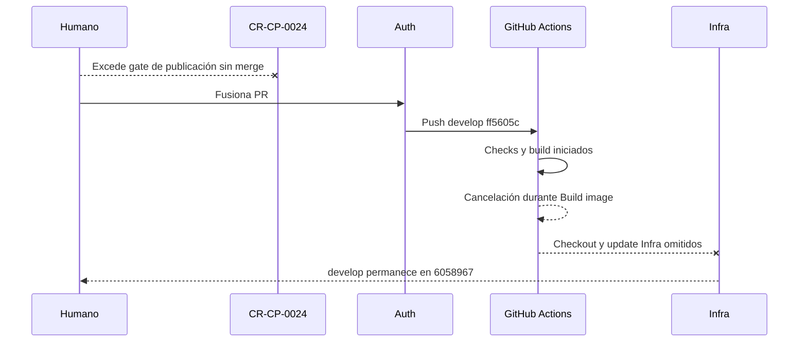

# Desviación y contención del merge Auth

## Resultado

El PR Auth `#15` fue fusionado fuera del gate vigente. El gate autorizaba
publicar el PR, pero prohibía fusionarlo, publicar una imagen y modificar
Infra. El código deseado quedó canónico en
`4uentes-auth/develop@ff5605c67d412e3e363d58de14a5b6b98b38c4ad`.

La ejecución automática de `push` `33452558381` fue cancelada mientras estaba
en el paso `Build image`. Los pasos `Checkout infra repo` y `Update infra image
tag` quedaron `skipped`. El readback posterior confirmó
`sst-4uentes-infra/develop@60589676f4dc2f74e0ec6b9dd3b20a324b4eb7cc`,
sin un commit nuevo de pin de Auth.

El log no contiene una exportación o push de manifest completado; termina con
`The operation was canceled`. La API de packages no permitió un segundo
readback porque el token disponible carece de `read:packages`. Por ello no se
afirma ausencia absoluta de blobs parciales, pero no existe evidencia de un tag
publicado y el workflow no alcanzó la mutación GitOps.

## Mapa de la contención

<!-- visual-map:start -->

```yaml
visual_map:
  schema_version: "1.0"
  id: "cr-cp-0024-auth-merge-containment"
  type: "sequence"
  question: "¿Qué efectos produjo el merge Auth fuera de gate y cuáles fueron contenidos?"
  abstraction_level: "Secuencia de desviación y contención Auth."
  source_refs:
    - "requests/running/CR-CP-0024-govern-multi-repository-integration-and-stable-promotion.yaml"
    - "evidence/requests/CR-CP-0024/auth-owner-execution-authorization-2026-08-30.md"
    - "evidence/requests/CR-CP-0024/auth-merge-deviation-and-containment-2026-08-31.md"
  request_ids: ["CR-CP-0024"]
  observed_at: "2026-08-31"
  authority_boundary: "Vista derivada del readback; GitHub conserva autoridad sobre PR y workflow, Auth sobre su código y el control-plane sobre lifecycle y disposición."
  textual_fallback_required: true
```



### Fallback textual

```text
CR-CP-0024 autorizaba publicar el PR Auth sin fusionarlo. El merge de PR #15 creó Auth develop ff5605c y disparó el workflow 33452558381. La contención canceló el workflow durante Build image; checkout y update de Infra quedaron omitidos. El readback confirmó Infra develop 6058967 sin cambios. El merge de código permanece pendiente de disposición humana explícita y no habilita por sí mismo ningún rollout.
```

<!-- visual-map:end -->

## Readbacks

| Superficie | Resultado |
|---|---|
| PR Auth | `#15`, `MERGED`, head `4b20fe5`, merge `ff5605c` |
| Check de pull request | `build-publish-update`: `SUCCESS`; evento PR, sin push de imagen |
| Workflow de push | `33452558381`: `cancelled` |
| Check owner dentro del push | `SUCCESS` |
| Build/push de imagen | cancelado; no hay manifest completado en el log |
| Checkout Infra | `skipped` |
| Update Infra | `skipped` |
| Infra `origin/develop` | `6058967`, sin avance |
| Jira | sin escrituras |

## Disposición recomendada

Aceptar explícitamente el merge de código ya integrado, conservar cancelado el
rollout y registrar el slice Auth como integrado-sin-rollout. Esta disposición
evita un revert innecesario de código que pasó allowlist, checks, harness HTTP,
idioma y secret scan. No autoriza reejecutar el workflow, publicar la imagen,
actualizar Infra ni promover Auth a `main`.

La alternativa es revertir el PR `#15` mediante un PR normal. No debe usarse
force-push ni reset de `develop`.

## Estado

`awaiting-explicit-merge-disposition`.
