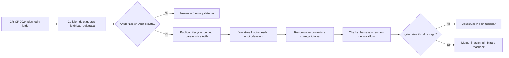

# Preflight de ejecución owner para Auth

## Resultado

El candidato técnico de Auth sigue reproducible, pero la mutación owner queda
pendiente de autorización explícita. La fuente inmutable continúa en
`f9fe6b523c4946d96360d280c6420956faba3690` y la base remota continúa en
`origin/develop@13ebe6ffd57b909a01dceaf78e8d42698094f6a8`.

El preflight descubrió una desviación de identidad que debe quedar explícita:

- `CR-HPT-0016` ya identifica canónicamente la reconciliación de governance y
  Jira de `INIT-HPT-0001`; no puede identificar también el grant de receipt
  intake;
- `CR-HPT-0022` aparece como etiqueta histórica en commits y documentación de
  Auth, pero no tiene lifecycle propio publicado en el control-plane;
- `CR-CP-0021` tampoco tiene lifecycle propio publicado; sólo existen links y
  deltas owner históricos;
- `CR-CP-0024` es el lifecycle retroactivo canónico que inventaría, clasifica y
  permite recuperar selectivamente esos deltas, pero su autorización publicada
  fue consumida sólo para planificación.

Por lo tanto, las tres etiquetas históricas se conservarán como procedencia,
no como identidades canónicas reutilizables. La autoridad de ejecución será
`CR-CP-0024` cuando se publique y lea su gate `running` para Auth. No se crearán
lifecycles duplicados con IDs ocupados ni se reinterpretará el lifecycle
canónico de `CR-HPT-0016`.

## Mapa del gate

<!-- visual-map:start -->

```yaml
visual_map:
  schema_version: "1.0"
  id: "cr-cp-0024-auth-owner-execution-gate"
  type: "lifecycle"
  question: "¿Qué autorización separa el candidato Auth validado de su mutación y merge owner?"
  abstraction_level: "Gate owner Auth de CR-CP-0024."
  source_refs:
    - "requests/planned/CR-CP-0024-govern-multi-repository-integration-and-stable-promotion.yaml"
    - "evidence/requests/CR-CP-0024/promotion-disposition-manifest.yaml"
    - "requests/inbox/CR-HPT-0016-reconcile-governance-initiative-jira-lifecycle.yaml"
    - "evidence/requests/CR-CP-0024/auth-owner-execution-preflight-2026-08-30.md"
  request_ids: ["CR-CP-0024"]
  observed_at: "2026-08-30"
  authority_boundary: "Vista derivada del preflight; CR-CP-0024 conserva autoridad de lifecycle y 4uentes-auth conserva autoridad sobre contratos, runtime, documentación y checks owner."
  textual_fallback_required: true
```



### Fallback textual

```text
CR-CP-0024 está planned y leído. El preflight registra que CR-HPT-0016, CR-HPT-0022 y CR-CP-0021 son sólo etiquetas históricas no reutilizables como lifecycles para este slice. Una autorización humana exacta habilita publicar y leer el running de CR-CP-0024 limitado a Auth. Sólo entonces se crea un worktree limpio, se recompone el candidato y se ejecutan checks. Una segunda autorización separada habilita el merge y sus posibles efectos de imagen y pin de Infra; sin ella el PR queda preservado y no se fusiona.
```

<!-- visual-map:end -->

## Superficie exacta propuesta

La primera autorización permitiría únicamente:

1. publicar y leer un lifecycle `running` de `CR-CP-0024` limitado al slice
   `4uentes-auth`;
2. crear un worktree limpio desde
   `origin/develop@13ebe6ffd57b909a01dceaf78e8d42698094f6a8`;
3. recuperar sólo las 20 rutas de la allowlist ya validada, preservando la
   separación de commits por etiqueta histórica;
4. traducir a español el Markdown humano, manteniendo YAML, contratos,
   identificadores y harness técnico en inglés;
5. ejecutar el check completo de Auth y la matriz HTTP de grants, audience,
   TTL, principal, wildcard y token compuesto;
6. publicar un PR owner sin fusionarlo.

No permitiría merge, publicación de imagen, actualización de Infra,
despliegue, escritura Jira, credenciales reales ni modificación de Backend.

## Gate de merge separado

El merge requerirá una segunda autorización que enumere:

- PR y SHA esperados;
- checks verdes;
- imagen y digest esperados;
- commit automático de Infra;
- confirmación de que ese commit cambia exclusivamente el tag o digest de
  Auth esperado;
- readback y rollback por PR, nunca force-push.

## Contrato que no cambia

- `finance:receipt-intake:create` y `finance:receipt-object:create` son grants
  separados;
- tokens RS256, audience `sst-api` y TTL máximo de 300 segundos;
- rechazo de tokens compuestos, wildcard, usuario y principal incorrecto.

## Estado

`awaiting-explicit-owner-authorization`.
