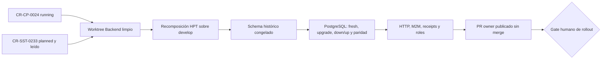

# Preflight de ejecución owner para Backend

## Resultado

Backend está listo para recomponer un candidato y publicar un PR, pero su merge
queda separado por los side effects automáticos de imagen e Infra y por el gate
obligatorio de PostgreSQL.

| Control | Readback |
|---|---|
| `origin/develop` | `28ce139fa079b89fbccfca2bab566b5bf1e50b6e` |
| `origin/master` | `0140e52d758654dfda8181cb9316165e787f0571` |
| Fuente HPT inmutable | `2a0de56bdfadbbfdd6f586e97b5300f5fc7e9bdf` |
| Merge-base | `dc67203c77bb91804db888ad57c4f2a174b3d6b8` |
| Divergencia develop/fuente | `2 / 10` commits exclusivos |
| Allowlist HPT | 51 paths, coincidencia exacta ya validada |

Los dos commits exclusivos de `develop` corresponden al contrato local de
secretos y puertos de `CR-HPT-0027`; deben preservarse. La rama histórica no se
fusionará: sus diez commits se reaplicarán de forma selectiva sobre un worktree
nuevo desde `origin/develop`.

## Identidad y procedencia

Las etiquetas históricas `CR-CP-0021`, `CR-HPT-0019` y `CR-HPT-0023` no pueden
usarse como lifecycles independientes para este slice: `CR-HPT-0019` ya está
ocupado canónicamente por la reconciliación Jira de Phinance y las otras dos no
tienen lifecycle owner publicado. Se conservan como procedencia; `CR-CP-0024`
gobierna su recuperación retroactiva. `CR-SST-0233` sí conserva lifecycle
canónico propio y gobierna la corrección de migraciones.

## Defecto de migración confirmado

`20260524120000-create-document-agent-jobs` importa hoy
`DocumentAgentJobSchema`, que ya contiene columnas agregadas posteriormente.
En una instalación limpia crea anticipadamente `tenant_id`, `user_id`,
`application_id`, `processing_mode`, snapshots, chain y fingerprint. Luego
`20260829010000-adopt-article-agent-processing-v1` intenta agregarlas otra vez.

El schema histórico original se recuperó del commit de creación
`cd9b4a5e6849acad439e06f40e112af9cebd8eae`: termina en
`requested_by_user_id`, usa estado predeterminado `pending` y no contiene los
campos de adopción posteriores. Ese snapshot, expresado localmente dentro de la
migración, será la autoridad histórica congelada.

## Mapa del gate

<!-- visual-map:start -->

```yaml
visual_map:
  schema_version: "1.0"
  id: "cr-cp-0024-backend-owner-gate"
  type: "lifecycle"
  question: "¿Qué pruebas separan la recomposición Backend de su merge con rollout?"
  abstraction_level: "Gate owner Backend de CR-CP-0024 y CR-SST-0233."
  source_refs:
    - "requests/running/CR-CP-0024-govern-multi-repository-integration-and-stable-promotion.yaml"
    - "requests/planned/CR-SST-0233-reconcile-fresh-database-migration-baseline.yaml"
    - "evidence/requests/CR-CP-0024/promotion-disposition-manifest.yaml"
    - "evidence/requests/CR-CP-0024/backend-owner-execution-preflight-2026-08-31.md"
  request_ids: ["CR-CP-0024", "CR-SST-0233"]
  observed_at: "2026-08-31"
  authority_boundary: "Vista derivada del preflight; los lifecycles conservan autoridad de ejecución y sst-bend conserva autoridad sobre runtime, schema, contratos, documentación y checks owner."
  textual_fallback_required: true
```



### Fallback textual

```text
CR-CP-0024 running y CR-SST-0233 publicado habilitan un worktree limpio de Backend. Allí se recompone la fuente HPT sin perder CR-HPT-0027, se congela el schema histórico y se ejecutan PostgreSQL fresh, upgrade, down/up y paridad, además de HTTP, M2M, receipts y roles. Sólo entonces se publica el PR owner. Su merge, imagen y actualización de Infra requieren otro gate humano.
```

<!-- visual-map:end -->

## Expansión explícita de superficie para CR-SST-0233

Además de los 51 paths HPT, se agregan de forma visible:

- `.github/workflows/node.js.yml`, para evitar CI verde sin migraciones;
- `db/migrations/20260524120000-create-document-agent-jobs.js`;
- `scripts/test-migration-chain-postgres.js`;
- `docs/tasks/2026-08-31-cr-sst-0233-migration-baseline.md`.

`package.json` y `scripts/ards-check.js` ya pertenecen a la allowlist HPT y
pueden reconciliar scripts/checks sin ampliar paths. La migración 202608 se
mantendrá sin cambios como única owner de las columnas posteriores.

## Side effects y límites

El PR hacia `develop` ejecuta build/checks sin push de imagen. Un merge dispara
`build-publish-development.yml`, publica `sst-bend:develop-<sha>` y puede
commitear directamente el pin en Infra. Por eso este gate permite publicar el
PR pero prohíbe fusionarlo o reejecutar workflows de push.

El workflow histórico `deploy.yml` con `argocd app sync` permanece fuera de
este slice; su reemplazo requiere CR owner separado antes de cualquier release
`develop → master`.

## Estado

`authorized-for-owner-pr-publication-without-merge`.
