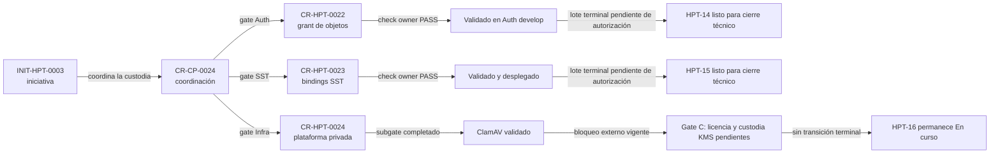

# Preparación de cierre técnico de los primeros gates de custodia

Fecha de observación: 2026-09-10. Coordinación: `CR-CP-0024`.

## Resultado

`CR-HPT-0022` y `CR-HPT-0023` están técnicamente terminados en sus ramas
integradas. Sus tareas Jira siguen `En curso` porque la transición terminal es
una operación separada y todavía no fue autorizada. `CR-HPT-0024` continúa
abierto: el subgate de ClamAV pasó, pero AIStor/KMS aún no fue puesto en
servicio.

<!-- visual-map:start -->

```yaml
visual_map:
  schema_version: "1.0"
  id: "custody-first-gates-technical-closure"
  type: "lifecycle"
  question: "¿Qué gates de custodia están listos para cierre técnico y cuál continúa abierto?"
  abstraction_level: "Lifecycle de requests y tracker Jira."
  source_refs:
    - "requests/done/CR-HPT-0022-adopt-automation-receipt-object-service-grant.yaml"
    - "requests/done/CR-HPT-0023-implement-sst-receipt-binding-provisioning.yaml"
    - "requests/running/CR-HPT-0024-deploy-private-receipt-object-platform.yaml"
    - "evidence/requests/CR-CP-0024/jira-terminal-readiness-batch-2026-09-10.json"
  request_ids: ["CR-CP-0024", "CR-HPT-0022", "CR-HPT-0023", "CR-HPT-0024"]
  initiative_ids: ["INIT-HPT-0003"]
  observed_at: "2026-09-10"
  authority_boundary: "Vista derivada; los lifecycles del control plane conservan la autoridad sobre el estado técnico y Jira es sólo el mirror operativo."
  textual_fallback_required: true
```



### Fallback textual

```text
En INIT-HPT-0003, CR-HPT-0022 avanza mediante check owner PASS hasta Auth develop validado y deja HPT-14 listo para cierre técnico, pero el lote terminal requiere autorización. CR-HPT-0023 avanza mediante check owner PASS hasta SST validado y desplegado y deja HPT-15 en la misma condición. CR-HPT-0024 completó el subgate ClamAV, pero permanece bloqueado en Gate C por licencia y custodia KMS; por eso HPT-16 continúa En curso y no recibe transición terminal. CR-CP-0024 conserva la autoridad de coordinación sobre esta vista derivada.
```

<!-- visual-map:end -->

## Readback de owners

| Gate | Revisión observada | Validación actual | Conclusión acotada |
| --- | --- | --- | --- |
| `CR-HPT-0022` / Auth | `d9263d1801963047eb01a1956b2a5ee54244a12f` | `npm run check`: PASS | El grant de objetos continúa integrado. El avance posterior a `ff5605c` corresponde al relay Learning y no modifica los contratos ni pruebas del grant de comprobantes. |
| `CR-HPT-0023` / SST | `e425355f65cfd1b70abbe6e38df579d905252459` | `npm run check`: PASS con acceso temporal al servicio mediante port-forward | Intake y bindings pasan sus matrices funcionales. El smoke ARDS general conserva 50% de cobertura protegida y no reemplaza las 30 aserciones sintéticas dedicadas ya registradas. |
| `CR-HPT-0024` / Infra | `755c6eb9b91c1055b1189487e34bff211a857fee` | Argo CD `Synced/Healthy`; subgate scanner previamente PASS | ClamAV está integrado. No existen recursos de la plataforma en `receipt-custody`; AIStor/KMS no está desplegado. |

El port-forward de SST fue únicamente transporte local para el check owner y
se cerró al finalizar. No se modificaron manifests, Secrets, bases de datos ni
estado funcional del cluster durante esta preparación.

## Jira observado

Readback de sólo lectura:

| Tarea | Estado | Resolución | `updated` | Comentarios |
| --- | --- | --- | --- | --- |
| `HPT-14` | En curso | null | `2026-08-29T14:10:02.411-0300` | 2 |
| `HPT-15` | En curso | null | `2026-09-05T22:33:55.191-0300` | 2 |
| `HPT-16` | En curso | null | `2026-09-05T22:33:55.217-0300` | 10 |

Las tres tareas conservan `HPT-8` como parent y ya tienen objetivo e inicio.
Para `HPT-14` y `HPT-15`, Jira ofrece la transición `41` hacia `Listo`.

El lote exacto propuesto está en
`jira-terminal-readiness-batch-2026-09-10.json`. No fue aplicado. Requiere
autorización explícita y un nuevo readback inmediatamente antes de cada
escritura. No incluye transición de `HPT-16`.

## Disposición de worktrees

- El root sucio del control plane se preservó sin mutación.
- Este registro usa el worktree limpio existente
  `worktrees/CR-CP-0024-worktree-sanitization`, reorientado a una rama nueva
  basada exactamente en `main@352d6e6`.
- Los worktrees de validación Auth y SST se conservan como evidencia; no deben
  fusionarse porque su contenido funcional ya está integrado en los branches
  owner.
- El worktree Infra se conserva para Gate C. Su HEAD coincide con `develop` y
  no contiene trabajo único pendiente de conciliación.
- No se autoriza retiro de worktrees o ramas en esta ventana.

## Readback de concurrencia y causa de duplicación

Durante el staging de esta evidencia, un segundo flujo de Gate C utilizó el
mismo worktree físico y el mismo índice Git. Ese flujo creó el commit
`516e382` incluyendo tanto sus archivos de playbook como los cinco archivos que
ya estaban staged para el cierre técnico. GitHub lo integró mediante el PR
control-plane #295 en `main@50bee7e`. El PR #295 contiene exactamente siete
rutas y su HEAD coincide con el commit observado localmente.

No se perdió ni se reimplementó funcionalidad, pero sí se incumplió la
exclusividad operacional esperada: una rama nueva no aísla el índice cuando dos
flujos comparten el mismo directorio de worktree. La contención fue no ejecutar
reset, rebase ni force-push; leer el PR remoto, comparar sus rutas, validar el
commit combinado y dejar el PR #296 limitado a corregir el contrato formal del
mapa Mermaid.

Regla preventiva para las siguientes ventanas: un worktree físico sólo puede
tener un flujo activo. Si ya existe otra ejecución, el nuevo flujo debe esperar
o recibir otro worktree gobernado; cambiar únicamente de branch no provee
aislamiento. Antes de commit y push se debe releer `HEAD`, branch, status y el
diff contra la base remota.

## Límites

Esta evidencia no autoriza transiciones Jira, merge del PR del control plane,
aceptación de licencia, creación de Secrets, bootstrap de AIStor/KMS,
promoción a stable, activación de Telegram ni invocación a Phinance.
