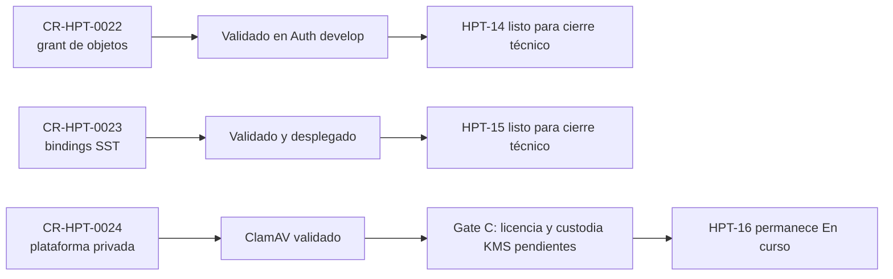

# Preparación de cierre técnico de los primeros gates de custodia

Fecha de observación: 2026-09-10. Coordinación: `CR-CP-0024`.

## Resultado

`CR-HPT-0022` y `CR-HPT-0023` están técnicamente terminados en sus ramas
integradas. Sus tareas Jira siguen `En curso` porque la transición terminal es
una operación separada y todavía no fue autorizada. `CR-HPT-0024` continúa
abierto: el subgate de ClamAV pasó, pero AIStor/KMS aún no fue puesto en
servicio.

Fallback textual: los gates de Auth y bindings pueden cerrarse de forma
independiente. La plataforma Infra no puede cerrarse hasta resolver sus
prerrequisitos externos y probar AIStor/KMS.

## Readback de owners

| Gate | Revisión observada | Validación actual | Conclusión acotada |
| --- | --- | --- | --- |
| `CR-HPT-0022` / Auth | `d9263d1801963047eb01a1956b2a5ee54244a12f` | `npm run check`: PASS | El grant de objetos continúa integrado. El avance posterior a `ff5605c` corresponde al relay Learning y no modifica los contratos ni pruebas del grant de comprobantes. |
| `CR-HPT-0023` / SST | `e425355f65cfd1b70abbe6e38df579d905252459` | `npm run check`: PASS con acceso temporal al servicio mediante port-forward | Intake y bindings pasan sus matrices funcionales. El smoke ARDS general conserva 50% de cobertura protegida y no reemplaza las 30 aserciones sintéticas dedicadas ya registradas. |
| `CR-HPT-0024` / Infra | `755c6eb9b91c1055b1189487e34bff211a857fee` | Argo CD `Synced/Healthy`; subgate scanner previamente PASS | ClamAV está integrado. No existen recursos de la plataforma en `receipt-custody`; AIStor/KMS no está desplegado. |

El port-forward de SST fue únicamente transporte local para el check owner y
se cerró al finalizar. No se modificaron manifests, Secrets, bases de datos ni
estado funcional del cluster durante esta preparación.

## Jira observado

Readback de sólo lectura:

| Tarea | Estado | Resolución | `updated` | Comentarios |
| --- | --- | --- | --- | --- |
| `HPT-14` | En curso | null | `2026-08-29T14:10:02.411-0300` | 2 |
| `HPT-15` | En curso | null | `2026-09-05T22:33:55.191-0300` | 2 |
| `HPT-16` | En curso | null | `2026-09-05T22:33:55.217-0300` | 10 |

Las tres tareas conservan `HPT-8` como parent y ya tienen objetivo e inicio.
Para `HPT-14` y `HPT-15`, Jira ofrece la transición `41` hacia `Listo`.

El lote exacto propuesto está en
`jira-terminal-readiness-batch-2026-09-10.json`. No fue aplicado. Requiere
autorización explícita y un nuevo readback inmediatamente antes de cada
escritura. No incluye transición de `HPT-16`.

## Disposición de worktrees

- El root sucio del control plane se preservó sin mutación.
- Este registro usa el worktree limpio existente
  `worktrees/CR-CP-0024-worktree-sanitization`, reorientado a una rama nueva
  basada exactamente en `main@352d6e6`.
- Los worktrees de validación Auth y SST se conservan como evidencia; no deben
  fusionarse porque su contenido funcional ya está integrado en los branches
  owner.
- El worktree Infra se conserva para Gate C. Su HEAD coincide con `develop` y
  no contiene trabajo único pendiente de conciliación.
- No se autoriza retiro de worktrees o ramas en esta ventana.

## Límites

Esta evidencia no autoriza transiciones Jira, merge del PR del control plane,
aceptación de licencia, creación de Secrets, bootstrap de AIStor/KMS,
promoción a stable, activación de Telegram ni invocación a Phinance.
