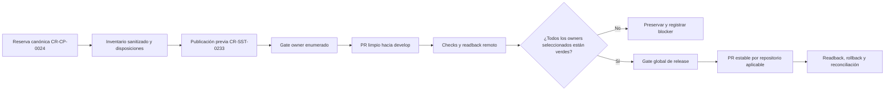

# Plan de integración gobernada y promoción estable

## Resultado de planificación

`CR-CP-0024` divide el trabajo en dos fases. Primero recompone los deltas
aprobados sobre las ramas de desarrollo actuales; después aplica un gate global
antes de cualquier promoción estable. Este documento no autoriza todavía
mutaciones owner, merges de Auth o Backend, despliegues ni escrituras Jira.

El baseline observado contiene 156 worktrees preexistentes. Este flujo agregó
tres worktrees limpios y trazables para validar el PR #197, reservar el request
y publicar el plan. El inventario actual registra 159 entradas, 24 dirty, 134
clean y un registro Core cuyo path no está disponible. Ninguna entrada fue
eliminada, limpiada, stasheada o rebased.

## Mapa del lifecycle

<!-- visual-map:start -->

```yaml
visual_map:
  schema_version: "1.0"
  id: "cr-cp-0024-governed-integration-lifecycle"
  type: "lifecycle"
  question: "¿Qué gates separan inventario, integración owner y promoción estable?"
  abstraction_level: "Lifecycle de promoción cross-repo gobernada."
  source_refs:
    - "requests/inbox/CR-CP-0024-govern-multi-repository-integration-and-stable-promotion.yaml"
    - "requests/planned/CR-CP-0024-govern-multi-repository-integration-and-stable-promotion.yaml"
    - "evidence/requests/CR-CP-0024/promotion-disposition-manifest.yaml"
    - "evidence/requests/CR-CP-0024/promotion-allowlist-validation-2026-08-30.md"
    - "evidence/requests/CR-CP-0024/worktree-inventory-2026-08-30.json"
  request_ids: ["CR-CP-0024", "CR-SST-0233"]
  observed_at: "2026-08-30"
  authority_boundary: "Vista derivada del plan; los lifecycle canónicos gobiernan la promoción y cada repo hijo conserva autoridad sobre código, contratos, documentación y validación owner."
  textual_fallback_required: true
```



### Fallback textual

```text
CR-CP-0024 habilita el inventario y el plan. CR-SST-0233 debe publicarse antes de tocar migraciones. Cada owner recibe después un gate independiente, un candidato limpio y un PR a develop. Sólo cuando todos los PR seleccionados pasan checks y readback se evalúan releases estables por repositorio. Un blocker conserva los worktrees y detiene la promoción; nunca amplía la allowlist.
```

<!-- visual-map:end -->

## Inventario y privacidad

El manifest machine-readable está en
`worktree-inventory-2026-08-30.json`. Para cada entrada conserva:

- repositorio lógico;
- path físico, permitido dentro de `evidence/`;
- HEAD y branch;
- estado dirty, clean o registro no disponible;
- cantidad de entradas de `git status`;
- SHA-256 del status normalizado;
- disposición inicial.

No conserva nombres de archivos modificados ni lee o publica contenido. Los 24
árboles dirty quedan `quarantine-preserve`. El registro Core no disponible no
se prunea. Los clean tampoco se retiran hasta demostrar reachability, ausencia
de procesos dependientes y autorización de retiro.

## Fase 1: integración en desarrollo

### Control-plane

Los commits de `CR-SST-0178`, `0214`, `0220`, `0231` y `0232` ya son
alcanzables desde `origin/main`. `CR-SST-0224@69b41f1` sigue pendiente y debe
publicarse mediante un PR independiente después del readback de este plan. La
raíz dirty continúa en cuarentena; no se fusionará ni rebasará.

### Auth

La base observada es `origin/develop@13ebe6f` y la fuente inmutable es
`f9fe6b5`. El candidato debe conservar commits separados para `CR-CP-0021`,
`CR-HPT-0016` y `CR-HPT-0022`, corregir Markdown humano a español y mantener
YAML, contratos, IDs y harness técnico en inglés.

El merge necesita autorización humana inmediata porque puede publicar una
imagen y actualizar el pin de Infra. El readback debe probar que el commit
automático sólo cambió digest o tag esperados.

### Backend

La base actual es `origin/develop@28ce139`, que ya contiene `CR-HPT-0027`. La
fuente HPT `2a0de56` diverge desde `dc67203`; se recompone por paths y commits,
no por merge de rama. `CR-SST-0233` bloquea la ejecución hasta quedar canónico
y recibir un gate owner independiente.

La aceptación incluye instalación PostgreSQL vacía, upgrade histórico con
fixtures, down/up relevante, paridad final, harness HTTP completo y regresión
de todas las rutas afectadas por `requireAccountRole`.

### Clientes

- Chatbot reconcilia primero `main@99ecc16` hacia `develop@5b96bbb` y preserva
  los seis paths owner exclusivos de QA/memoria.
- Extension parte de `origin/develop@6d0b512`; sus fuentes actuales son dirty y
  no se vuelven inmutables hasta extraer cada request en orden. La captura PNG
  privada queda excluida permanentemente.
- Fend parte de `origin/develop@bd9b8d2`; el worktree `CR-SST-0231` está dirty
  y no es fuente. El PR futuro conserva commits separados por request y excluye
  scroll/focus con `request_id: TODO`, regex 2024 y eliminaciones temporales.

### Portfolio, Phinance, Infra y Automation

- Portfolio ejecuta primero `CR-4UENTES-0039`: CV fuera del tip y build,
  copia de assets por allowlist pública, revisión de binarios y prueba 404.
- Phinance parte de `origin/main@228b192`; el delta dirty no se usa como fuente
  hasta publicar y extraer `CR-HPT-0007` sin perder checks `0017/0021`.
- Infra conserva `origin/develop@6058967` y `CR-HPT-0024` como canónicos. Los
  17 cambios de la raíz se clasifican por CR; `production.yaml` y
  `test-demo.yaml` quedan fuera.
- Automation requiere un gate externo para crear el repo privado. El baseline
  excluye worktrees, `.env`, volúmenes, datos persistentes, credential IDs y
  exports con secretos. SST conserva custody; Phinance sigue prohibido.

## Fase 2: promoción estable

No comienza hasta que todos los PR de integración seleccionados estén verdes y
sus readbacks estén registrados. Core e Infra no tienen destino estable en este
programa. Backend no puede ir a `master` mientras el workflow inseguro conserve
un `push` que ejecute `argocd app sync`; un CR owner separado debe reemplazarlo
por validación no desplegable.

Cada release manifest enumera commit y CR. Un commit sin lifecycle detiene el
release. La allowlist no se amplía durante implementación: se enmienda en el
control-plane, se valida, se fusiona y recién entonces se recompone el candidato.

## Rollback y efectos automáticos

- Revertir el PR por el flujo normal; nunca force-push.
- Restaurar el pin GitOps anterior mediante un nuevo cambio gobernado.
- Conservar ramas backup y worktrees hasta el readback.
- No marcar terminal un CR o Jira sólo por promoción Git.
- Mantener `CR-HPT-0024` running hasta completar licencia, secretos externos,
  despliegue autorizado y QA TLS/mTLS/SSE/EICAR/persistencia.

## Próximo gate

Fusionar este plan y `CR-SST-0233`, refrescar `origin/main` y publicar los
recoveries control-plane todavía ausentes mediante PRs independientes. La
primera mutación de un repo hijo requerirá un lifecycle running con owner,
base, fuente, paths, pruebas y autorización exacta.
