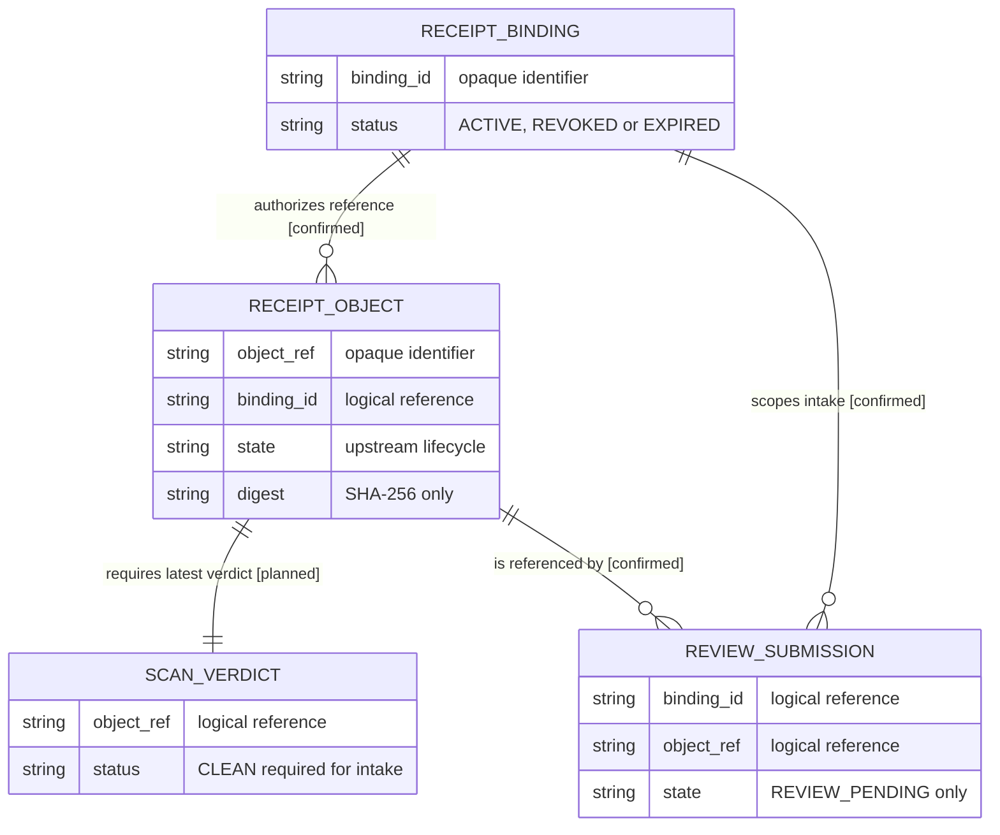

# Decisión de custodia de objetos y aprovisionamiento de bindings

Fecha: 2026-08-27

## Resultado

El gate fija el boundary que debe existir antes de implementar almacenamiento o
emisión de bindings. No asigna owners todavía no aprobados ni selecciona un
proveedor concreto.

`sst-bend` es el owner observado del registro de metadata consumido por el
endpoint de aceptación. El custodio del binario, el productor del veredicto de
malware, el emisor/revocador de bindings y el owner de fixtures protegidos
permanecen `TODO` hasta un lifecycle de adopción owner.

Sólo un objeto opaco, perteneciente al mismo binding, con estado `CLEAN` y sin
expirar puede llegar a `REVIEW_PENDING`. Los estados upstream propuestos son
`REGISTERED`, `SCANNING`, `CLEAN`, `REJECTED`, `EXPIRED` y `DELETED`; no se
declaran implementados.

## Mapa lógico de objetos y bindings

<!-- visual-map:start -->

```yaml
visual_map:
  schema_version: "1.0"
  id: "receipt-object-binding-logical-boundary"
  type: "data"
  question: "¿Cómo se relacionan el binding opaco, el objeto custodiado, el veredicto de scan y la recepción para revisión?"
  abstraction_level: "Entidades lógicas del contrato, sin valores ni topología de implementación."
  source_refs:
    - "evidence/requests/CR-CP-0024/precursors/CR-HPT-0020/object-custody-and-binding-decision.yaml"
    - "evidence/requests/CR-CP-0024/precursors/CR-HPT-0020/planned/CR-HPT-0020-define-receipt-object-custody-and-binding-provisioning.yaml"
    - "evidence/requests/CR-CP-0024/precursors/CR-HPT-0017/promotion-manifest.yaml"
  observed_at: "2026-08-27"
  authority_boundary: "Vista derivada sin valores; el YAML de decisión y los futuros contratos owner conservan autoridad."
  textual_fallback_required: true
```



### Fallback textual del mapa

```text
Un RECEIPT_BINDING autoriza cero o más RECEIPT_OBJECT por referencia opaca.
Cada RECEIPT_OBJECT requiere un SCAN_VERDICT vigente; sólo CLEAN es elegible.
Un RECEIPT_BINDING delimita cero o más REVIEW_SUBMISSION.
Cada REVIEW_SUBMISSION referencia un RECEIPT_OBJECT del mismo binding.
La aceptación crea únicamente REVIEW_PENDING y no contiene binario ni identidad externa cruda.
```

<!-- visual-map:end -->

## Decisiones y bloqueos

- Cifrado en reposo y tránsito, mínimo privilegio, retención y borrado son
  requisitos obligatorios, pero sus contratos owner siguen pendientes.
- El binding debe emitirse desde contexto SST confiable y nunca desde claims de
  usuario suministrados por Automation.
- Bindings desconocidos, revocados o expirados fallan cerrados.
- Objetos `SCANNING`, `REJECTED`, `EXPIRED`, `DELETED` o pertenecientes a otro
  binding fallan cerrados.
- La QA integrada exige fixtures totalmente sintéticos y evidencia sin tokens,
  binarios ni identidades externas.

Los siguientes gates deben separar adopción de owners, implementación runtime y
QA protegida. Ninguno queda autorizado por esta decisión.
