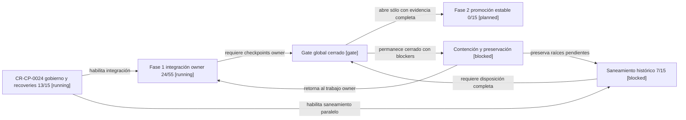

# Scoreboard gobernado de integración de CR-CP-0024

## Resultado actual

Al 5 de septiembre de 2026, `CR-CP-0024` registra **44 de 100 puntos
gobernados satisfechos**. El programa continúa en la fase 1, integración owner
en ramas de desarrollo. La fase 2, promoción estable, no comenzó y conserva
`0%`.

El `44%` no mide líneas de código ni producto terminado. Es una vista derivada
de checkpoints binarios respaldados por evidencia: un checkpoint obtiene todos
sus puntos sólo cuando sus criterios están demostrados; `pending`, `active` y
`blocked` obtienen cero. El lifecycle y sus evidencias siguen siendo la fuente
de autoridad y este scoreboard no autoriza merges, despliegues ni cierres.

| Dimensión | Puntos satisfechos | Puntos totales | Lectura |
| --- | ---: | ---: | --- |
| Gobierno y control plane | 13 | 15 | Bloqueado por el gap de lifecycle de `CR-SST-0233` |
| Integración owner | 24 | 55 | Auth integrado; Backend integrado pero rollout bloqueado; clientes pendientes |
| Saneamiento histórico | 7 | 15 | Diez seeds listos y dos de diez raíces históricas saneadas |
| Gate global y promoción estable | 0 | 15 | No iniciado |
| **Total** | **44** | **100** | **Fase 1 activa; gate global cerrado** |

Los diez seeds limpios representan `100%` de la baseline ya declarada. Esto no
equivale a tener saneadas las raíces históricas: allí hay 2 de 10 repositorios
resueltos (`20%`) y ocho checkouts sucios preservados.

## Posición en el flujo

<!-- visual-map:start -->

```yaml
visual_map:
  schema_version: "1.0"
  id: "cr-cp-0024-program-phase-gate"
  type: "lifecycle"
  question: "¿Qué debe completarse antes de abrir la promoción estable de CR-CP-0024?"
  abstraction_level: "program phase gate"
  source_refs:
    - "evidence/requests/CR-CP-0024/program-scoreboard.current.yaml"
    - "requests/running/CR-CP-0024-govern-multi-repository-integration-and-stable-promotion.yaml"
  observed_at: "2026-09-05"
  authority_boundary: "Vista derivada; el lifecycle CR-CP-0024 y sus readbacks conservan autoridad."
  textual_fallback_required: true
  request_ids: ["CR-CP-0024"]
```



### Fallback textual del mapa de lifecycle

```text
CR-CP-0024 gobierno y recoveries --habilita integración--> Fase 1 integración owner
CR-CP-0024 gobierno y recoveries --habilita saneamiento paralelo--> Saneamiento histórico
Fase 1 integración owner --requiere checkpoints owner--> Gate global cerrado
Saneamiento histórico --requiere disposición completa--> Gate global cerrado
Gate global cerrado --abre sólo con evidencia completa--> Fase 2 promoción estable
Gate global cerrado --permanece cerrado con blockers--> Contención y preservación
Contención y preservación --retorna al trabajo owner--> Fase 1 integración owner
Contención y preservación --preserva raíces pendientes--> Saneamiento histórico
```

<!-- visual-map:end -->

## Estado por repositorio

| Repositorio | Desarrollo / integración | Destino estable | Estado gobernado |
| --- | --- | --- | --- |
| Control plane | `main@4d661d4` al iniciar la observación | `main` | Activo; este scoreboard reconcilia drift posterior |
| Core | `develop@ded8c466` | Ninguno | Canónico; raíz histórica saneada |
| Auth | `develop@ff5605c` | `main` | Integración owner aceptada; promoción estable bloqueada |
| Backend | `develop@5db4dd8` | `master` | Merge, imagen y pin demostrados; rollout ClamAV no sano |
| Chatbot | `develop@5b96bbb` | `main` | Reconciliación `main → develop` pendiente |
| Extension | `develop@6d0b512` | `main` | Extracción request-scoped pendiente; PNG privado excluido |
| Fend | `develop@bd9b8d2` | `master` | Recomposición owner pendiente |
| Portfolio | `develop@f28b016` | `main` | CV/allowlist resueltos; readiness funcional aún bloqueada |
| Phinance | `main@228b192` | `main` | Integración aditiva pendiente |
| Infra | `develop@a4d1200` | Ninguno | Remediaciones integradas; rollout ClamAV bloqueado |
| Automation | `main@32055ab` | `main` | Baseline privada descubierta; integración funcional pendiente |

Los SHAs de repositorios funcionales son los documentados por sus readbacks; no
se presentan como un nuevo `fetch` global. El SHA de autoridad usado para
construir la vista es `origin/main@4d661d440db2688d3b2b98fa97fe46bc80a4867a`.

## Bloqueos que gobiernan el siguiente avance

1. `receipt-clamav` dejó atrás el error de permisos tras Infra PR 25, pero el
   nuevo contenedor fue observado `OOMKilled` durante la actualización de
   firmas. Backend e Infra no cumplen salud y el gate global permanece cerrado.
2. `CR-SST-0233` sólo tiene lifecycle `inbox/planned`, aunque Backend PR 32
   integró trabajo atribuido a su corrección de migraciones. Debe reconciliarse
   el lifecycle; el scoreboard no lo considera satisfecho.
3. Portfolio todavía requiere separación Vite/Sass, corrección del overflow
   móvil, disposición de vulnerabilidades heredadas y CI owner antes de una
   promoción estable.
4. Chatbot, Extension, Fend y Phinance aún no tienen su integración owner de
   esta ola demostrada.
5. Ocho raíces históricas sucias permanecen preservadas. No se borran, resetean
   ni reutilizan como base de features.

## Drift documental contenido

El manifest de disposición es una observación del 30 de agosto y quedó atrasado
frente a los readbacks posteriores de Auth, Backend, Portfolio, Infra y
Automation. El readiness de worktrees también es histórico: sus SHAs y conteos
no se promueven silenciosamente a “estado actual”. Este scoreboard mantiene
esas fuentes intactas, registra la divergencia y usa los lifecycles/readbacks
más recientes para la vista derivada.

También se registra una desviación normativa: Portfolio y el discovery de
Automation avanzaron después de que el gate externo declarara que ningún otro
owner debía avanzar mientras Backend estuviera no sano. Documentar el hecho no
crea autorización retroactiva ni abre el gate estable.

## Regla para recalcular

La fuente machine-readable es
[`program-scoreboard.current.yaml`](program-scoreboard.current.yaml). Los pesos
suman exactamente 100 y no se editan para hacer subir un porcentaje. Un cambio
de alcance requiere una nueva revisión; cada checkpoint sólo cambia a
`satisfied` con evidencia y SHA/readback aplicable.
