# Aplicación de la policy de worktrees para saneamiento

Fecha observada: 2026-09-03. Request: `CR-CP-0024`.

## Decisión aplicada

Se aplica la `worktree-request-lifecycle-policy` existente. No se crea una
policy nueva y no se modifica su autoridad.

La protección adicional sobre los checkouts históricos es un control operativo
de remediación limitado a `CR-CP-0024`. Ese control permanece activo mientras
exista información única sin commit, commits locales sin preservación o deltas
sin lifecycle. Cuando todas las entradas tengan disposición verificable, el
control se marca cumplido. La policy base continúa activa para futuros
worktrees.

## Baseline disponible para nuevas features

Los checkouts detached bajo el binding lógico
`<local-apps>/worktrees/current` fueron refrescados desde
sus refs remotas canónicas y verifican `dirty=0`.

Cada feature debe crear su propia branch y su propio worktree desde la ref
remota refrescada. Los checkouts `current` son seeds verificadas y no deben
compartirse entre agentes concurrentes.

Excepciones de readiness:

- Portfolio está limpio en Git, pero queda bloqueado para features hasta que
  `CR-4UENTES-0039` retire el CV y la copia recursiva de recursos.
- Trabajo Phinance dependiente de recepción documental queda bloqueado hasta
  publicar y recomponer `CR-HPT-0007`; trabajo no relacionado puede partir del
  `origin/main` canónico.

Core y Chatbot tenían roots limpios y atrasados. Ambos fueron actualizados por
fast-forward hasta sus `origin/develop` observados y permanecen limpios.

## Resultado de la auditoría histórica

| Repositorio | Disposición | Motivo de preservación |
| --- | --- | --- |
| Control plane | `preserve-dirty-uncommitted-audit` | Los 15 commits locales fueron reemplazados canónicamente; quedan entradas sin commit por clasificar |
| Auth | `preserve-dirty` | Deltas divergentes y lifecycle faltante para unidades de seguridad |
| Backend | `preserve-dirty-uncommitted-audit` | `efa955b` fue recompuesto como CR-SST-0212; quedan 26 tracked y 11 untracked por clasificar |
| Infra | `preserve-dirty` | Ambientes y deltas sin lifecycle propio |
| Fend | `preserve-dirty` | Colisiones con canonical y allowlist parcial CR-SST-0231 |
| Extension | `preserve-dirty` | Reconstrucción por hunks y captura privada excluida |
| Portfolio | `preserve-dirty` | CR-4UENTES-0039 debe ejecutarse primero |
| Phinance | `preserve-dirty` | CR-HPT-0007 aún no tiene lifecycle publicado |
| Core | `sanitized-fast-forwarded` | Root limpio; no existía información local única |
| Chatbot | `sanitized-fast-forwarded` | Root limpio; no existía información local única |

No existe en este corte ningún checkout histórico dirty que pueda incluirse en
`remove-now`. Los logs Auth `tmp-bf-dev.err` y `tmp-bf-dev.log` son candidatos
generados, pero incluso su eliminación requiere una allowlist autorizada.

## Lifecycle del control de remediación

<!-- visual-map:start -->

```yaml
visual_map:
  schema_version: "1.0"
  id: "worktree-sanitization-remediation-control"
  type: "lifecycle"
  question: "¿Cuándo puede finalizar el control temporal de saneamiento sin retirar la policy durable?"
  abstraction_level: "worktree remediation control"
  source_refs:
    - "docs/policies/worktree-request-lifecycle-policy.md"
    - "requests/running/CR-CP-0024-govern-multi-repository-integration-and-stable-promotion.yaml"
    - "evidence/requests/CR-CP-0024/worktree-sanitization-readiness-2026-09-03.yaml"
  observed_at: "2026-09-03"
  authority_boundary: "Vista derivada; la policy publicada y CR-CP-0024 conservan autoridad."
  textual_fallback_required: true
```



```mermaid
flowchart LR
    P["Base policy [authoritative]"]
    R["Remediation control [running]"]
    S["Historical branches sanitized [gate]"]
    F["Remediation control fulfilled [validated]"]
    C["Base policy remains active [authoritative]"]

    P -->|"governs worktree recovery"| R
    R -->|"requires complete disposition evidence"| S
    S -->|"allows request-scoped control closure"| F
    F -->|"does not deprecate durable rule"| C
```

### Fallback textual del lifecycle

```text
La policy base gobierna la recuperación y activa el control de remediación.
El control exige evidencia completa de saneamiento de branches históricos.
Sólo después de esa evidencia el control temporal puede marcarse cumplido.
Cerrar el control temporal no depreca ni elimina la policy base.
```

<!-- visual-map:end -->

## Próximo gate

El siguiente lote debe recuperar una unidad gobernada, no limpiar todo el
checkout. `efa955b` y los 15 commits locales del control plane no deben
cherry-pickearse: fueron reemplazados por integraciones canónicas. La siguiente
ejecución owner habilitada es `CR-4UENTES-0039`; Auth, Infra y Phinance requieren
publicar primero sus lifecycles faltantes. Los cambios sin commit deben
clasificarse por allowlists antes de retirar cualquier checkout histórico.

Antes de eliminar archivos o retirar un worktree se presentará una lista exacta
de paths y se solicitará autorización separada.
