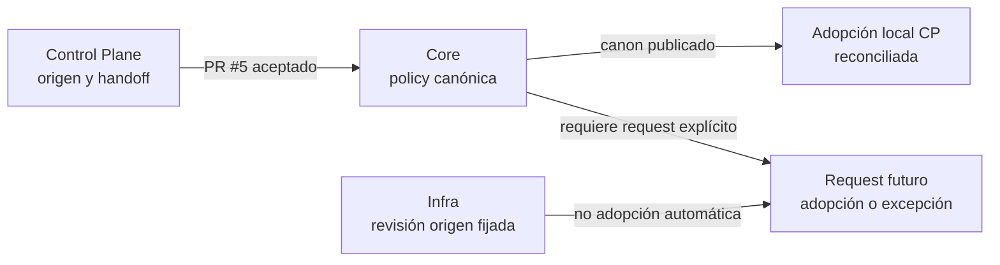

# Readback de publicación canónica — CR-CP-0028

## Resultado

`knowledge-to-execution-documentation-policy` quedó publicada por su owner
canónico, `4uentes-ards-core`, como `core-profile-scoped`.

- PR: <https://github.com/afpogo/4uentes-ards-core/pull/5>.
- Estado observado: `MERGED`.
- Fecha de merge: `2026-09-06T00:49:15Z`.
- Commit de policy: `1dcad5745a8a7c86f842953cb0a57b2bebdf5d5a`.
- Merge commit en `develop`: `376aa401f8b8cc7ea5a7362a8c114ebbf80a2fa4`.
- Ancestry check: PASS; el commit de policy pertenece a `develop`.

## Mapa de reconciliación

Autoridad del mapa: Core decide y publica el canon; Control Plane conserva la
procedencia y registra adopción local. Fuentes: PR #5, Core `develop`,
`CR-CP-0026`, `CR-CP-0027` y `CR-CP-0028`.

Fallback textual: Core publicó la policy canónica; el control plane actualiza
su adopción y conserva procedencia. Infra no cambia por este merge: requiere
un request futuro para adoptar la revisión de Core o registrar una excepción.

## Límites y siguiente trabajo

- No se modificó Infra, runtime ni Jira.
- La adopción existente de Infra no se reetiqueta retroactivamente.
- Un schema estructural para relaciones tipadas y un rollout hijo amplio son
  incrementos separados.
