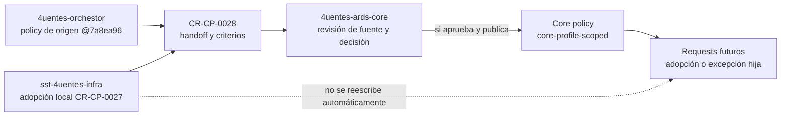

# Handoff para promoción de knowledge-to-execution a Core

Fecha: 2026-09-05

Request: `CR-CP-0028`

## Objetivo

Entregar al owner de `4uentes-ards-core` una propuesta verificable para evaluar
la promoción de `knowledge-to-execution-documentation-policy` desde policy de
origen del control plane a policy `core-profile-scoped`.

Este documento no autoriza ni ejecuta una mutación de Core. La fuente local es
`4uentes-orchestor@7a8ea96`; Infra la adoptó por separado en `CR-CP-0027`.

## Mapa De Autoridad Y Handoff

Autoridad del mapa: `4uentes-ards-core` decide el canon; `4uentes-orchestor`
prepara el handoff y conserva la evidencia local.

Fuentes: `CR-CP-0026`, `CR-CP-0027`,
`docs/policies/knowledge-to-execution-documentation-policy.md`,
`4uentes-ards-core/AGENTS.md` y `governance/source-validation.md`.

Leyenda textual:

- El control plane puede proponer y entregar evidencia, pero no convierte su
  policy local en canon por sí mismo.
- Core valida fuentes y decide si publica la policy reutilizable.
- La adopción actual de Infra sigue fijada a la revisión de origen.
- Una policy Core publicada requiere nuevos requests de adopción o excepción
  para cada repo hijo afectado.

Fallback textual: el handoff lleva la policy local y su evidencia al owner de
Core. Si Core acepta, publica una revisión canónica tras validarla. Ningún
manifest hijo cambia por ese solo hecho: cada repo decide una nueva adopción o
excepción mediante su lifecycle.

## Paquete Requerido Para Core

- política fuente y registro del control plane en `4uentes-orchestor@7a8ea96`;
- evidencia de definición: `CR-CP-0026`;
- evidencia de adopción Infra: `CR-CP-0027` y PR #28;
- revisión de `governance/source-validation.md` y
  `docs/reference-sources.md` del repo Core;
- propuesta de texto, registry y README Core definidos en el request planeado.

## Límites

- No se modifica Core desde este workflow.
- No se reescribe el manifest de Infra.
- No se crea overlay, runtime, Jira ni cambio de infraestructura.
- Si Core rechaza o encuentra divergencia, la policy local conserva su estado y
  se registra un gap; no se promueve parcialmente.
