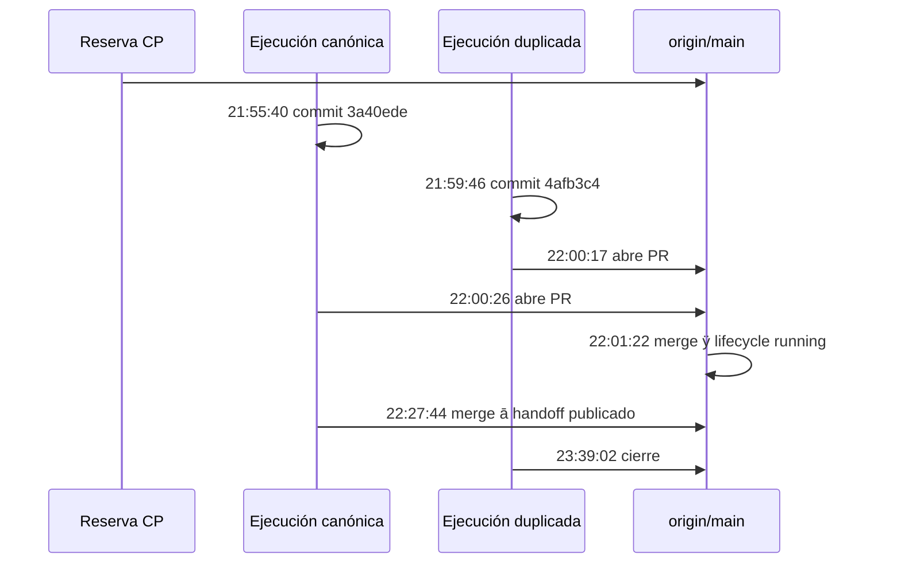

# Análisis de duplicación de trabajo de CR-CP-0028

Fecha: 2026-09-05. Alcance: control plane y metadatos GitHub públicos del
repositorio. No se modificó `4uentes-ards-core`, Infra, runtime ni Jira para
este análisis.

## Resultado

La colisión no fue una implementación duplicada de Core. Fueron dos
publicaciones de control plane para el mismo request:

- PR [#255](https://github.com/afpogo/4uentes-ards-control-plane/pull/255)
  publicó el plan canónico y avanzó `CR-CP-0028` a `running`;
- PR [#254](https://github.com/afpogo/4uentes-ards-control-plane/pull/254)
  fue una segunda propuesta de plan para el mismo ID; quedó en conflicto y se
  cerró como supersedida por #255;
- PR [#257](https://github.com/afpogo/4uentes-ards-control-plane/pull/257)
  publicó el handoff outbound del flujo canónico.

No hay evidencia de mutación de Core asociada a #254. El request canónico
sigue `running-core-owner-workflow-pending` y espera un workflow separado del
owner de Core.

## Línea de tiempo verificable

Autoridad del mapa: GitHub y `origin/main` son la evidencia primaria de
publicación; commits y timestamps son evidencia auxiliar. Las horas son UTC.

Fallback textual: después de reservar el request, dos ramas produjeron planes
para el mismo ID. Aunque #254 se abrió nueve segundos antes, el commit de la
ejecución canónica #255 existía casi cuatro minutos antes. #255 se fusionó y
publicó el estado `running`; por ello #254 ya no podía fusionarse sin
duplicar o regresar el lifecycle.

## Hechos y límites de la evidencia

| Hecho observado | Fuente | Consecuencia |
| --- | --- | --- |
| La reserva #248 se fusionó antes de ambas publicaciones. | `origin/main`, evidence de reserva | El ID sí tenía una intención canónica reservada. |
| Los commits `3a40ede` y `4afb3c4` contienen planes para `CR-CP-0028`. | Git history y PRs #255/#254 | Existieron dos unidades de publicación equivalentes. |
| #255 fue fusionado; #254 resultó `CONFLICTING` y fue cerrado. | GitHub PR readback | #255 tiene precedencia como lifecycle canónico. |
| #257 publicó el handoff outbound y `origin/main` lo contiene. | lifecycle running y PR #257 | El siguiente gate no es otro plan CP sino la aceptación owner de Core. |
| El inicio exacto del worktree local de la ejecución canónica no es reconstruible. | No existe un lease publicado previo al PR | No se atribuye intención o culpa a un agente/persona. |

## Causa raíz

La reserva de identidad funcionó, pero faltó una exclusión de ejecución entre
la reserva y la publicación. En concreto:

1. El preflight no se repitió inmediatamente antes de crear/push/abrir #254.
2. El validator de IDs protege el árbol que se valida; no observa por sí solo
   branches locales no publicadas, worktrees en curso ni PRs creados después
   del baseline.
3. No existía un lease de ejecución visible que declarara de forma atómica el
   único branch/worktree autorizado para `CR-CP-0028`.
4. La conversación/ejecución duplicada se trató de hecho como una nueva unidad
   de trabajo, aunque la policy establece que ni una conversación ni un agente
   crean otro dominio de identidad.

## Controles propuestos

Estos controles son recomendaciones. Cambiar validators, schemas o policies
requiere un request de mejora separado y aprobado.

| Horizonte | Control | Evidencia/DoD |
| --- | --- | --- |
| Inmediato | Repetir preflight justo antes de `commit`, `push` y `gh pr create`: refrescar la ref canónica, listar worktrees, buscar branches por CR y consultar PRs abiertos/cerrados por ID. | Evidencia con timestamp, comandos y decisión `continue` o `block`. |
| Inmediato | Un solo ejecutor con mutación por `(repo, CR)`; trabajo paralelo sólo de lectura y sin abrir branch/PR. | El running request declara branch, worktree y responsable de integración. |
| Próximo request | Modelar un `execution_lease` en el lifecycle publicado, con branch, worktree, inicio, owner y estado. | Validator bloquea una segunda ejecución activa del mismo `(repo, CR)` salvo excepción explícita. |
| Próximo request | Extender el preflight operacional con búsqueda de refs locales/remotas, worktrees y PRs antes de publicar. | Harness negativo reproduce una segunda rama y obtiene bloqueo antes de PR. |
| Próximo request | Definir protocolo de supersesión: conservar commit/branch, documentar precedencia y cerrar PR, sin reescribir el lifecycle canónico. | Readback de PR cerrado y ruta de preservación verificable. |

## Disposición de los worktrees

El worktree de #254 permanece limpio y preservado mientras este análisis se
publica; no se lo retira para ocultar la colisión. Este worktree de evidencia
es una excepción temporal, creada desde `origin/main` por el mismo request y
con alcance exclusivo de diagnóstico. Tras el readback de esta evidencia se
deberán evaluar ambos retiros con el contrato de retiro controlado de la
policy de worktrees.

## Próximo gate

Publicar y releer esta evidencia de prevención. Después, sólo con una
autorización separada del owner, iniciar el workflow en
`4uentes-ards-core`; no se debe abrir otro plan CP para `CR-CP-0028`.
