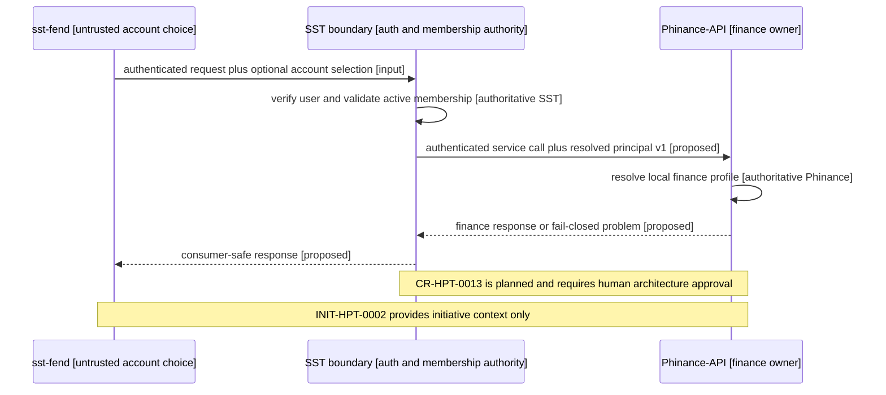

# CR-HPT-0013 — análisis del contrato PrincipalContext v1

Fecha observada: 2026-08-22

## Resultado

El siguiente paso seguro es aprobar un contrato cross-repo, no implementar un
adapter inmediatamente. El runtime Phinance falla cerrado correctamente, pero
su `PrincipalContext` actual mezcla un hecho que SST puede afirmar
(`account_id + stable_subject`) con un identificador que sólo Phinance posee
(`finance_profile_id`).

SST conserva autenticación, cuenta activa y membership. Phinance conserva el
perfil y todos los recursos financieros. Ningún header enviado por el
navegador es contexto confiable por sí mismo.

## Hallazgos

| Tema | Estado observado | Decisión necesaria |
|---|---|---|
| Membership | `sst-bend` posee `Account` y `AccountMembership` en runtime | Mantener resolución en SST |
| Cuenta elegida | `x-active-account-id` es input del navegador validado por SST | Nunca reenviarlo como autoridad desnuda |
| Perfil financiero | Conceptualmente pertenece a Phinance | Resolver `finance_profile_id` dentro de Phinance |
| Scopes | `finance:*` siguen propuestos | SST debe adoptarlos o publicar un mapping aprobado |
| Transporte | No existe contrato HPT ejecutable | Exigir caller SST autenticado y audience dedicada |
| Routing | Directo o facade continúa pendiente | Recomendada facade SST en v1 |
| Readiness | `/ready` sólo refleja proceso | Incorporar dependencias requeridas en el CR de implementación |

`GET /4uentes/v1/me` demuestra que SST puede resolver usuario y cuenta, pero
no constituye todavía un contrato interno, estable y autenticado para
Phinance. Del mismo modo, evidencia histórica de M2M no se considera disponible
si el owner checkout/runtime no la confirma.

## Mapa de secuencia propuesto

<!-- visual-map:start -->

```yaml
visual_map:
  schema_version: "1.0"
  id: "cr-hpt-0013-principal-context-v1-sequence"
  type: "sequence"
  question: "¿En qué orden se valida identidad, membership y ownership financiero sin confiar en el navegador?"
  abstraction_level: "cross-repo handoff"
  source_refs:
    - "solutions/finanzas-personales.yaml"
    - "catalog/services/finanzas-personales-backend.yaml"
    - "requests/done/CR-HPT-0003-finanzas-personales-frontend-backend-boundary-reconciliation.yaml"
    - "requests/done/CR-HPT-0008-implement-everyday-economic-resource-api-slice.yaml"
    - "requests/planned/CR-HPT-0013-define-trusted-principal-context-v1.yaml"
  observed_at: "2026-08-22"
  authority_boundary: "Vista derivada; los contratos owner futuros y el request aprobado conservan autoridad."
  textual_fallback_required: true
  request_ids: ["CR-HPT-0013"]
  initiative_ids: ["INIT-HPT-0002"]
```



## Fallback textual del mapa de secuencia

```text
1. sst-fend envía una request autenticada y una selección opcional de cuenta que sigue siendo input no confiable.
2. La frontera SST verifica la credencial y valida que la cuenta activa pertenezca al usuario.
3. SST invoca Phinance mediante autenticación servicio-a-servicio y entrega sólo el principal v1 resuelto.
4. Phinance resuelve internamente el finance_profile_id y aplica ownership financiero.
5. Phinance responde o falla cerrado; SST devuelve una respuesta segura al consumidor.
6. CR-HPT-0013 permanece planned y requiere aprobación humana; INIT-HPT-0002 sólo aporta contexto de iniciativa.
```

<!-- visual-map:end -->

## Alternativas evaluadas

### Facade SST — recomendada

Conserva JWT, membership y selección de cuenta en SST. Phinance sólo acepta
invocaciones con procedencia de servicio autenticada y resuelve su perfil
local. Evita reutilizar un token de navegador con audience incorrecta.

### Acceso directo del navegador — no recomendado para v1

Exigiría audience propia de Phinance, scopes aprobados, verificación JWT local
y una consulta protegida de membership a SST. También amplía CORS, routing y
superficie pública. Sólo debe adoptarse mediante excepción arquitectónica
explícita y evidencia de que reduce riesgo total.

### Headers internos sin autenticación de servicio — rechazado

La ubicación de red, CORS o nombres como `X-SST-Account-ID` no protegen la
integridad del contexto. Un header sólo puede consumirse después de verificar
la procedencia del servicio bajo un mecanismo aprobado.

## Atomización

1. Aprobar el contrato PrincipalContext v1.
2. Implementar la capability productora en SST mediante un CR independiente.
3. Implementar el adapter consumidor y resolver local en Phinance mediante
   otro CR.
4. Crear bindings y QA E2E bajo un CR de integración.

Esta separación mantiene ownership y rollback claros y evita mezclar una
decisión de seguridad con persistencia, proxy, despliegue y UI.
