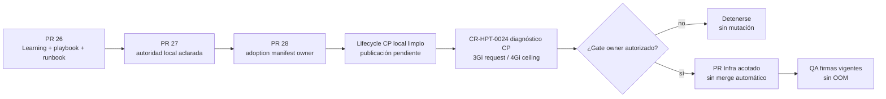

# Diagnóstico de memoria y techo de ClamAV

Fecha: 2026-09-05

## Rol y alcance

Este documento es evidencia de diagnóstico del control plane. Registra una
decisión de dimensionamiento para el owner Infra; no autoriza una mutación de
Git, Kubernetes, DNS, Secrets, licencia ni Jira. La autoridad técnica futura
sigue siendo `sst-4uentes-infra`, en su manifest y documentación owner.

## Hallazgos observados

| Señal | Valor observado |
| --- | --- |
| Contenedor | `receipt-clamav` en `4uentes-sst/sst-bend-58498cc978-rxdlq` |
| Request / límite actual | `768Mi` / `1536Mi` |
| Última terminación | `OOMKilled`, exit `137` |
| Reinicios observados | `23` |
| Fase del fallo | `Testing database` de `daily.cld`, versión `28102` a `28114` |
| Cgroup después del reinicio | actual `1079119872` bytes; peak `1182822400` bytes |
| Worker asignable | `12248696Ki` |
| Requests / límites ya declarados | `2322Mi` / `6642Mi` |

El socket de `clamd` responde y el pod está `Ready`, pero la base diaria tiene
más de siete días y `freshclam` no puede resolver `database.clamav.net`. Por
eso la readiness actual no demuestra firmas vigentes ni cierra el blocker de
custodia.

## Decisión seleccionada

El próximo PR owner deberá proponer exactamente:

| Recurso | Actual | Seleccionado |
| --- | --- | --- |
| Request de memoria | `768Mi` | `3Gi` |
| Límite de memoria | `1536Mi` | `4Gi` |

ClamAV recomienda 3 GiB como mínimo y 3–4 GiB para Docker/Kubernetes
restringido. El límite anterior fue superado durante la validación de firmas;
el techo de 4 GiB conserva margen de recarga. Con esos valores, el worker
proyecta `4626Mi` de requests (aprox. 38%) y `9202Mi` de límites (aprox. 75%),
dentro de `12248696Ki` asignables. Esto selecciona un techo inicial prudente;
no afirma que la corrección esté validada hasta completar una actualización de
firmas real sin OOM.

Las referencias upstream son [requisitos de ClamAV](https://docs.clamav.net/Introduction.html)
y su [guía de troubleshooting](https://docs.clamav.net/faq/faq-troubleshoot.html),
que identifica la recarga de bases como un problema frecuente de memoria en
Docker/Kubernetes.

## Avance de adopción ya existente

La remediación de memoria todavía no tiene branch ni PR propios, pero el
problema ya está tratado en la cadena documental del owner. El lifecycle de
adopción del control plane existe en un worktree limpio, aunque aún no está
publicado ni integrado en `main`:

| Capa | Avance publicado | Estado útil para este gate |
| --- | --- | --- |
| Learning, playbook y runbook | Infra PR #26, merge `4ab3e7e` | Explican custodia, gates y stop conditions. |
| Autoridad documental local | Infra PR #27, merge `6379f5f` | Evita confundir guías humanas con manifests autoritativos. |
| Adopción de policy | Infra PR #28, merge `8efb13e` | Publica `policy_adoption_manifest` bajo `CR-CP-0027`. |
| Lifecycle de adopción en control plane | Branch local limpia `agent/cr-cp-0027-infra-knowledge-policy-adoption@cac58bf` | No existe branch remota observada y `main` todavía no contiene el lifecycle; publicación pendiente. |
| Manifest runtime | `receipt-malware-scanner.patch.yml` | Aún conserva `768Mi/1536Mi`; requiere gate owner. |
| Implementación de memoria | Sin PR abierto ni branch dedicada observada | Pendiente; no existe duplicación activa. |

<!-- visual-map:start -->

```yaml
visual_map:
  schema_version: "1.0"
  id: "cr-hpt-0024-clamav-adoption-progress"
  type: "lifecycle"
  question: "Qué partes de la adopción ya existen y cuál es el próximo gate?"
  abstraction_level: "Progreso documental y operativo de ClamAV en Infra."
  source_refs:
    - "requests/running/CR-HPT-0024-deploy-private-receipt-object-platform.yaml"
    - "evidence/requests/CR-HPT-0024/clamav-memory-diagnosis-and-ceiling-2026-09-05.md"
  request_ids:
    - "CR-HPT-0024"
  observed_at: "2026-09-05"
  authority_boundary: "Vista derivada; Infra conserva autoridad sobre documentación owner y manifest runtime."
  textual_fallback_required: true
```



### Fallback textual

```text
Infra ya publicó la base humana, aclaró su autoridad y adoptó formalmente la
policy. El lifecycle correspondiente del control plane está limpio pero aún es
local. CR-HPT-0024 completa la decisión numérica. Sin un gate owner explícito se
detiene; con autorización se abre un PR acotado y la aceptación exige firmas
vigentes sin OOM.
```

<!-- visual-map:end -->

## PR owner futuro y stop conditions

El cambio autorizado en un gate posterior se limitará a:

- `k8s-manifests/overlays/development/sst-bend/receipt-malware-scanner.patch.yml`;
- `docs/playbooks/receipt-custody-adoption.md`;
- `docs/runbooks/receipt-custody-development.md`.

El PR debe conservar `/init-unprivileged`, UID/GID `1000`, `drop: [ALL]`,
staging en memoria, socket Unix y límites de escaneo de 10 MiB. Debe pasar los
checks owner y demostrar una actualización y recarga de firmas sin `OOMKilled`.
Debe detenerse si la resolución DNS sigue fallando, el contenedor vuelve a OOM,
la seguridad del sidecar se debilita o el presupuesto de scheduling deja de ser
válido.

El merge, el autosync GitOps que pudiera resultar, una corrección DNS, cambios
de Secrets, licencia y Jira requieren autorizaciones separadas.
