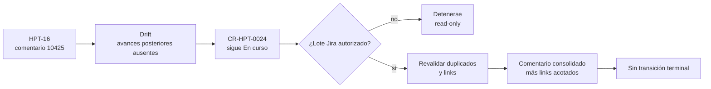

# Reconciliación read-only de Jira para CR-HPT-0024

- Rol primario: evidencia de reconciliación del espejo Jira.
- Owner del lifecycle: `4uentes-orchestor`.
- Owner del espejo: Jira; no es fuente de verdad de ARDS/SDD.
- Fecha observada: 2026-09-05 21:54:34 -03:00.
- Estado: auditoría completada sin escrituras.
- Alcance: `HPT-8`, `HPT-16`, predecesores y duplicados exactos.

No se agregaron comentarios, links ni worklogs; tampoco se ejecutaron
transiciones, asignaciones o ediciones.

## Estado observado

| Issue | Relación | Estado | Resolución | Última actualización |
| --- | --- | --- | --- | --- |
| `HPT-8` | Epic de `INIT-HPT-0003` | En curso | Sin resolución | 2026-08-29 14:09:46 -03:00 |
| `HPT-16` | Tarea de `CR-HPT-0024`, hija de `HPT-8` | En curso | Sin resolución | 2026-09-05 00:28:28 -03:00 |
| `HPT-13` | Predecesor `CR-HPT-0020` | En curso | Sin resolución | 2026-08-29 14:09:59 -03:00 |
| `HPT-15` | Predecesor `CR-HPT-0023` | En curso | Sin resolución | 2026-08-29 14:10:04 -03:00 |

`HPT-16` no tiene assignee. Su parent es correcto, pero no tiene issue links ni
remote links. El último comentario es `10425`; describe el fallo posterior al
PR #24 y exige otra remediación owner. No contiene los avances posteriores.

## Búsqueda de duplicados

Las búsquedas por label `cr-hpt-0024`, identidad `CR-HPT-0024` y summary exacto
devolvieron únicamente `HPT-16`. La búsqueda exacta de la iniciativa devolvió
únicamente `HPT-8` como Epic. No se detectaron duplicados.

## Drift del espejo

Jira no refleja aún:

- la remediación no privilegiada del PR Infra #25;
- la documentación owner del PR #26;
- la aclaración de autoridad y adopción de policy de los PRs #27 y #28;
- el OOM durante la validación de firmas de FreshClam;
- la selección gobernada de `request: 3Gi` y `limit: 4Gi`;
- los merges de los PRs control-plane #258 y #267.

El estado `En curso` sigue siendo correcto. El runtime y la frescura de firmas
continúan bloqueados, por lo que no corresponde transición terminal.

<!-- visual-map:start -->

```yaml
visual_map:
  schema_version: "1.0"
  id: "cr-hpt-0024-jira-mirror-reconciliation"
  type: "lifecycle"
  question: "Qué refleja Jira, qué falta y qué requiere autorización?"
  abstraction_level: "Reconciliación derivada entre el lifecycle ARDS/SDD y su espejo Jira."
  source_refs:
    - "requests/running/CR-HPT-0024-deploy-private-receipt-object-platform.yaml"
    - "evidence/requests/CR-HPT-0024/jira-readonly-reconciliation-2026-09-05.md"
  request_ids:
    - "CR-HPT-0024"
  observed_at: "2026-09-05"
  authority_boundary: "Vista derivada; el lifecycle ARDS/SDD conserva autoridad y Jira funciona como espejo operativo."
  textual_fallback_required: true
```



### Fallback textual

```text
HPT-16 conserva como último avance el comentario 10425. Los eventos posteriores
producen drift respecto de CR-HPT-0024, que correctamente sigue En curso. Sin
autorización se mantiene read-only. Un lote autorizado deberá revalidar
duplicados y links, publicar un único comentario consolidado y no ejecutar una
transición terminal.
```

<!-- visual-map:end -->

## Lote futuro propuesto, no autorizado

1. Repetir la búsqueda exacta de comentarios y links inmediatamente antes de
   escribir.
2. Agregar un único comentario consolidado a `HPT-16`; mantener `En curso`.
3. Verificar la semántica Jira de `Blocks` y, si coincide, enlazar `HPT-13` y
   `HPT-15` como bloqueadores de `HPT-16`.
4. No modificar `HPT-8`, assignee, resolución ni estado.

Este inventario no autoriza el lote. Los keys y operaciones deberán recibir una
aprobación humana nueva y explícita.
