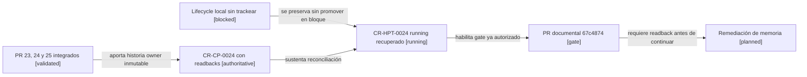

# Reconciliación canónica de CR-HPT-0024

## Resultado

`CR-HPT-0024` gobernó la plataforma privada de custodia de comprobantes, pero
sus archivos de lifecycle quedaron solamente sin trackear en el checkout raíz
sucio del control plane. Mientras tanto, Infra PR #23, #24 y #25 fueron
integrados y sus readbacks quedaron publicados bajo `CR-CP-0024`.

Esta recuperación crea una representación canónica mínima y actual desde
`origin/main@608991400018ebd497414774d61cf70afd178541`. No copia en bloque el
directorio de evidencia legacy, no modifica el checkout dirty y no convierte
sus archivos locales en autoridad.

## Mapa de recuperación

<!-- visual-map:start -->

```yaml
visual_map:
  schema_version: "1.0"
  id: "cr-hpt-0024-retroactive-running-recovery"
  type: "lifecycle"
  question: "¿Cómo recupera autoridad canónica CR-HPT-0024 sin reautorizar su ejecución histórica?"
  abstraction_level: "request lifecycle recovery"
  source_refs:
    - "requests/running/CR-HPT-0024-deploy-private-receipt-object-platform.yaml"
    - "requests/running/CR-CP-0024-govern-multi-repository-integration-and-stable-promotion.yaml"
    - "evidence/requests/CR-CP-0024/infra-pr25-merge-and-runtime-readback-2026-09-05.md"
  observed_at: "2026-09-05"
  authority_boundary: "Vista derivada; los lifecycles fusionados y los readbacks Git conservan autoridad."
  textual_fallback_required: true
  request_ids: ["CR-HPT-0024", "CR-CP-0024"]
```



### Fallback textual del mapa

```text
Lifecycle local sin trackear --se preserva sin promover en bloque--> CR-HPT-0024 running recuperado
PR 23, 24 y 25 integrados --aporta historia owner inmutable--> CR-CP-0024 con readbacks
CR-CP-0024 con readbacks --sustenta reconciliación--> CR-HPT-0024 running recuperado
CR-HPT-0024 running recuperado --habilita gate ya autorizado--> PR documental 67c4874
PR documental 67c4874 --requiere readback antes de continuar--> Remediación de memoria
```

<!-- visual-map:end -->

## Precedencia aplicada

La recuperación usa, en este orden:

1. `origin/main` y los readbacks publicados de `CR-CP-0024`;
2. los SHAs remotos de Infra PR #23, #24 y #25;
3. el lifecycle local únicamente como procedencia para identidad e intención.

Los trece documentos legacy no se incorporan porque no son necesarios para
demostrar el estado actual y algunos contienen snapshots operativos o Jira ya
superados. Permanecen preservados en el checkout raíz para una clasificación
posterior.

## Límites vigentes

El merge de esta recuperación no autoriza mutación owner. Tras su readback sólo
queda habilitado el gate ya publicado en `CR-CP-0024`: empujar exactamente el
commit documental `67c4874`, abrir un PR contra Infra `develop` y detenerse sin
merge. El diagnóstico/cambio de memoria, el autosync, Kubernetes y Jira siguen
separados.
