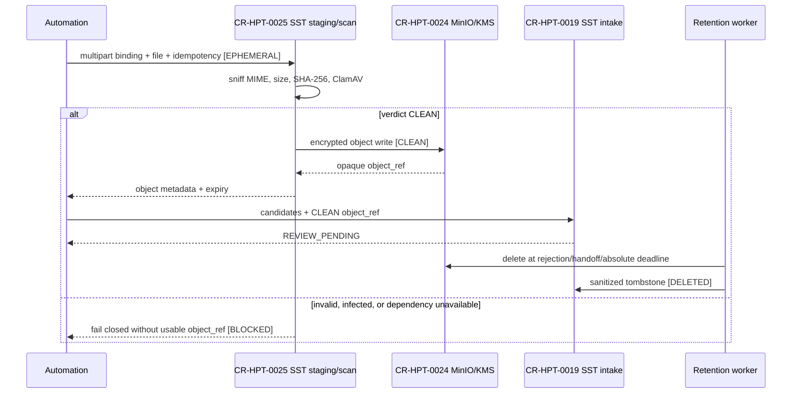

# Bloqueo y mapa de CR-HPT-0025

Fecha: 2026-08-28

## Bloqueo

No se creó worktree ni se modificó `sst-bend`: el gate exige basarse en el
resultado integrado de `CR-HPT-0019`, que todavía no existe, y consumir la
plataforma privada de `CR-HPT-0024`, bloqueada en preflight de proveedor.

## Mapa de secuencia y datos objetivo

Pregunta: qué datos atraviesan cada boundary y dónde se decide la persistencia.

Leyenda de estados: `[EPHEMERAL]` no se conserva; `[CLEAN]` habilita storage;
`[REVIEW_PENDING]` es metadata durable; `[DELETED]` conserva sólo tombstone.

<!-- visual-map:start -->

```yaml
visual_map:
  schema_version: "1.0"
  id: "cr-hpt-0025-target-sequence"
  type: "sequence"
  question: "¿Qué datos atraviesan cada boundary del upload y dónde se habilita la persistencia?"
  abstraction_level: "Target data flow; no representa una implementación existente."
  source_refs:
    - "requests/planned/CR-HPT-0025-implement-sst-receipt-object-upload-custody-retention.yaml"
    - "evidence/requests/CR-CP-0024/precursors/infra-provider-preflight-blocker.md"
  observed_at: "2026-08-28"
  authority_boundary: "Vista derivada y objetivo bloqueado; el request conserva autoridad y el mapa no constituye evidencia runtime."
  request_ids: ["CR-HPT-0025", "CR-HPT-0024", "CR-HPT-0019"]
  status_vocabulary: ["EPHEMERAL", "CLEAN", "REVIEW_PENDING", "DELETED", "BLOCKED"]
  textual_fallback_required: true
```



### Fallback textual

```text
CR-HPT-0025 recibe el multipart y gobierna staging, scan, storage y retención.
CR-HPT-0024 debe proveer MinIO/KMS y ClamAV privados.
CR-HPT-0019 debe proveer el intake durable ya integrado.
Automation envía binding, archivo e idempotency a staging efímero.
SST valida tipo/tamaño, calcula SHA-256 y consulta ClamAV.
Sólo CLEAN permite escribir cifrado en MinIO/KMS y emitir object_ref.
Automation usa ese object_ref en intake, que crea REVIEW_PENDING.
Retención borra el objeto físico a 24 h, 7 d o 30 d según el evento aplicable.
Tras borrar queda únicamente tombstone sanitizado, digest, estado y timestamps.
Cualquier inválido, malware o dependencia caída falla cerrado sin object_ref.
```

<!-- visual-map:end -->
