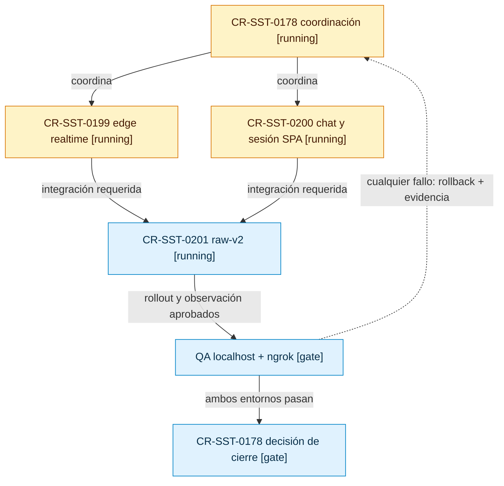

# Plan integral de chat visible y `raw-v2` en development

Este mapa responde qué CR debe completar qué gate antes del cierre integrado de
`CR-SST-0178`. Los request YAML vinculados conservan autoridad; Jira es sólo un
mirror y no existe autorización de escritura en este lifecycle.

<!-- visual-map:start -->

```yaml
visual_map:
  schema_version: "1.0"
  id: "cr-sst-0178-integrated-chat-raw-v2-lifecycle"
  type: "lifecycle"
  question: "¿Qué CR debe completar qué gate antes del QA y cierre integrado de CR-SST-0178?"
  abstraction_level: "request lifecycle"
  source_refs:
    - "requests/running/CR-SST-0178-deploy-sst-chatbot-development-cluster.yaml"
    - "requests/planned/CR-SST-0199-development-realtime-edge.yaml"
    - "requests/planned/CR-SST-0200-visible-chat-and-spa-session-repair.yaml"
    - "requests/planned/CR-SST-0201-development-raw-v2-gradual-adoption.yaml"
  observed_at: "2026-08-21"
  authority_boundary: "Vista derivada; los request YAML y la evidencia de validación conservan autoridad."
  textual_fallback_required: true
  request_ids: ["CR-SST-0178", "CR-SST-0199", "CR-SST-0200", "CR-SST-0201"]
```



## Fallback textual del mapa de lifecycle

```text
CR-SST-0178 [running] coordina CR-SST-0199 y CR-SST-0200.
CR-SST-0199 y CR-SST-0200 deben integrarse antes de iniciar la mutación de CR-SST-0201.
CR-SST-0201 debe completar rollout y observación antes del QA localhost + ngrok.
Sólo el PASS de ambos entornos permite cerrar CR-SST-0178.
Cualquier fallo conserva CR-SST-0178 en running y exige rollback más evidencia exacta.
```

<!-- visual-map:end -->

## Límites fijados

- Alcance exclusivo de development; producción, extensión y mobile quedan fuera.
- `sst-bend` conserva conversación y persistencia; `sst-chatbot` no recibe Ingress.
- `CR-SST-0159` permanece `running` por password recovery.
- `CR-SST-0182` conserva coordinación cross-tab.
- No se escribirá en Jira sin un lote enumerado independiente.
