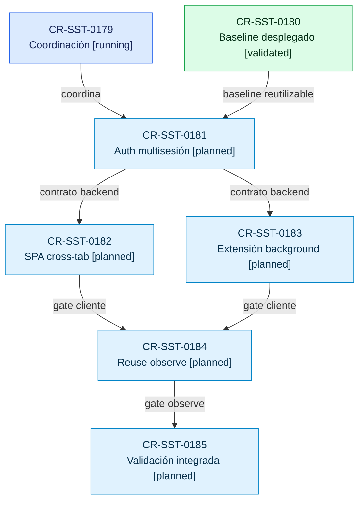

# Plan de implementación segura del MVP multisesión

## Objetivo y autoridad

Permitir que SST web y la extensión mantengan sesiones independientes y
revocables, con refresh de uso único, logout terminal por familia y migración
legacy sin caída. `CR-SST-0179` coordina el lifecycle; cada implementación
técnica conserva aprobación, owner docs y validación independientes.

Este plan no autoriza despliegue, datos productivos, creación de secretos ni
escrituras Jira.

## Reconciliación con CR-SST-0180

`CR-SST-0180` ya es un baseline desplegado en development, no un experimento
pendiente de publicación. Se conservan sus controles seguros y se reemplazará
su decisión de familia única sólo después de completar los gates posteriores.

| Baseline desplegado | Tratamiento |
| --- | --- |
| `sid`, `token_use`, CAS de generación y migración legacy | Reutilizar en `CR-SST-0181` |
| Introspección M2M | Endurecer y validar en `CR-SST-0181` |
| Timeouts de 15 s y errores acotados | Mantener y probar en `CR-SST-0185` |
| Single-flight SPA por runtime | Extender entre pestañas en `CR-SST-0182` |
| Coordinación de extensión por runtime | Consolidar en background en `CR-SST-0183` |
| Telemetría y configuración `observe` | Usar como base del gate `CR-SST-0184` |
| Una familia activa por cuenta | Reemplazar por familias independientes por `sid` |

Hasta que los CR técnicos sean implementados, validados y promovidos, la
política single-family de `CR-SST-0180` sigue siendo el comportamiento runtime
autoritativo.

## Orden de ejecución

Pregunta: ¿qué CR debe completar su gate antes de habilitar el siguiente paso
de adopción multisesión?

Nivel de abstracción: lifecycle y dependencias entre change requests. El mapa
no representa endpoints, clases ni estado interno del cluster.

Fuentes de verdad:

- `requests/running/CR-SST-0179-reconcile-atomic-revocable-auth-session-families.yaml`
- `requests/running/CR-SST-0180-integrate-login-sessions-and-timeout-corrections.yaml`
- `requests/planned/CR-SST-0181-adapt-auth-to-independent-session-families.yaml`
- `requests/planned/CR-SST-0182-coordinate-spa-session-refresh-across-tabs.yaml`
- `requests/planned/CR-SST-0183-complete-extension-background-session-coordination.yaml`
- `requests/planned/CR-SST-0184-observe-and-gate-refresh-token-reuse.yaml`
- `requests/planned/CR-SST-0185-validate-integrated-multi-session-adoption.yaml`

Estado observado: 2026-08-18. El diagrama es derivado; los YAML conservan
autoridad.

<!-- visual-map:start -->

```yaml
visual_map:
  schema_version: "1.0"
  id: "sst-multi-session-adoption-request-dependencies"
  type: "dependency"
  question: "¿Qué CR debe completar su gate antes de habilitar el siguiente paso de adopción multisesión?"
  abstraction_level: "Lifecycle y dependencias entre change requests."
  source_refs:
    - "requests/running/CR-SST-0179-reconcile-atomic-revocable-auth-session-families.yaml"
    - "requests/running/CR-SST-0180-integrate-login-sessions-and-timeout-corrections.yaml"
    - "requests/planned/CR-SST-0181-adapt-auth-to-independent-session-families.yaml"
    - "requests/planned/CR-SST-0182-coordinate-spa-session-refresh-across-tabs.yaml"
    - "requests/planned/CR-SST-0183-complete-extension-background-session-coordination.yaml"
    - "requests/planned/CR-SST-0184-observe-and-gate-refresh-token-reuse.yaml"
    - "requests/planned/CR-SST-0185-validate-integrated-multi-session-adoption.yaml"
  observed_at: "2026-08-18"
  authority_boundary: "Vista derivada; los YAML del lifecycle conservan autoridad."
  request_ids: ["CR-SST-0179", "CR-SST-0180", "CR-SST-0181", "CR-SST-0182", "CR-SST-0183", "CR-SST-0184", "CR-SST-0185"]
  textual_fallback_required: true
```



### Fallback textual accesible

```text
CR-SST-0179 coordinates CR-SST-0181.
CR-SST-0180 provides the deployed baseline to CR-SST-0181.
CR-SST-0181 is the backend prerequisite for CR-SST-0182 and CR-SST-0183.
CR-SST-0182 and CR-SST-0183 are client prerequisites for CR-SST-0184.
CR-SST-0184 is the observe prerequisite for CR-SST-0185.
```

<!-- visual-map:end -->

## Contrato funcional e invariantes

- Cada login crea un `sid` criptográficamente aleatorio e independiente.
- Refresh preserva `sid` y cambia sólo su generación mediante CAS exacto.
- Una generación refresh se consume como máximo una vez.
- Logout normal revoca sólo `userId + sid`; `logout-all` es separado.
- Ningún refresh puede resucitar una familia revocada.
- Un refresh válido sin `sid` puede migrar una única vez mediante CAS.
- Ningún token raw, email, IP, `sid` o `jti` aparece en telemetría o evidencia.
- Un resultado ambiguo posterior al CAS exige re-login; el cliente no repite el
  refresh consumido.
- Consumidores JWT-only aceptan el access token hasta su expiración; los que
  introspectan observan revocación dentro del lease declarado.

## Gates atomizados

1. `CR-SST-0181`: Auth permite familias por `sid`, CAS exacto, logout terminal,
   migración legacy e introspección M2M endurecida.
2. `CR-SST-0182`: Axios, actor, realtime y pestañas comparten coordinación SPA.
3. `CR-SST-0183`: el background MV3 es owner único de refresh y logout.
4. `CR-SST-0184`: reuse permanece en `observe`, sin revocar ni emitir PII; pasar
   a `enforce` exige otra decisión explícita.
5. `CR-SST-0185`: Mongo sintético, dos procesos Auth, M2M, dos pestañas y la
   extensión real prueban el contrato integrado y su cleanup.

## Rollback y cierre

- Los campos nuevos son aditivos; nunca se vuelve a un binario que rechace
  familias ya emitidas.
- Desactivar introspección o reuse enforcement no borra familias.
- No se eliminan campos legacy en este ciclo.
- Cada CR debe pasar checks owner, `git diff --check`, scan secret-safe y el
  `npm run check` completo del control plane.
- La promoción runtime y cualquier creación/rotación de secretos quedan fuera
  de este lifecycle y requieren su gate propio.
