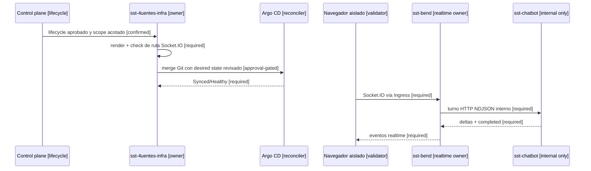

# Plan de corrección del Ingress realtime de development

## Resultado buscado

`CR-SST-0199` corrige exclusivamente el salto público
`sst-fend -> Ingress -> sst-bend` que bloquea el handshake Socket.IO. El
chatbot conserva acceso interno únicamente a través de `sst-bend`.

No se crean secretos, no se modifica producción y no se autoriza una edición
persistente directa del clúster. La publicación y el rollback ocurren por
Git/Argo CD.

## Mapa de secuencia del gate

<!-- visual-map:start -->

```yaml
visual_map:
  schema_version: "1.0"
  id: "cr-sst-0199-development-realtime-sequence"
  type: "sequence"
  question: "¿En qué orden se corrige y valida el salto Socket.IO público sin exponer sst-chatbot?"
  abstraction_level: "cross-repo handoff"
  source_refs:
    - "requests/planned/CR-SST-0199-route-realtime-socketio-through-development-ingress.yaml"
    - "requests/running/CR-SST-0178-deploy-sst-chatbot-development-cluster.yaml"
    - "evidence/requests/CR-SST-0178/isolated-browser-qa-2026-08-19.md"
  observed_at: "2026-08-21"
  authority_boundary: "Vista derivada; los requests y los contratos owner de sst-4uentes-infra conservan autoridad."
  textual_fallback_required: true
```



### Fallback textual del mapa de secuencia

```text
1. El control plane publica el lifecycle aprobado y acotado para el owner Infra.
2. Infra agrega y valida la ruta Socket.IO antes del catch-all del frontend.
3. El cambio se fusiona en Git y Argo CD debe reportar Synced/Healthy.
4. Un navegador aislado conecta por el Ingress al owner realtime sst-bend.
5. sst-bend invoca internamente a sst-chatbot y recibe deltas más completed.
6. sst-bend devuelve los eventos al navegador; sst-chatbot nunca obtiene Ingress público.
```

<!-- visual-map:end -->

## Unidades y gates

1. Publicar y fusionar este lifecycle antes de cualquier mutación owner.
2. Crear una worktree limpia de `sst-4uentes-infra` desde `origin/develop`.
3. Inventariar el Ingress y los puertos renderizados; no asumir nombres.
4. Implementar la ruta mínima y actualizar specs/docs owner.
5. Ejecutar `npm run check`, render, dry-run, diff check y scan secret-safe.
6. Publicar PR; no fusionarlo hasta revisión humana.
7. Tras el merge, observar Argo y repetir QA con identidad sintética aislada.

## Límites y rollback

- Ambiente único: development.
- Sin escrituras Jira, datos productivos ni creación/lectura de secretos.
- Sin cambios runtime en Auth, Bend, Fend, Extension o Chatbot.
- Rollback inicial: revert Git del commit Infra y reconciliación Argo.
