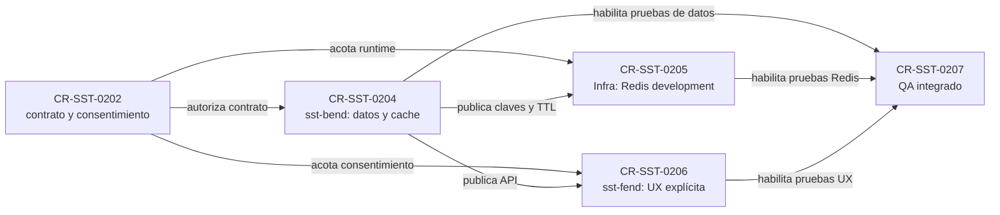

# Plan de retención consciente del chat SST

## Decisión

La mejora se ejecuta como un CR principal y cuatro CRs hijos. `CR-SST-0202`
define el contrato transversal; `CR-SST-0204` implementa la autoridad de datos
en Bend; `CR-SST-0205` provee Redis en development; `CR-SST-0206` implementa
el consentimiento en Fend; y `CR-SST-0207` realiza el QA integrado.

No se modificó ningún repositorio funcional, clúster ni issue de Jira en esta
etapa. Jira seguirá siendo un espejo: se propone un Task bajo `SST-86` para el
CR principal y cuatro Subtasks, sujeto a autorización enumerada separada.

## Mapa de dependencias y autoridad

<!-- visual-map:start -->

```yaml
visual_map:
  schema_version: "1.0"
  id: "cr-sst-0202-retention-dependency-map"
  type: "dependency"
  question: "¿Cómo se separan consentimiento, autoridad de datos, Redis, UX y QA sin mezclar ownership?"
  abstraction_level: "cross-repo lifecycle"
  source_refs:
    - "requests/planned/CR-SST-0202-consent-aware-chat-retention.yaml"
    - "requests/planned/CR-SST-0204-bend-chat-retention-and-cache.yaml"
    - "requests/planned/CR-SST-0205-development-redis-chat-runtime.yaml"
    - "requests/planned/CR-SST-0206-fend-chat-retention-consent-ux.yaml"
    - "requests/planned/CR-SST-0207-integrated-chat-retention-qa.yaml"
  observed_at: "2026-08-22"
  authority_boundary: "Vista derivada; cada request y la documentación del repositorio owner conservan autoridad."
  textual_fallback_required: true
```



### Fallback textual del mapa

```text
1. Se aprueba CR-SST-0202 como contrato transversal.
2. Bend publica el contrato y la semántica de persistencia en CR-SST-0204.
3. Infra y Fend consumen ese contrato mediante CR-SST-0205 y CR-SST-0206.
4. El QA CR-SST-0207 comienza cuando los tres owners están integrados.
```

<!-- visual-map:end -->

## Estados acordados

| Modo | Autoridad/estado | Recuperación |
| --- | --- | --- |
| Temporal | Redis o memoria volátil con TTL; nunca PostgreSQL | Entre sesiones activas del mismo usuario hasta finalizar o expirar |
| Guardada en SST | PostgreSQL durable como autoridad; Redis cache-aside | Después de logout, en otros dispositivos y sesiones futuras |

Redis no es una opción visible para el usuario. En modo guardado, una lectura
busca primero en Redis; ante miss consulta PostgreSQL y repuebla el cache. Una
escritura durable confirma primero PostgreSQL y luego actualiza o invalida
Redis. Esto evita que una falla del cache se convierta en pérdida durable.

El contenido visible se mantiene en memoria de la aplicación. El navegador
puede conservar solamente una referencia opaca y un cursor no sensible. Las
acciones se distinguen así:

- `Limpiar este dispositivo`: borra únicamente estado local.
- `Finalizar conversación temporal`: elimina el estado volátil y avisa a las sesiones activas.
- `Guardar en SST`: promoción explícita e idempotente a PostgreSQL.
- `Eliminar de SST`: borra la conversación durable e invalida Redis.

Socket.IO continúa siendo el transporte de navegador. Redis pub/sub o el
adapter de Socket.IO puede distribuir eventos entre réplicas; gRPC no se agrega
como dependencia para sincronizar navegadores.

## Gates de ejecución

1. Publicar y revisar este lifecycle en el control plane.
2. Aprobar individualmente `CR-SST-0204`, `CR-SST-0205` y `CR-SST-0206` antes de mutar sus repositorios owner.
3. Hacer que Bend publique primero su contrato y pruebas de ownership/idempotencia.
4. Integrar Redis por GitOps y la UX de consentimiento contra el contrato aprobado.
5. Ejecutar `CR-SST-0207` con identidades sintéticas en localhost y ngrok reservado.
6. Cerrar cada CR con checks owner, documentación owner y `npm run check` del control plane.

## Jira publicado

- `CR-SST-0202`: `SST-113`, Tarea bajo Epic `SST-86`.
- `CR-SST-0204` a `CR-SST-0207`: `SST-114` a `SST-117`, Subtasks de `SST-113`.
- La búsqueda JQL previa no encontró duplicados compatibles.
- El lote autorizado fue ejecutado y consumido; futuras escrituras requieren una autorización nueva.
