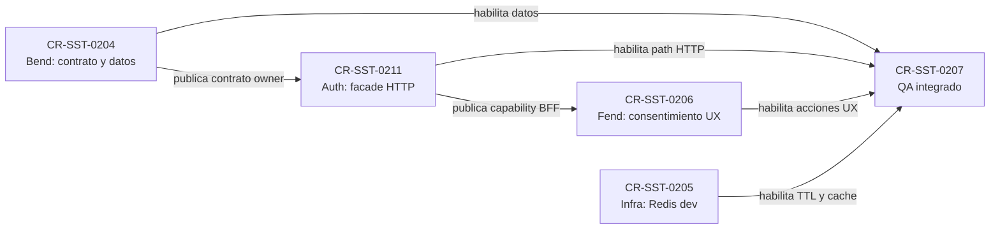

# Plan de adopción del facade de retención de chat en 4uentes-auth

## Resultado del análisis

`CR-SST-0211` completa un lifecycle owner que no quedó atomizado en el cierre
original de `CR-SST-0202`. Bend conserva la autoridad sobre conversaciones,
consentimiento durable, PostgreSQL, Redis, TTL y ownership. `4uentes-auth`
adopta ese contrato como facade HTTP autenticado. Fend consume el facade y
mantiene como única excepción directa a Bend el transporte Socket.IO ya
gobernado.

Esta planificación no modifica repositorios hijos, Jira, clústeres ni datos.
La ejecución en `4uentes-auth` requiere aprobación separada y debe comenzar
desde un worktree limpio creado después de refrescar `origin/develop`.

## Mapa de dependencias y autoridad

<!-- visual-map:start -->

```yaml
visual_map:
  schema_version: "1.0"
  id: "cr-sst-0211-auth-retention-facade-dependency-map"
  type: "dependency"
  question: "¿Cómo llega el contrato de retención desde Bend hasta Fend sin mover la autoridad de datos al BFF?"
  abstraction_level: "cross-repo lifecycle"
  source_refs:
    - "requests/planned/CR-SST-0204-bend-chat-retention-and-cache.yaml"
    - "requests/planned/CR-SST-0205-development-redis-chat-runtime.yaml"
    - "requests/planned/CR-SST-0211-adopt-chat-retention-facade-in-auth.yaml"
    - "requests/planned/CR-SST-0206-fend-chat-retention-consent-ux.yaml"
    - "requests/planned/CR-SST-0207-integrated-chat-retention-qa.yaml"
  observed_at: "2026-08-22"
  authority_boundary: "Vista derivada; Bend conserva autoridad del contrato de datos y cada repositorio owner conserva su documentación local."
  textual_fallback_required: true
```



### Fallback textual del mapa

```text
1. CR-SST-0204 publica primero el contrato owner de retención en sst-bend.
2. CR-SST-0211 adopta ese contrato bajo /api/chat en 4uentes-auth.
3. CR-SST-0206 consume solamente la capability publicada por 4uentes-auth.
4. CR-SST-0205 habilita Redis en development y CR-SST-0207 prueba Bend, Auth,
   Fend y Redis como una sola cadena integrada.
```

<!-- visual-map:end -->

## Pasadas de análisis

### 1. Autoridad y routing

El runtime canónico observado de `4uentes-auth` ya protege
`/api/chat/conversations`, historial y delete con
`AuthMiddleware.validateJwt`, y construye el destino desde
`SST_CHAT_BASE_URL`. El gap no exige otro gateway: exige extender esa misma
superficie. El BFF no puede almacenar chat en MongoDB ni decidir TTL,
persistencia o ownership.

El frontend conserva la excepción directa a Bend solamente para Socket.IO.
Listar, recuperar, guardar, finalizar y eliminar por HTTP deben recorrer
`sst-fend -> 4uentes-auth -> sst-bend`.

### 2. Paridad del contrato HTTP

La ejecución debe adoptar el contrato exacto que publique `CR-SST-0204`; este
plan no canoniza nombres de rutas todavía inexistentes. La paridad mínima debe
cubrir list, create temporal, history, promote/save idempotente, finish
temporal y durable delete.

Existe un riesgo de compatibilidad en el `DELETE` actual. No se puede cambiar
silenciosamente su significado ni tratar `finish temporary` como alias de
`delete from SST`. La decisión de compatibilidad se bloquea hasta leer el spec
owner de Bend y debe quedar probada en Auth.

### 3. Identidad, privacidad e idempotencia

Todas las rutas requieren el access token validado por el middleware actual y
deben propagar `Authorization` y el contexto de cuenta soportado. Bend vuelve a
validar JWT y ownership; Auth no confía en `userId`, `accountId`, `saved` ni
consentimiento enviados como helpers dentro del body.

Las mutaciones deben preservar los headers de idempotencia y correlación que
defina Bend. Auth no conserva cuerpos, mensajes, tokens ni resultados en
MongoDB, caches locales o logs. El plan no cambia refresh cookies, CSRF,
familias de sesión, scopes de Socket.IO ni introspección.

### 4. Errores y acciones destructivas

Los errores de dominio upstream deben mantener su significado. Un timeout o
una caída de Bend nunca se presenta como conversación guardada, finalizada o
eliminada. Los IDs se validan y codifican antes de construir el target. Los
tests deben cubrir explícitamente 400, 401, 403, 404, 409, timeout y upstream
unavailable.

### 5. Documentación owner y handoff

La regla de `4uentes-auth` exige dos handoffs: adopción inbound desde Bend y
publicación outbound hacia Fend. También deben actualizarse routing,
integrations API, chat sessions y el harness HTTP reproducible. Ninguna
capability se marca `ready-for-consumer` antes de implementar runtime y pasar
`npm run check` en el owner.

### 6. Dependencias, QA y Jira

`CR-SST-0206` pasa a depender de `CR-SST-0211`, y `CR-SST-0207` incorpora
`CR-SST-0211` como prerrequisito. Jira no tiene mirror para este follow-up y no
se modifica en esta ventana. Cualquier alta o link futuro necesita un lote
enumerado y autorizado por separado.

## Orden de ejecución propuesto

1. Ejecutar y publicar el contrato Bend de `CR-SST-0204`.
2. Aprobar explícitamente la mutación owner de `CR-SST-0211`.
3. Crear worktree limpio de `4uentes-auth` desde `origin/develop` refrescado.
4. Adoptar spec, rutas, headers, errores, capabilities inbound/outbound y
   documentación owner en una sola unidad auditable.
5. Ejecutar `npm run check` de `4uentes-auth` y pruebas negativas sin MongoDB.
6. Publicar el facade y recién entonces habilitar la ejecución de
   `CR-SST-0206`.
7. Cerrar con `CR-SST-0207`, evidencia sintética secret-safe y
   `npm run check` del control plane.

## Gaps bloqueantes antes de código

- Falta el spec owner `chat-retention-v1` de Bend; `CR-SST-0204` debe
  publicarlo primero.
- Falta decidir compatibilidad explícita del `DELETE` existente contra
  `finish temporary` y `delete durable`.
- Falta autorización humana para mutar `4uentes-auth`.
- Falta un lote Jira separado si se desea reflejar `CR-SST-0211` y sus links.

Ninguno de estos gaps impide cerrar la planificación local, pero todos
bloquean una ejecución owner prematura.
