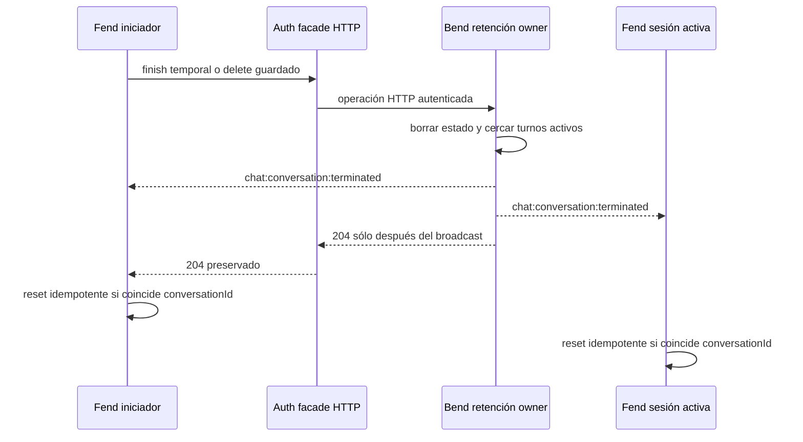

# Plan de propagación del evento terminal de retención

Fecha observada: 2026-08-24.

## Resultado del relevamiento

El siguiente gate queda atomizado como `CR-SST-0218`. Su único objetivo es
cerrar el defecto funcional detectado por `CR-SST-0207`: una finalización
temporal elimina el estado HTTP, pero las sesiones Socket.IO activas no reciben
una señal terminal y pueden conservar una vista obsoleta.

Esta planificación no modifica repositorios hijos, Jira, runtime, Redis,
PostgreSQL, secretos ni producción. La ejecución owner requiere un gate humano
posterior a la fusión y readback de este plan.

## Readback y baselines owner

- La reserva mínima se fusionó por el PR de control-plane `#120`; el merge
  `85764645da6af07ffb4a43f506fc94ae4ef79fb4` contiene el inbox canónico.
- El worktree de reserva estaba limpio, su commit era alcanzable desde
  `origin/main` y fue retirado sin borrar su branch.
- El worktree de planificación nació desde el `origin/main` refrescado en
  `2a5c072` y preserva el lote posterior de retiro de worktrees del PR `#121`.
- Bend fue leído sin mutación desde `origin/develop@fc5573a`. El namespace
  `/sst-chat/v1` publica los eventos de mensajes, handoff y error, pero no uno
  terminal. Las rutas `finish` y `DELETE` mutan el store y devuelven `204` sin
  conexión con el broadcaster.
- Fend fue leído desde el `develop` remoto en
  `317b17247cb6375ea01472856dfaae379b0f4a0c`. La UI ya implementa consentimiento,
  finish, delete y limpieza local, pero escucha sólo los eventos realtime
  anteriores y resetea únicamente la pestaña que ejecuta la llamada HTTP.
- Los roots locales de Bend y Fend contienen trabajo ajeno y no son elegibles
  para mutación. La futura ejecución deberá usar worktrees owner limpios.

El preflight Jira read-only no pudo recuperar datos porque el conector rechazó
el refresh OAuth como inválido. No hubo escritura. Jira continúa siendo mirror
y el ID `CR-SST-0218` ya está reservado por el control-plane canónico, no por el
tracker.

## Mapa de secuencia y autoridad

<!-- visual-map:start -->

```yaml
visual_map:
  schema_version: "1.0"
  id: "cr-sst-0218-terminal-event-sequence"
  type: "sequence"
  question: "¿En qué orden converge una finalización autorizada entre HTTP, Bend realtime y las sesiones Fend activas?"
  abstraction_level: "cross-repo retention termination"
  source_refs:
    - "requests/inbox/CR-SST-0218-retention-terminal-event-propagation.yaml"
    - "requests/planned/CR-SST-0218-retention-terminal-event-propagation.yaml"
    - "evidence/requests/CR-SST-0207/integrated-matrix-checkpoint-2026-08-24.md"
    - "initiatives/INIT-SST-0007-sst-chatbot-first-connected-version.yaml"
  observed_at: "2026-08-24"
  authority_boundary: "Vista derivada; Bend conserva autoridad de retención, Fend de su UX, Auth del facade HTTP y el control-plane del lifecycle."
  textual_fallback_required: true
```



### Fallback textual del mapa

```text
1. La sesión iniciadora envía finish o delete por el facade HTTP de Auth.
2. Bend valida ownership y completa primero el borrado autoritativo.
3. Bend cancela o cerca turnos activos para impedir escrituras posteriores.
4. Bend emite el evento terminal a todas las sesiones autorizadas del room.
5. Auth conserva el 204 y cada Fend resetea sólo si conversationId coincide.
6. Un 400, 404 o 409 no produce evento; una lectura posterior sigue en 404.
```

<!-- visual-map:end -->

## Decisión de contrato propuesta

El evento será `chat:conversation:terminated`. Es transitorio y no se reinyecta
desde history porque su objeto ya fue eliminado. El payload se limita a:

```json
{"conversationId":"<opaque-uuid>","reason":"temporary_finished|saved_deleted"}
```

No incluye secuencia, mensajes, deltas, principal, token, cookie, credencial ni
URL. Fend debe tratar duplicados de forma idempotente e ignorar un evento cuyo
`conversationId` no sea el activo. Una reconexión tardía conserva el fallback
actual: history devuelve `404` y la referencia local se descarta.

El evento sólo corresponde a `finish` temporal y `delete` guardado exitosos.
La expiración TTL proactiva, el cache hit/miss, el acceso QA por ngrok y la
limpieza de residuos sintéticos quedan fuera de este lifecycle.

## Boundary y ownership

- `sst-bend`: productor realtime, autoridad de retención, cancelación/fencing
  de turnos y prevención de resurrección.
- `sst-fend`: consumidor del evento y autoridad de la convergencia visual.
- `4uentes-auth`: sin cambio; continúa proxyando únicamente el HTTP y no se
  convierte en relay Socket.IO.
- `sst-chatbot`, Infra y datastores: sin cambio.
- `4uentes-orchestor`: lifecycle, plan, evidencia y mirror Jira.

## Unidades de ejecución y DoD

| Unidad | Owner | Riesgo | Definition of Done |
| --- | --- | --- | --- |
| Publicar plan | control-plane | medio | Plan fusionado, readback remoto y full check PASS |
| Productor terminal | sst-bend | alto | Evento exacto, no-event negatives, turn fencing y no resurrección probados |
| Consumidor terminal | sst-fend | alto | Reset matching, ignore non-matching, duplicados y notice probados |
| Publicar owners | Bend/Fend | alto | PRs fusionados, refs leídas y owner docs completas |
| Jira mirror | control-plane | medio | OAuth, duplicado, jerarquía, autorización exacta y readback PASS |
| QA integrada | control-plane | alto | Dos sesiones activas convergen y history queda en 404 |
| Cierre | control-plane | medio | `done` fusionado/readback antes de cleanup |

## Jira propuesto, todavía no autorizado

Después del merge/readback del plan se debe restaurar OAuth y ejecutar una
búsqueda JQL de duplicados. Si no existe mirror compatible, el lote candidato
será una única `Subtask` de `SST-113`:

`[CR-SST-0218] Propagar eventos terminales de retencion a sesiones activas`

La creación y transición a `En curso` necesitan aprobación exacta posterior.
No se autorizan comentarios, links, assignee, labels ni edición de otros
issues.

## Gates pendientes

1. Fusionar y leer este lifecycle `planned` desde `origin/main`.
2. Obtener autorización exacta para publicar `running` y mutar Bend/Fend.
3. Recuperar OAuth Jira, repetir duplicate/hierarchy preflight y autorizar el
   lote enumerado.
4. Ejecutar owners en worktrees limpios, publicar/readback y recién entonces
   retomar la fila terminal de `CR-SST-0207`.

