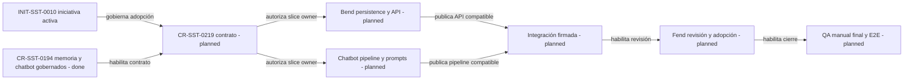

# CR-SST-0219 - Plan De Implementación Del Contrato

Fecha observada: 2026-08-24.

## Resultado Buscado

Convertir la propuesta de análisis secuencial por párrafos en un contrato
ARDS/SDD implementable y verificable. Este CR pertenece al control plane: no
modifica código, contratos owner ni runtime de `sst-bend`, `sst-chatbot` o
`sst-fend`.

La base ya está publicada:

- `CR-SST-0192`: contrato de memoria personal;
- `CR-SST-0193`: persistencia y API canónica;
- `CR-SST-0210`: identidad, tenant, account y application scope;
- `CR-SST-0194`: proposal y recall gobernados del chatbot.

## Policies Aplicadas

- El control plane sigue siendo autoridad del lifecycle; Jira es espejo.
- El plan debe fusionarse y leerse desde `main` antes de cualquier mutación
  externa.
- Cada repo funcional deberá recibir un CR propio, publicar sus specs/docs
  ARDS/SDD owner y pasar su validación completa.
- Todo cierre funcional deberá incluir QA manual de última revisión, además de
  las pruebas automatizadas.
- Ninguna salida del chatbot se convierte automáticamente en memoria aceptada.
- Los mapas son vistas derivadas y conservan fuentes, fecha, autoridad y
  fallback textual.

## Mapa Del Orden De Adopción

<!-- visual-map:start -->

```yaml
visual_map:
  schema_version: "1.0"
  id: "cr-sst-0219-paragraph-derivation-gates"
  type: "lifecycle"
  question: "¿Qué gates deben completarse desde el contrato hasta el cierre E2E de la derivación por párrafos?"
  abstraction_level: "control-plane adoption gates"
  source_refs:
    - "requests/planned/CR-SST-0219-adopt-paragraph-sequential-derivation-contract.yaml"
    - "initiatives/INIT-SST-0010-personal-knowledge-and-memory-workspace.yaml"
    - "evidence/initiatives/INIT-SST-0010/paragraph-sequential-derivation-adoption-plan.md"
    - "requests/done/CR-SST-0194-integrate-chatbot-memory-proposals-and-recall.yaml"
  observed_at: "2026-08-24"
  authority_boundary: "Vista derivada; el control plane conserva autoridad de orquestación y cada repo owner conserva autoridad sobre sus contratos técnicos."
  textual_fallback_required: true
  request_ids: ["CR-SST-0194", "CR-SST-0219"]
  initiative_ids: ["INIT-SST-0010"]
  status_vocabulary: ["done", "planned", "blocked"]
```



## Fallback Textual Del Mapa

```text
INIT-SST-0010 gobierna la adopción.
La base gobernada de CR-SST-0194 ya está cerrada.
Luego se publica y aprueba CR-SST-0219.
Bend y chatbot pueden trabajar en paralelo después del contrato.
La integración comienza cuando ambos owners publicaron contratos compatibles.
La UI comienza después de la integración.
El cierre requiere QA manual final y E2E autenticado.
```

<!-- visual-map:end -->

## Contrato A Materializar

### Agregado y orden

- `DERIVATION_RUN` es el agregado raíz.
- Cada corrida referencia un `SOURCE_SNAPSHOT` inmutable y una
  `PARAGRAPH_SEQUENCE` inmutable.
- Mantiene una sola `CONTEXT_CHAIN` versionada.
- Produce cero o más `PARAGRAPH_DERIVATION`, ordenadas por
  `paragraph_ordinal`.
- Una corrida completada puede producir una `FINAL_DERIVATION`.
- La finalización puede entregar una `DERIVATION_MEMORY_PROPOSAL` en
  `needs_review`.

### Prompt y sesgo explícito

El profile default será `open-general-analysis`: amplio, pero obligado a
separar evidencia, inferencias e interpretaciones alternativas. Una mirada
elegida por el usuario se registra como profile/instrucción versionada.

Cambiar el prompt no reescribe análisis anteriores. Crea otra corrida o un
fork explícito con provenance independiente. Perfiles más sesgados, como
sentimiento, se incorporan después como contratos versionados y conservan los
mismos guardrails.

### Autoridad de memoria

`sst-chatbot` analiza y propone. `sst-bend` reconstruye identidad y scope,
valida el handoff y conserva el estado durable. Sólo una acción explícita del
usuario puede aceptar o corregir una propuesta y promoverla a memoria
canónica. Rechazo y supersesión permanecen auditables.

## Unidades Ordenadas

1. Fusionar y leer el plan `CR-SST-0219`.
2. Reconectar Jira, repetir JQL y solicitar un lote exacto para crear el mirror
   con descripción completa.
3. Obtener autorización separada para implementar el contrato del control
   plane.
4. Materializar esquema lógico, lifecycle, prompt registry y handoffs.
5. Recorrer manualmente los escenarios del contrato como última revisión.
6. Actualizar la descripción Jira con el resultado real, comentar y cerrar sólo
   después del cierre ARDS/SDD local.
7. Fusionar el lifecycle `done`, leer `main` y recién entonces retirar el
   worktree temporal.
8. Reservar CRs independientes para Bend, chatbot, integración, Fend y E2E.

## Definition Of Done

- Identidad `CR-SST-0219` única y publicada.
- Contrato lógico, estados, prompt composition y memory handoff aprobados.
- Owners y dependencias de los siguientes CRs explícitos.
- QA manual de última revisión aprobado por `4uentes`.
- Descripción y estado Jira reconciliados mediante lote exacto autorizado.
- `npm run check` y `git diff --check` en PASS.
- Lifecycle terminal fusionado y leído desde `main`.

## Límites

- No hay mutación de repos hijos en este CR.
- No hay creación automática de los CRs hijos.
- No hay producción, despliegue, provider externo, embeddings ni vector store.
- No se publica contenido privado, prompts de usuario ni identificadores
  sensibles en Jira o evidencia.
