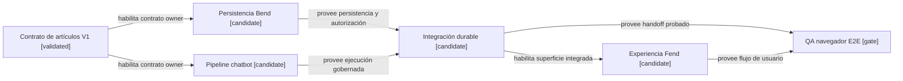

# Preflight de asignación de requests hijos

## Resultado del namespace

La primera búsqueda encontró libre el bloque desde `CR-SST-0222`, pero antes de publicar `origin/main` incorporó `CR-SST-0222` para una reconciliación de calidad. La propuesta se descartó sin reservar ni colisionar.

La búsqueda repetida sobre `origin/main@af0560d`, nombres de ramas remotas y el historial alcanzable no encontró reservas para `CR-SST-0223`, `CR-SST-0224`, `CR-SST-0225`, `CR-SST-0226` ni `CR-SST-0227`.

La observación no reserva los IDs. Otra publicación puede ocuparlos antes del gate de creación; por eso el namespace debe repetirse inmediatamente antes de escribir los lifecycles.

## Asignación propuesta

| ID candidato | Slice | Owner principal | Dependencias propuestas |
|---|---|---|---|
| `CR-SST-0223` | Persistencia y autorización de runs, resultados, resúmenes y propuestas | `sst-bend` | `CR-SST-0220`, `CR-SST-0210` |
| `CR-SST-0224` | Ejecución de ambos modos, prompts, límites y retries | `sst-chatbot` | `CR-SST-0220`, `CR-SST-0219` |
| `CR-SST-0225` | Integración durable Bend–chatbot | cross-repo | candidatos `0223` y `0224` |
| `CR-SST-0226` | Acción, selección, progreso y revisión del resumen | `sst-fend` | candidato `0225` |
| `CR-SST-0227` | QA end-to-end por navegador y cierre de adopción | control plane + owners | candidatos `0225` y `0226` |

## Mapa de dependencias

<!-- visual-map:start -->

```yaml
visual_map:
  schema_version: "1.0"
  id: "article-processing-owner-slice-proposal"
  type: "dependency"
  question: "¿En qué orden deben adoptarse los owners del procesamiento de artículos?"
  abstraction_level: "Slices de adopción por owner para V1."
  source_refs:
    - "evidence/requests/CR-SST-0220/article-agent-processing-contract-v1.yaml"
    - "requests/running/CR-SST-0220-generalize-agent-processing-modes-for-articles.yaml"
  observed_at: "2026-08-27"
  authority_boundary: "Vista derivada y no reservante; el contrato V1 y futuros lifecycles publicados conservan autoridad."
  textual_fallback_required: true
```



### Fallback textual

```text
El contrato V1 habilita dos candidatos paralelos: CR-SST-0223 para Bend y CR-SST-0224 para chatbot. Ambos deben completarse antes de CR-SST-0225, la integración durable. CR-SST-0226 adopta la experiencia Fend después de esa integración. CR-SST-0227 ejecuta el QA E2E únicamente cuando integración y Fend estén disponibles.
```

<!-- visual-map:end -->

## Reglas obligatorias para cada hijo

- Repetir namespace y publicar inbox + planned antes de tocar el owner.
- Registrar selección de modelo, riesgo, atomización, límites y autorización.
- Actualizar el ARDS/SDD local de cada repositorio modificado.
- Evaluar y publicar mapas conformes a `visual-documentation-as-code-policy` cuando datos, secuencia, dependencias o lifecycle se entiendan mejor visualmente; incluir metadata, fuentes, autoridad y fallback textual.
- Ejecutar checks del owner y `npm run check` completo del control plane.
- No usar DB scripts ni seeders para el QA de usuario.
- Cerrar E2E con Chrome DevTools MCP exclusivamente y aprobación humana explícita.

## Gate pendiente

La creación de estos cinco lifecycles es una mutación separada. Requiere repetir el namespace y recibir autorización explícita que enumere los cinco IDs. Este preflight no permite cambios en repositorios hijos.
