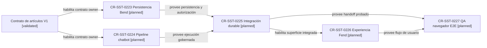

# Reserva de requests hijos

## Resultado del namespace

La primera búsqueda encontró libre el bloque desde `CR-SST-0222`, pero antes de publicar `origin/main` incorporó `CR-SST-0222` para una reconciliación de calidad. La propuesta se descartó sin reservar ni colisionar.

La búsqueda final sobre `origin/main@d71bd6d`, nombres de ramas remotas, el árbol canónico y el historial alcanzable no encontró reservas para `CR-SST-0223`, `CR-SST-0224`, `CR-SST-0225`, `CR-SST-0226` ni `CR-SST-0227`. El control incluyó la reserva posterior `CR-SST-0228`, cuya propia evidencia confirma que no tomó el rango `0223..0227`.

La autorización humana `autorizo ambos`, recibida el 2026-08-28, habilitó crear los cinco lifecycles únicamente en el control plane. Los archivos locales `inbox + planned` reservan la propuesta dentro de esta rama; la reserva será canónica sólo después de merge y readback remoto. Ningún lifecycle habilita mutaciones de owners, runtime, datos o Jira.

## Asignación reservada localmente

| ID | Slice | Owner principal | Dependencias |
|---|---|---|---|
| `CR-SST-0223` | Persistencia y autorización de runs, resultados, resúmenes y propuestas | `sst-bend` | `CR-SST-0220`, `CR-SST-0210` |
| `CR-SST-0224` | Ejecución de ambos modos, prompts, límites y retries | `sst-chatbot` | `CR-SST-0220`, `CR-SST-0219` |
| `CR-SST-0225` | Integración durable Bend–chatbot | cross-repo | `CR-SST-0223`, `CR-SST-0224` |
| `CR-SST-0226` | Acción, selección, progreso y revisión del resumen | `sst-fend` | `CR-SST-0225` |
| `CR-SST-0227` | QA end-to-end por navegador y cierre de adopción | control plane + owners | `CR-SST-0225`, `CR-SST-0226` |

## Mapa de dependencias

<!-- visual-map:start -->

```yaml
visual_map:
  schema_version: "1.0"
  id: "article-processing-owner-slice-reservation"
  type: "dependency"
  question: "¿En qué orden deben adoptarse los owners del procesamiento de artículos?"
  abstraction_level: "Slices de adopción por owner para V1."
  source_refs:
    - "evidence/requests/CR-SST-0220/article-agent-processing-contract-v1.yaml"
    - "requests/running/CR-SST-0220-generalize-agent-processing-modes-for-articles.yaml"
    - "requests/planned/CR-SST-0223-persist-article-processing-runs-and-summaries.yaml"
    - "requests/planned/CR-SST-0224-implement-article-processing-agent-pipeline.yaml"
    - "requests/planned/CR-SST-0225-integrate-article-processing-bend-chatbot.yaml"
    - "requests/planned/CR-SST-0226-adopt-article-processing-user-experience.yaml"
    - "requests/planned/CR-SST-0227-validate-article-processing-end-to-end.yaml"
  request_ids:
    - "CR-SST-0223"
    - "CR-SST-0224"
    - "CR-SST-0225"
    - "CR-SST-0226"
    - "CR-SST-0227"
  observed_at: "2026-08-28"
  authority_boundary: "Vista derivada de lifecycles locales planned; cada archivo publicado conserva autoridad y ninguna ejecución owner está autorizada."
  textual_fallback_required: true
```



### Fallback textual

```text
El contrato V1 habilita dos lifecycles planned paralelos: CR-SST-0223 para Bend y CR-SST-0224 para chatbot. Ambos deben completarse antes de CR-SST-0225, la integración durable. CR-SST-0226 adopta la experiencia Fend después de esa integración. CR-SST-0227 ejecuta el QA E2E únicamente cuando integración y Fend estén disponibles.
```

<!-- visual-map:end -->

## Reglas obligatorias para cada hijo

- Repetir namespace y publicar inbox + planned antes de tocar el owner.
- Registrar selección de modelo, riesgo, atomización, límites y autorización.
- Actualizar el ARDS/SDD local de cada repositorio modificado.
- Evaluar y publicar mapas conformes a `visual-documentation-as-code-policy` cuando datos, secuencia, dependencias o lifecycle se entiendan mejor visualmente; incluir metadata, fuentes, autoridad y fallback textual.
- Ejecutar checks del owner y `npm run check` completo del control plane.
- No usar DB scripts ni seeders para el QA de usuario.
- Cerrar E2E con Chrome DevTools MCP exclusivamente y aprobación humana explícita.

## Gate pendiente

Los cinco lifecycles están creados localmente bajo la autorización del 2026-08-28. El próximo gate es publicar esta rama y confirmar el readback canónico. Después, cada request requiere su propia autorización de ejecución; este gate no permite cambios en repositorios hijos.
