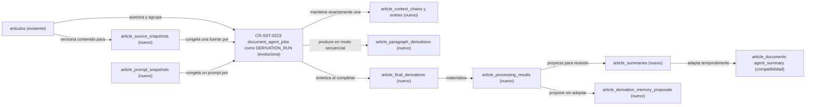

# Plan de adopción Bend para procesamiento de artículos

## Resultado buscado

Bend debe convertirse en autoridad de autorización y persistencia del agregado definido por `sst-article-agent-processing-v1`, conservando compatibilidad con el runtime `document-agent` existente. Chatbot seguirá siendo el ejecutor futuro de derivaciones y Fend seguirá siendo consumidor; este request no implementa esos owners.

## Estrategia de compatibilidad

`document_agent_jobs` se evoluciona como representación física de `DERIVATION_RUN`. Se agregan referencias de scope, modo, snapshots y cadena, y se mantienen los endpoints `/articulos/:id/agent-jobs` como adaptadores durante V1. No se crea otra tabla de runs en paralelo.

`article_documents.type=agent_summary` puede seguir exponiéndose para clientes legacy, pero se deriva desde el resultado y no reemplaza `ARTICLE_SUMMARY`: el resumen canónico necesita estado editorial, ordinal y procedencia propios.

## Mapa de persistencia propuesta

<!-- visual-map:start -->

```yaml
visual_map:
  schema_version: "1.0"
  id: "cr-sst-0223-bend-persistence-adoption"
  type: "dependency"
  question: "¿Cómo adopta Bend el contrato V1 sin duplicar el job existente?"
  abstraction_level: "Entidades físicas propuestas y compatibilidad del owner Bend."
  source_refs:
    - "evidence/requests/CR-SST-0220/article-agent-processing-contract-v1.yaml"
    - "evidence/requests/CR-SST-0223/owner-readonly-preflight-2026-08-28.md"
    - "requests/planned/CR-SST-0223-persist-article-processing-runs-and-summaries.yaml"
  request_ids:
    - "CR-SST-0223"
  observed_at: "2026-08-28"
  authority_boundary: "Vista derivada y propuesta del control plane; la spec y migraciones publicadas por sst-bend serán autoridad física si el gate se autoriza y fusiona."
  textual_fallback_required: true
```



### Fallback textual

```text
CR-SST-0223 hace que el artículo existente origine un snapshot inmutable. document_agent_jobs evoluciona como DERIVATION_RUN y referencia un source snapshot, un prompt snapshot y exactamente una context chain. Sólo el modo secuencial genera paragraph derivations. Un run completado puede crear una final derivation y un processing result. Del result nacen article summaries revisables y, por separado, memory proposals no adoptadas. Un summary puede proyectarse como article_documents agent_summary únicamente para compatibilidad.
```

<!-- visual-map:end -->

## Contratos a publicar en el owner

- Spec API normativa para crear/listar/leer runs y consultar resultados, resúmenes y propuestas bajo artículo y cuenta autorizados.
- Spec de persistencia con claves, FKs, uniques de idempotencia, estados, transacciones y política de inmutabilidad.
- Capability outbound en estado `draft` para BFF/Fend; sólo pasa a `ready-for-consumer` cuando runtime y QA owner estén alineados.
- Documento humano en español con mapa de datos y lifecycle; manifest o metadata de adopción de policies aplicables.
- `orchestrator_link` con `CR-SST-0223`, `INIT-SST-0010` y el issue Jira sólo después de crearlo.

## Ejecución atomizada

1. Publicar primero specs, docs, mapa, compatibilidad y migraciones reversibles; validar el contrato owner.
2. Implementar modelos y repositorios con transacciones, scope reconstruido y uniques de idempotencia; probar aislamiento y rollback.
3. Adaptar el runtime `document-agent`, agregar las superficies HTTP mínimas y preservar respuestas legacy; no invocar todavía al chatbot.
4. Ejecutar checks owner, pruebas focales y revisión manual de contrato; publicar PR owner y hacer readback remoto.
5. Actualizar el control plane, registrar evidencia terminal y dejar la integración real bloqueada para `CR-SST-0225`.

## Criterios negativos

- Un artículo fuera de la cuenta activa no crea ni expone runs.
- Repetir una idempotency key compatible no duplica run, resultado, resumen ni propuesta.
- Cambiar modo, prompt o versión de fuente no reescribe runs previos.
- Fallo, cancelación o supersesión no publica resultado exitoso.
- Publicar un resumen no acepta memoria.
- Contenido y prompts privados no aparecen en logs, Jira ni evidencia del control plane.
