# Preview de autorización de ejecución para CR-SST-0224

## Propósito

Definir el lote mínimo necesario para iniciar el owner `sst-chatbot` sin
confundir planificación, Jira mirror e implementación.

Este documento es un preview. No concede autorización.

## Mapa de gates

<!-- visual-map:start -->

```yaml
visual_map:
  schema_version: "1.0"
  id: "cr-sst-0224-running-authorization-gates"
  type: "lifecycle"
  question: "Qué gates deben completarse antes y después de mutar sst-chatbot para CR-SST-0224?"
  abstraction_level: "Lifecycle owner de CR-SST-0224."
  source_refs:
    - "requests/planned/CR-SST-0224-implement-article-processing-agent-pipeline.yaml"
    - "evidence/requests/CR-SST-0224/owner-readonly-preflight-2026-08-29.md"
    - "evidence/requests/CR-SST-0224/jira-readonly-preflight-2026-08-29.md"
    - "evidence/requests/CR-SST-0220/article-agent-processing-contract-v1.yaml"
  observed_at: "2026-08-29"
  authority_boundary: "Vista derivada; la autoridad permanece en el lifecycle publicado, el contrato V1 y los ARDS/SDD del owner sst-chatbot."
  textual_fallback_required: true
  request_ids: ["CR-SST-0224"]
```



```mermaid
flowchart LR
    PLAN["CR-SST-0224 planned<br/>preflights read-only completos"]
    AUTH["Autorización humana exacta<br/>owner y Jira enumerados"]
    RUN["Lifecycle running<br/>publicado y leído"]
    JIRA["Jira Subtask<br/>creada e iniciada"]
    WT["Worktree sst-chatbot<br/>desde origin develop"]
    DOCS["ARDS SDD owner<br/>contrato y mapas"]
    CODE["Runtime puro<br/>ambos modos y fake provider"]
    PR["PR owner<br/>checks y readback"]
    CLOSE["Reconciliación control plane<br/>QA manual y cierre"]
    PLAN -->|"requiere"| AUTH
    AUTH -->|"habilita publicación"| RUN
    AUTH -->|"habilita lote separado"| JIRA
    RUN -->|"habilita mutación owner"| WT
    WT -->|"documentar antes o junto al runtime"| DOCS
    DOCS -->|"contrato limita implementación"| CODE
    CODE -->|"checks owner en PASS"| PR
    PR -->|"merge canónico habilita"| CLOSE
```

### Fallback textual

```text
CR-SST-0224 permanece planned con preflights read-only completos. Una autorización humana exacta habilita dos acciones separadas: publicar y leer el lifecycle running, y ejecutar el lote Jira enumerado. Sólo el running publicado habilita crear un worktree de sst-chatbot desde origin/develop. En el owner se publican primero o junto al runtime los ARDS/SDD, contratos y mapas. La implementación pura de ambos modos usa fake provider y debe pasar checks antes del PR owner. El merge y readback owner habilitan reconciliación, QA manual y cierre en el control plane.
```

<!-- visual-map:end -->

## Gate owner propuesto

La autorización owner permitiría únicamente:

1. promover `CR-SST-0224` a `running` en el control plane;
2. crear un worktree limpio de `sst-chatbot` desde
   `origin/develop@5b96bbb4c08731785f007ecaabd9e8c03bc88283`;
3. crear la rama
   `feat/CR-SST-0224/article-processing-agent-pipeline`;
4. actualizar ARDS/SDD owner, prompt catalog, código bajo
   `src/app/article_processing/` y tests;
5. ejecutar tests con fakes y `scripts/check.py`;
6. preparar un PR owner para revisión.

No permitiría deployment, publicación de imagen, llamadas pagas obligatorias,
credenciales reales, mutación de Bend/Fend/Auth/infra ni datos compartidos.

## Lote Jira propuesto

Máximo dos escrituras:

1. crear exactamente una `Subtask` bajo `SST-122` con summary
   `[SST][CR-SST-0224] Implement governed article processing agent pipeline`;
2. aplicar únicamente la transición `21` desde `Tareas por hacer` hacia
   `En curso`.

Después debe ejecutarse readback de key, summary, parent, type, status y
resolución. La autorización se consume al completar el lote.

## Criterios técnicos obligatorios

- `full_document` falla explícitamente antes del provider cuando excede el
  límite; nunca trunca;
- `sequential_paragraphs` procesa índices ascendentes y sólo agrega contexto
  después de validar una derivación;
- la `CONTEXT_CHAIN` está acotada, versionada y no usa memoria del provider;
- el default `open-general-analysis` y una mirada custom generan snapshots
  distinguibles;
- fuente, contexto y mirada no pueden cambiar system guardrails ni schema;
- toda salida del provider se valida estrictamente antes de emitirse;
- un fallo conserva el último checkpoint confirmado y no produce un final
  exitoso parcial;
- logs y traces conservan hashes y metadata, no artículo, prompt privado,
  credenciales ni respuesta cruda.

## Estado

`awaiting-explicit-authorization`.
