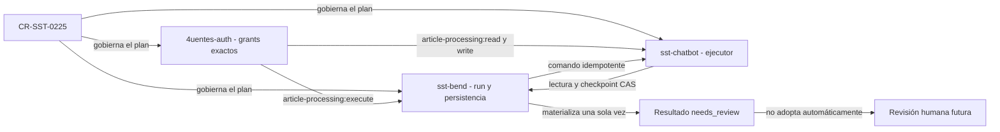

# CR-SST-0225 — Plan de integración durable Bend, Chatbot y Auth

Rol documental primario: playbook de implementación. Owner:
`4uentes-ards-control-plane`. Estado: preparado dentro del gate de lifecycle
`running`. Observado: 2026-09-12.

Este documento selecciona contratos, orden y gates; no es un runbook y no
autoriza mutaciones owner. Los comandos y pasos ejecutables aparecerán sólo
después de fusionar este plan y aprobar la ejecución de los tres owners.

## Resultado buscado

Una acción autorizada sobre un artículo crea o recupera un run durable en
`sst-bend`. Bend ordena la ejecución; `sst-chatbot` deriva el documento completo
o sus párrafos; cada checkpoint vuelve a Bend mediante aceptación atómica. Un
reinicio recupera el último prefijo confirmado y no duplica derivaciones,
resúmenes ni propuestas.

`4uentes-auth` emite permisos de servicio de propósito único. No se crean
identidades ni secretos y no se mezclan conversación, memoria o procesamiento
de artículos bajo un mismo scope.

## Referencias observadas

| Owner | Ref local de `origin/develop` | Autoridad relevante |
| --- | --- | --- |
| `sst-bend` | `cbb2222bb3a0898be328dc4e6765eb72f853745e` | scope de usuario, run, lease, checkpoint, resultado y persistencia |
| `sst-chatbot` | `a0ce974b9b02be55d11609ae757fbcee569dcfa8` | pipeline y ejecución de derivaciones |
| `4uentes-auth` | `a49260ff4b178530a1b2fab421b0793ea505d6e3` | tuples de service grants, claims y TTL |

Las referencias se leyeron sin `fetch` y sin modificar los owners. Los
checkouts habituales de Bend y Auth contienen trabajo ajeno; quedan excluidos.
Una futura ejecución deberá refrescar `origin/develop` y crear worktrees
aislados y limpios.

## Frontera de autoridad

<!-- visual-map:start -->

```yaml
visual_map:
  schema_version: "1.0"
  id: "cr-sst-0225-three-owner-implementation-order"
  type: "dependency"
  question: "¿Qué publica y gobierna cada owner para hacer reanudable el procesamiento de artículos?"
  abstraction_level: "Owners, contratos M2M y orden de integración de CR-SST-0225."
  source_refs:
    - "requests/planned/CR-SST-0225-integrate-article-processing-bend-chatbot.yaml"
    - "requests/running/CR-SST-0225-integrate-article-processing-bend-chatbot.yaml"
    - "evidence/requests/CR-SST-0225/running-preflight-and-auth-boundary-2026-09-11.md"
    - "evidence/requests/CR-SST-0220/article-agent-processing-contract-v1.yaml"
  request_ids: ["CR-SST-0225"]
  observed_at: "2026-09-12"
  authority_boundary: "Vista derivada de planificación; cada spec owner futura conservará autoridad y toda mutación requiere un gate posterior."
  textual_fallback_required: true
```



### Fallback textual

```text
CR-SST-0225 gobierna el plan de los tres owners. Auth define tres grants exactos. Bend usa execute para ordenar a Chatbot una ejecución ya autorizada. Chatbot usa read para recuperar lifecycle y checkpoint, y write para proponer checkpoints o una candidata final. Bend valida scope, estado, versión e hashes antes de aceptar de forma atómica. El resultado queda needs_review y una revisión humana posterior decide cualquier adopción; el service grant nunca adopta memoria.
```

<!-- visual-map:end -->

## Contrato M2M objetivo

| Caller | Audience | Scope único | Operación permitida |
| --- | --- | --- | --- |
| `sst-bend` | `sst-chatbot` | `article-processing:execute` | iniciar o reanudar un run autorizado e idempotente |
| `sst-chatbot` | `sst-api` | `article-processing:read` | leer lifecycle, lease y prefijo confirmado del run |
| `sst-chatbot` | `sst-api` | `article-processing:write` | proponer checkpoint o candidata final para aceptación de Bend |

Cada token debe resolver un solo tuple caller–audience–scope. Un scope no
implica otro. Auth debe rechazar caller, audience, scope, secreto o combinación
múltiple incorrectos. Los claims no transportan contenido del artículo.

## Estrategia de transporte y recuperación

El plan usa HTTP M2M sobre las identidades existentes. El run persistido en
Bend actúa como cola durable y fuente de recuperación; no se agrega un broker.

1. Bend crea o recupera el run con idempotency key, snapshots y hashes.
2. Un coordinador reclama un lease y ordena `execute` a Chatbot.
3. Chatbot lee el checkpoint confirmado antes de derivar.
4. Cada párrafo se propone con ordinal, hash de entrada, hash de contexto y
   versión CAS.
5. Bend confirma la nueva versión o devuelve un conflicto estable.
6. Chatbot propone una candidata final sólo después del último checkpoint.
7. Un timeout o reinicio deja vencer el lease; otro intento relee el estado
   durable y continúa después del último ordinal confirmado.

El contrato owner decidirá paths y envelopes definitivos. Este playbook no
convierte nombres de rutas propuestos en autoridad normativa.

## Superficies owner previstas

### `4uentes-auth`

- Extender `specs/auth.yaml` con los tres tuples exactos.
- Publicar una capability outbound y documentación humana para los grants de
  procesamiento de artículos.
- Actualizar índices, lifecycle de service tokens y checks ARDS/SDD.
- Extender `src/domain/services/service-credentials.ts` y agregar una matriz
  de pruebas positivas y negativas.
- No cambiar login, sesiones, routing de usuario, identidades ni secretos.

### `sst-bend`

- Evolucionar `specs/api/article-agent-processing.yaml` y la capability
  `article-agent-processing-v1` con el protocolo interno productor.
- Actualizar `docs/api/30-article-agent-processing.md`, capability y mapa de
  lifecycle/fallos.
- Agregar coordinación por lease, dispatch idempotente y aceptación CAS sobre
  los modelos publicados por `CR-SST-0223`.
- Exponer solamente las lecturas y propuestas necesarias bajo audience,
  caller, scope y account reconstruidos.
- Mantener `needs_review`; completar un run no publica ni adopta memoria.

### `sst-chatbot`

- Evolucionar `specs/architecture/article-processing-pipeline.yaml` y
  `docs/architecture/article-processing-pipeline.md` con puertos M2M reales.
- Publicar contratos inbound para `execute` y outbound para lifecycle y
  checkpoints.
- Adaptar `src/app/article_processing/` sin asumir persistencia durable local.
- Releer antes de reanudar, descartar salidas stale y separar errores de
  provider de conflictos de aceptación.
- Preservar snapshots de prompt; el usuario elige parámetros permitidos, no
  edita el system prompt owner.

Las rutas nuevas exactas se confirmarán mediante discovery del worktree limpio.
Si una superficie owner no existe, se registrará `TODO` verificable o una
excepción; el control plane no la sustituirá.

## Unidades y orden de publicación

| Orden | Unidad | Owner | Gate de salida |
| --- | --- | --- | --- |
| 1 | Lifecycle y plan | control plane | PR fusionado, readback y full check |
| 2 | Contratos compatibles | tres owners | specs/docs alineadas antes de runtime |
| 3 | Grants exactos | Auth | tuple positivo y matriz de rechazo |
| 4 | Coordinador durable | Bend | lease, CAS, idempotencia y retry probados |
| 5 | Adaptadores reales | Chatbot | resume, stale output y provider failure probados |
| 6 | Integración | Bend + Chatbot + Auth | restart y duplicados probados sin bypass |
| 7 | Publicación owner | cada owner | checks locales, PR y readback canónico |
| 8 | Cierre | control plane | owner docs, evidencia, Jira autorizado y full check |

Los contratos deben revisarse juntos. Para runtime, Auth publica primero los
grants; Bend publica luego la autoridad durable; Chatbot consume ambos
contratos. Si los contratos divergen, se detiene la integración y se corrige en
el owner correspondiente antes de continuar.

## Invariantes y stop conditions

- Un tuple M2M incorrecto devuelve `401/403` y no cambia el run.
- La misma idempotency key con hashes distintos devuelve conflicto.
- Un lease vigente impide otro ejecutor simultáneo.
- Un CAS fallido obliga a releer; nunca sobrescribe contexto confirmado.
- Un output de Chatbot para un run no `running`, una versión anterior o hashes
  distintos se descarta.
- Repetir el mismo checkpoint o final devuelve el estado canónico sin duplicar.
- Una caída de Chatbot conserva el último checkpoint aceptado en Bend.
- Logs, Jira y evidencia excluyen contenido, prompts privados, tokens y
  secretos.
- Cualquier necesidad de nueva identidad, secreto, broker, migración ejecutada
  o cambio de infraestructura detiene esta CR y exige un gate nuevo.

## QA y cierre

Cada owner ejecutará su check completo y pruebas focales. La integración deberá
probar happy path, scopes negativos, conflicto CAS, timeout, caída antes y
después de un checkpoint, reanudación y candidata final repetida.

El QA manual final de producto continúa reservado para `CR-SST-0227`: se hará
exclusivamente con MCP Chrome DevTools, simulando al usuario y creando datos
desde la interfaz, sin scripts de base de datos ni seeders. `CR-SST-0225` debe
dejar el runtime verificable para ese gate, pero no lo ejecuta durante esta
preparación documental.

## Próximos gates

1. Validar y autorizar la publicación Git de este batch del control plane.
2. Fusionar y releer el lifecycle y el plan desde `origin/main`.
3. Autorizar explícitamente la creación de tres worktrees owner limpios y la
   ejecución acotada de las unidades publicadas.
4. Ejecutar un preflight Jira separado antes de cualquier escritura.
