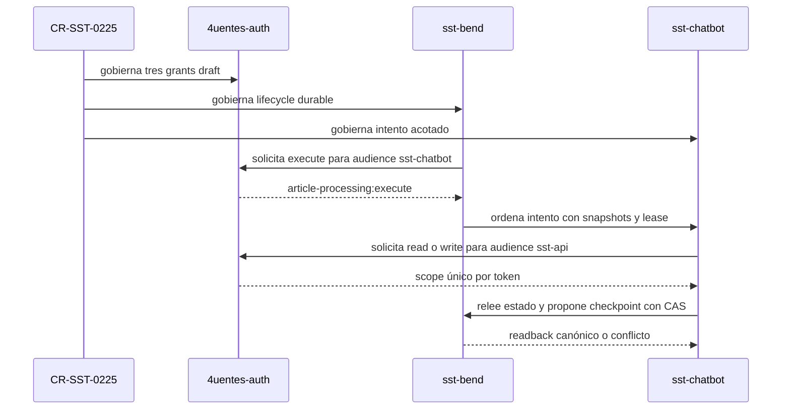

# CR-SST-0225 — Readback y unidad contract-first de tres owners

Rol documental primario: reporte de evidencia de ejecución. Owner:
`4uentes-ards-control-plane`. Fecha observada: 2026-09-12. Estado:
`local-awaiting-review`.

## Resultado

El PR 329 quedó verificado en el commit de merge solicitado
`bb7fa4b1f4ce6ab72ae86cb1c8df9c348e5e7767`. Desde ese commit se creó el
worktree de control plane. Sus padres son
`68102671da5d96695a9f5e44796db36fa814eae3` y
`0ba8aef6e790b253df2746e9c27177a7914a8613`, y su título es
`Merge pull request #329 from afpogo/agent/cr-sst-0225-running-start`.

Después se refrescó `origin/develop` de cada owner y se crearon worktrees
aislados. Los tres publican localmente contratos draft compatibles, sin push ni
PR:

| Owner | Base refrescada | Rama local | Commit local |
| --- | --- | --- | --- |
| `sst-bend` | `cbb2222bb3a0898be328dc4e6765eb72f853745e` | `agent/cr-sst-0225-handoff-contract` | `9b0800d2bb73da5fb14373406b4fd210eb05cd1c` |
| `sst-chatbot` | `a0ce974b9b02be55d11609ae757fbcee569dcfa8` | `agent/cr-sst-0225-execution-contract` | `ddd84001aaa17c5df05db66a66ae1b726b548efb` |
| `4uentes-auth` | `a49260ff4b178530a1b2fab421b0793ea505d6e3` | `agent/cr-sst-0225-service-grants-contract` | `64e37947fd3084eb40874acf55f8685cc8270caf` |

El ref local de seguimiento `origin/main` del control plane avanzó después del
merge solicitado. Esta unidad no tomó ese ref móvil como base: conserva el
readback y el checkout exactamente en `bb7fa4b`.

## Worktrees aislados

Los paths absolutos se registran sólo en evidencia operativa, nunca en catálogo
ni solutions:

- `C:\Users\andre\Desktop\4uentes\apps\4uentes-orchestor\worktrees\CR-SST-0225-owner-contracts`
- `C:\Users\andre\Desktop\4uentes\apps\4uentes-orchestor\worktrees\CR-SST-0225-bend-contract`
- `C:\Users\andre\Desktop\4uentes\apps\4uentes-orchestor\worktrees\CR-SST-0225-chatbot-contract`
- `C:\Users\andre\Desktop\4uentes\apps\4uentes-orchestor\worktrees\CR-SST-0225-auth-contract`

Cada owner estaba limpio antes de materializar su unidad. Después del commit,
los tres árboles versionados vuelven a estar limpios.

## Contrato alineado

El protocolo target-state es `sst-article-processing-handoff-v1@1.0.0`. Bend
conserva autorización, lifecycle, lease, checkpoints, resultado y persistencia;
Chatbot ejecuta un intento síncrono y acotado sin autoridad durable local; Auth
declara tres grants exactos, todavía no ejecutables.

<!-- visual-map:start -->

```yaml
visual_map:
  schema_version: "1.0"
  id: "cr-sst-0225-contract-first-readback"
  type: "sequence"
  question: "¿Cómo encajan los tres contratos draft sin implementar todavía el runtime?"
  abstraction_level: "Handoff M2M, scopes exactos y autoridad durable de CR-SST-0225."
  source_refs:
    - "requests/running/CR-SST-0225-integrate-article-processing-bend-chatbot.yaml"
    - "evidence/requests/CR-SST-0225/implementation-plan.md"
    - "state/features/article-agent-processing.current.yaml"
  request_ids: ["CR-SST-0225"]
  observed_at: "2026-09-12"
  authority_boundary: "Vista derivada; las specs owner conservan autoridad y no representa endpoints, grants ni despliegues ejecutables."
  textual_fallback_required: true
```



### Fallback textual

```text
CR-SST-0225 gobierna tres contratos draft. Auth declara execute para Bend hacia Chatbot, y read o write para Chatbot hacia Bend, siempre como tokens separados. Bend ordena un intento ya autorizado y mantiene el estado durable. Chatbot relee el estado, deriva sólo lo pendiente y propone checkpoints con CAS. Bend devuelve el readback canónico. Ninguna flecha del mapa representa runtime o grants ya implementados.
```

<!-- visual-map:end -->

## Recursos owner publicados localmente

### sst-bend

- contrato de API `specs/api/article-processing-handoff.yaml`;
- capabilities inbound de ejecución Chatbot y grants Auth;
- evolución draft de `article-agent-processing-v1`;
- documentación de API, capabilities y task report, con mapa y fallback.

### sst-chatbot

- capability `specs/capabilities/article-processing-execution.yaml`;
- integración `specs/integrations/sst-article-processing-handoff.yaml`;
- evolución de la spec y documentación del pipeline, con mapa y fallback;
- task report contract-first.

### 4uentes-auth

- capability outbound `article-processing-service-grants-v1`;
- bloque `planned_grants` contract-only en `specs/auth.yaml`, separado de la
  allowlist activa;
- documentación de lifecycle, capability y task report, con mapa y fallback.

## Validación

| Owner | Comando | Resultado |
| --- | --- | --- |
| `sst-chatbot` | `python scripts/check.py` con el venv owner existente | PASS: ARDS/SDD, 272 tests y smokes deterministas |
| `4uentes-auth` | `npm run check` con dependencias owner existentes | PASS: ARDS, build y todas las matrices locales |
| `sst-bend` | `npm run check` después de `npm ci --ignore-scripts` en el worktree | PARCIAL: todas las suites deterministas previas pasaron, incluida article agent processing; el preflight HTTP final quedó bloqueado porque SST no estaba iniciado |
| tres owners | parse de YAML y `git diff --cached --check` | PASS |

No se inició SST ni scrapper para forzar el check de Bend: este gate prohíbe
runtime y entornos compartidos. El bloqueo observado fue exclusivamente
`GET http://localhost:3005/4uentes/v1/public/gallery` sin servicio disponible.
No es una falla del contrato modificado y debe revalidarse en un gate que
autorice runtime local.

## Límites comprobados

- No se modificó código runtime, allowlists ejecutables ni tests funcionales.
- No se crearon ni rotaron secretos, variables o identidades.
- No se tocaron datos, migraciones, infraestructura o despliegues.
- No se escribió en Jira.
- No se hizo push ni se creó PR.
- `chat:process`, `agent-handoff:submit` y los scopes de memoria no se
  reutilizaron ni ampliaron.

## Próximo gate

Revisión humana de los cuatro commits locales: Bend, Chatbot, Auth y este
readback de control plane. Publicar ramas o PRs y comenzar grants/runtime exige
autorizaciones posteriores y explícitas.
