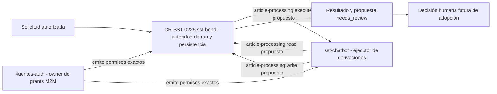
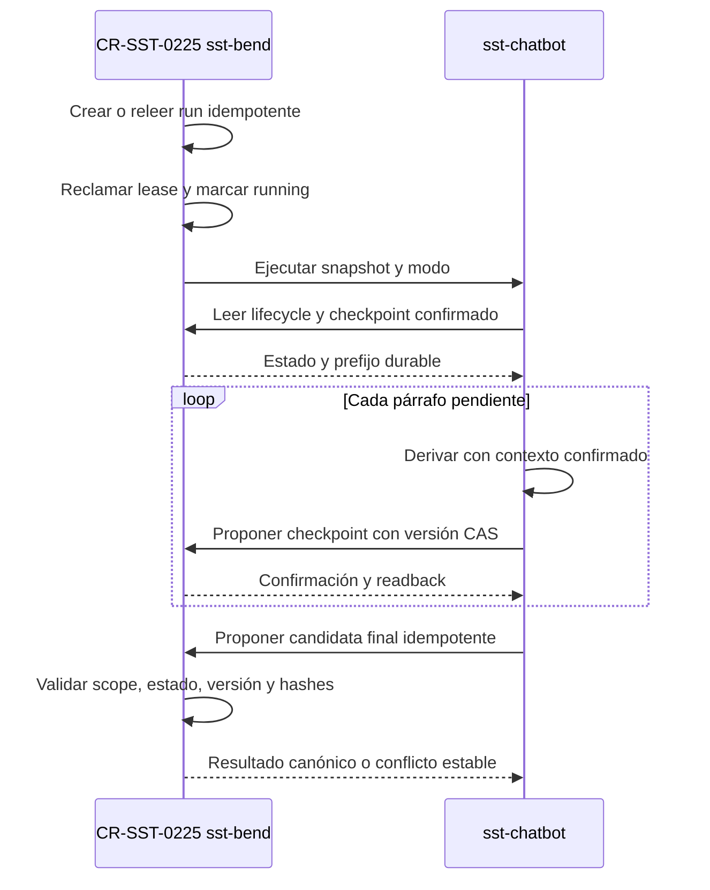

# CR-SST-0225 — Preflight de integración y frontera M2M

Rol documental primario: playbook de decisión. Owner: `4uentes-ards-control-plane`.
Estado: propuesta previa al lifecycle `running`. Observado: 2026-09-11.
Este documento selecciona el próximo gate; no es un runbook, no autoriza
mutaciones y no sustituye los contratos owner.

## Pregunta

¿Cómo conectar el agregado durable de `sst-bend` con el ejecutor de
`sst-chatbot` sin ampliar silenciosamente permisos, ownership ni autoridad de
memoria?

## Fuentes canónicas observadas

- Control plane: `origin/main@3d83f79da845b70b4b790580b916a255cdf6f147`.
- Bend: `origin/develop@cbb2222bb3a0898be328dc4e6765eb72f853745e`.
- Chatbot: `origin/develop@a0ce974b9b02be55d11609ae757fbcee569dcfa8`.
- Contrato Bend: `specs/api/article-agent-processing.yaml@1.0.0`.
- Capability Bend: `article-agent-processing-v1`, todavía `draft`.
- Contrato Chatbot: `specs/architecture/article-processing-pipeline.yaml`,
  implementado localmente con puertos y fakes.
- Plan: `requests/planned/CR-SST-0225-integrate-article-processing-bend-chatbot.yaml`.

CR-SST-0223 y CR-SST-0224 están `done`, publicados y leídos desde sus ramas
canónicas. El predecessor gate está satisfecho.

## Hallazgo de autorización

La identidad `sst-bend` puede solicitar actualmente `chat:process` hacia la
audience `sst-chatbot`. La identidad `sst-chatbot` posee grants separados para
`agent-handoff:submit`, `user-memory:recall` y `user-memory:propose` hacia
`sst-api`.

Ninguno de esos scopes autoriza el nuevo protocolo de procesamiento de
artículos. Reutilizar `chat:process` mezclaría conversación con procesamiento
documental; reutilizar `agent-handoff:submit` para checkpoints o finalización
ampliaría una capability histórica. Ambas alternativas se rechazan.

La opción recomendada agrega grants explícitos, sin crear nuevas identidades ni
secretos:

- `article-processing:execute`: `sst-bend` llama al ejecutor de `sst-chatbot`;
- `article-processing:read`: `sst-chatbot` consulta lifecycle y checkpoint
  confirmados en Bend;
- `article-processing:write`: `sst-chatbot` propone checkpoint o candidata
  final para aceptación atómica de Bend.

`4uentes-auth` es el owner de esos grants. Incorporarlo a CR-SST-0225 sería una
expansión material del plan de dos owners; por lo tanto requiere decisión humana
y lifecycle actualizado antes de cualquier cambio owner.

## Mapa de dependencias y autoridad

<!-- visual-map:start -->

```yaml
visual_map:
  schema_version: "1.0"
  id: "cr-sst-0225-owner-and-auth-boundary"
  type: "dependency"
  question: "Qué owner gobierna cada tramo del handoff durable de artículos?"
  abstraction_level: "Servicios lógicos, scopes M2M y autoridades del CR."
  source_refs:
    - "requests/planned/CR-SST-0225-integrate-article-processing-bend-chatbot.yaml"
    - "requests/done/CR-SST-0223-persist-article-processing-runs-and-summaries.yaml"
    - "requests/done/CR-SST-0224-implement-article-processing-agent-pipeline.yaml"
    - "solutions/sst.yaml"
  request_ids: ["CR-SST-0225"]
  observed_at: "2026-09-11"
  authority_boundary: "Vista derivada propuesta; los specs owner conservan autoridad y la decisión humana pendiente prevalece."
  textual_fallback_required: true
```



### Fallback textual

```text
En CR-SST-0225, Bend autoriza el run, conserva lifecycle, checkpoints y persistencia. Chatbot
ejecuta derivaciones y sólo lee o propone cambios mediante puertos internos.
Auth emite scopes exactos para cada dirección. Completar el run produce una
propuesta needs_review; no adopta memoria automáticamente.
```

<!-- visual-map:end -->

## Secuencia recomendada

<!-- visual-map:start -->

```yaml
visual_map:
  schema_version: "1.0"
  id: "cr-sst-0225-durable-execution-sequence"
  type: "sequence"
  question: "Cómo se reanuda un run sin duplicar párrafos ni resultado final?"
  abstraction_level: "Protocolo lógico de ejecución y aceptación durable."
  source_refs:
    - "evidence/requests/CR-SST-0220/article-agent-processing-contract-v1.yaml"
    - "requests/planned/CR-SST-0225-integrate-article-processing-bend-chatbot.yaml"
  request_ids: ["CR-SST-0225"]
  observed_at: "2026-09-11"
  authority_boundary: "Vista derivada del target state; los contratos owner conservan autoridad y la autorización de ejecución prevalece."
  textual_fallback_required: true
```



### Fallback textual

```text
En CR-SST-0225, Bend crea o recupera el run y reclama una ejecución con lease. Chatbot carga el
prefijo confirmado. Cada párrafo se acepta mediante compare-and-swap y readback.
La candidata final se acepta una sola vez con scope, estado, versión e hashes
verificados. Un restart vuelve a leer el mismo run y omite sólo lo confirmado.
```

<!-- visual-map:end -->

## Fallos y stop conditions

- Token M2M sin audience, caller o scope exactos: `401/403`, sin cambio de run.
- Snapshot, prompt, source hash o scope inconsistente: conflicto cerrado.
- Lease vigente de otra ejecución: no lanzar un segundo worker.
- Lifecycle distinto de `running`: Chatbot descarta la salida.
- CAS de contexto en conflicto: releer; nunca sobrescribir.
- Timeout o caída de Chatbot: liberar o vencer lease y conservar el último
  checkpoint confirmado.
- Candidata final repetida con los mismos hashes: devolver el resultado previo.
- Misma idempotency key con contenido diferente: conflicto, sin overwrite.
- No hay rollback destructivo: la compensación es pausar o fallar el run y
  reanudar desde evidencia durable.

## Decisión requerida

Recomendación: ampliar de forma explícita el alcance owner de CR-SST-0225 para
incluir `4uentes-auth` sólo en los grants M2M anteriores. No se requiere un
runbook operativo todavía: primero deben publicarse el lifecycle `running`, los
contratos de handoff y la autorización exacta de los tres owners.

Hasta esa decisión:

- CR-SST-0225 permanece `planned`;
- no se crean worktrees owner;
- no se implementan endpoints, workers, scopes ni migraciones;
- no se escribe Jira;
- no se despliega ni se ejecutan migraciones.

## Jira read-only

La búsqueda `project = SST AND summary ~ "CR-SST-0225"` no devolvió issues.
`SST-122` fue releído como `En curso`, resolución nula. Un futuro mirror debe
ser exactamente una Subtask de `SST-122` y requiere autorización separada.
