# CR-SST-0228: plan de readiness para migración compartida

Fecha: 2026-08-28  
Estado: `planning-only`  
Predecesor: `CR-SST-0221`

## Resultado del inventario read-only

El clúster `kind-sst-cluster-dev` conserva dos nodos Kubernetes `v1.32.0`
`Ready`. `sst-app` está `Synced/Healthy`; seis Deployments y dos StatefulSets
de aplicación están listos. Phinance no está desplegado actualmente.

Los datos persistentes observados son:

| Owner | PVC | Capacidad | Estado |
| --- | --- | ---: | --- |
| `4uentes-auth` | `node-auth-mongo-data-node-auth-mongo-0` | 1 Gi | Bound |
| `sst-bend` | `sst-postgres-data-sst-postgres-0` | 2 Gi | Bound |

Los nodos Kind montan `/var` desde volúmenes Docker locales. Por eso destruir y
recrear el clúster no prueba conservación: primero hacen falta backups de
aplicación y restore validado.

No se consultaron objetos Secret ni contenido de PostgreSQL, MongoDB o etcd.

## Decisión recomendada

Se recomienda una migración in-place del único control plane. Un playbook owner
sin claves en Git debe colocar la configuración runtime bajo
`/var/lib/4uentes/kubernetes-encryption`, protegerla con permisos root, parchar
el static pod del API server y mantener una copia cifrada independiente bajo
custodia humana.

La recreación controlada queda como alternativa si el operador aprueba el
tratamiento de datos y demuestra el restore. Descartar datos no es una
inferencia válida.

También debe corregirse el cliente operativo: el host tiene `kubectl v1.29.2`
y el servidor `v1.32.0`, fuera del skew soportado de una versión menor.
El nodo control-plane sí contiene `kubectl v1.32.0`; el futuro playbook puede
usarlo y mantener el cliente dentro del skew permitido.

## Mapa de gates de ejecución

<!-- visual-map:start -->
```yaml
visual_map:
  schema_version: "1.0"
  id: "cr-sst-0228-shared-secret-migration-gates"
  type: "lifecycle"
  question: "Qué gates deben pasar antes de cifrar y retirar identity en el clúster compartido?"
  abstraction_level: "shared-cluster execution gate"
  source_refs:
    - "requests/planned/CR-SST-0228-migrate-shared-development-secret-storage.yaml"
    - "state/features/kubernetes-secret-storage-encryption.current.yaml"
    - "evidence/requests/CR-SST-0221/disposable-prototype-runtime-proof-2026-08-28.md"
  observed_at: "2026-08-28"
  authority_boundary: "Vista derivada; CR-SST-0228 y el futuro playbook de sst-4uentes-infra conservan autoridad."
  textual_fallback_required: true
  status_vocabulary: ["confirmed", "planned", "validated", "blocked"]
```



```mermaid
flowchart LR
    P["Prototipo descartable [confirmed]"]
    D["Custodio y destinos [blocked]"]
    B["Backups y restore [blocked]"]
    O["Playbook owner y kubectl 1.32 [blocked]"]
    A["Lote exacto autorizado [blocked]"]
    V1["v1 más identity [planned]"]
    R["Rewrite y audit [planned]"]
    W["Readiness por owner [planned]"]
    V2["v2 sin identity [planned]"]
    X["Abort y recovery [blocked]"]

    P --> D --> B --> O --> A --> V1 --> R --> W --> V2
    V1 -.->|API o nodo falla| X
    R -.->|cardinalidad o lectura falla| X
    W -.->|workload o Argo falla| X

    classDef confirmed fill:#dcfce7,stroke:#16a34a,color:#052e16
    classDef blocked fill:#fee2e2,stroke:#dc2626,color:#450a0a
    classDef migrating fill:#e0f2fe,stroke:#0284c7,color:#082f49
    classDef steady fill:#dbeafe,stroke:#2563eb,color:#172554
    classDef recovery fill:#fef3c7,stroke:#d97706,color:#451a03
    class P confirmed
    class D,B,O,A blocked
    class V1,R,W migrating
    class V2 steady
    class X recovery
```

### Fallback textual

```text
Prototipo probado -> custodio y destinos -> backups/restore -> playbook owner y cliente compatible -> autorización exacta -> v1 con identity -> rewrite/audit -> readiness por owner -> v2 sin identity.
Si falla API, cardinalidad, nodo, Argo o un workload, el flujo se detiene y ejecuta recovery sin retirar la clave necesaria para leer datos ya cifrados.
```
<!-- visual-map:end -->

## Decisiones humanas pendientes

- Identidad del custodio de claves.
- Destino de dos copias cifradas independientes.
- Destinos de snapshot etcd y dumps PostgreSQL/MongoDB.
- Ventana de indisponibilidad.
- Pérdida de datos aceptable.
- Período de retención de `v1` después de promover `v2`.
- Aceptación del camino in-place recomendado o alternativa explícita.
- Herramienta de cifrado autenticado para backups; se recomienda `age`, que no
  está instalado actualmente.

Hasta resolverlas y publicar una autorización enumerada, no se debe crear
backup, leer Secrets, generar claves, modificar el static pod, reescribir
objetos, reiniciar workloads ni escribir en Jira.
